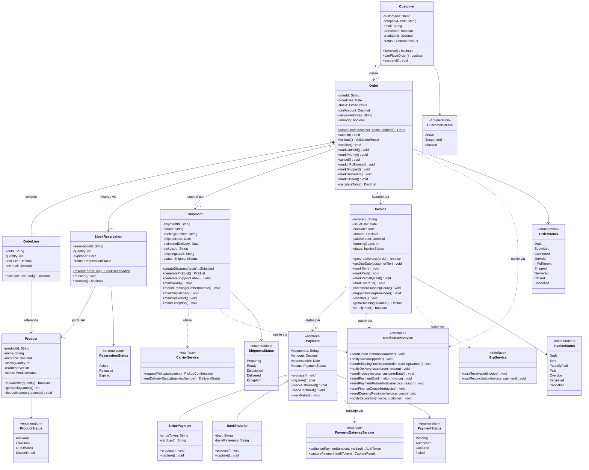

# Solution — Diagramme de Classes OMS NovaTrade

**Livrable du Study Case :** 06 (sixième livrable de la feuille de route)
**Énoncé :** voir le document maître `Study Case.md`
**Périmètre couvert :** modèle de classes du domaine OMS NovaTrade — classes, attributs, méthodes, relations, multiplicités

> **✅ Version finale — Construction après UC-01, UC-02 et UC-03**
>
> Ce document présente le diagramme de classes **complet**, dans son état après l'analyse des trois cas d'utilisation principaux du Study Case : **UC-01 *Place Order*, UC-02 *Fulfil Order* et UC-03 *Process Invoice and Payment***. Toutes les classes, méthodes, attributs et relations dérivés des couloirs Système des trois diagrammes d'Activité y sont consolidés.
>
> Ce diagramme servira de référence à l'**audit d'intégration** (livrable 07).

Ce document applique la **règle de dérivation Activité → Classes** énoncée en début du document `Study Case.md` : les méthodes émergent des actions du couloir Système des diagrammes d'activité, et les attributs émergent des objets manipulés. Il s'appuie strictement sur les livrables 03 (`Study Case - UC01 Place Order.md`), 04 (`Study Case - UC02 Fulfil Order.md`) et 05 (`Study Case - UC03 Invoice Payment.md`) pour identifier les éléments nécessaires.

---

## 1. Cadrage de l'Exercice

### Principe de construction incrémentale

Le diagramme de classes se construit **après** les diagrammes d'Activité — il en est la conséquence, pas la prémisse. Chaque action du couloir Système d'un diagramme d'Activité produit une **méthode** d'une classe ; chaque objet manipulé entre actions produit un ou plusieurs **attributs**. Le diagramme s'enrichit donc à chaque nouveau UC traité.

### État final du modèle

Après les trois UC, le modèle couvre l'intégralité du processus Commande à l'Encaissement (*Order-to-Cash*) :

- L'**identité** du Client et son statut (BR-01) — y compris la suspension consécutive à un défaut de paiement (BR-13)
- La **structure** d'une Commande et de ses Lignes (BR-02)
- Le **catalogue Produit** (consulté en lecture, déduit en écriture lors de l'expédition)
- La **réservation de stock** (BR-03) puis sa **déduction effective** à l'expédition
- L'**Expédition** (`Shipment`) et son cycle de vie complet
- La **Facture** (`Invoice`) et son cycle de relance (BR-11 à BR-13)
- Le **Paiement** (`Payment`) abstrait, et ses deux implémentations concrètes `StripePayment` et `BankTransfer` (BR-14)
- Les services externes : **notification** (Service de notification), **transport** (Transporteur), **paiement** (Passerelle de paiement) et **rapprochement comptable** (Système ERP)

Cette photographie constitue le **modèle de référence** pour la suite de l'analyse (audit d'intégration en livrable 07) et pour l'implémentation par l'équipe de développement.

---

## 2. Classes Émergeant des Trois UC

### Inventaire consolidé

| Classe | Origine | Rôle |
|---|---|---|
| **Customer** | UC-01 — acteur primaire (BR-01) ; UC-03 — suspension possible (BR-13) | Représente le client professionnel qui passe la commande, paie les factures et peut être suspendu après escalade |
| **Order** | UC-01 — création et confirmation ; UC-02 — exécution ; UC-03 — origine de la facturation | Aggregate root du modèle de commande |
| **OrderLine** | UC-01 — composant de l'Order (BR-02) ; UC-02 — base de la liste de prélèvement | Détaille la quantité commandée d'un produit donné |
| **Product** | UC-01 — vérification de stock (BR-03) ; UC-02 — déduction d'inventaire (BR-09) | Article du catalogue |
| **StockReservation** | UC-01 — création de la réservation (BR-03) ; UC-02 — libération à l'expédition | Mise en attente temporaire de stock |
| **Shipment** | UC-02 — objet central, cycle de vie complet | Envoi physique des marchandises |
| **Invoice** *(nouveau — UC-03)* | UC-03 — générée à `Shipment Dispatched` (BR-11), gérée jusqu'au paiement ou à l'escalade | Demande de paiement émise au Client |
| **Payment** *(nouvelle, abstraite — UC-03)* | UC-03 — règle une Facture (BR-14) | Classe abstraite représentant un paiement, indépendamment du moyen utilisé |
| **StripePayment** *(nouvelle, concrète — UC-03)* | UC-03 — paiement par carte via Stripe | Implémentation concrète de `Payment` |
| **BankTransfer** *(nouvelle, concrète — UC-03)* | UC-03 — paiement par virement bancaire | Implémentation concrète de `Payment` |
| **NotificationService** *(interface)* | Présente dans les trois UC | Abstrait l'envoi de courriels et SMS (confirmation, suivi, facturation, relances) |
| **CarrierService** *(interface)* | UC-02 — Transporteur | Abstrait l'interaction avec le prestataire logistique tiers |
| **PaymentGatewayService** *(interface, nouvelle — UC-03)* | UC-03 — Passerelle de paiement | Abstrait l'interaction avec le processeur de paiement externe (autorisation, capture) |
| **ErpService** *(interface, nouvelle — UC-03)* | UC-03 — rapprochement comptable (BR-15) | Abstrait l'écriture des créances et des rapprochements dans le Système ERP |

### Méthodes dérivées des diagrammes d'Activité

Chaque action du couloir Système se traduit par une méthode. Le tableau ci-dessous consolide les méthodes issues des trois UC.

#### Méthodes héritées de UC-01

| Action d'Activité (UC-01) | Méthode dérivée | Classe |
|---|---|---|
| Créer la commande en statut Draft | `createDraft(customer, items, address)` | `Order` (factory) |
| Marquer Submitted | `submit()` | `Order` |
| Vérifier le statut du Client (BR-01) | `isActive()` / `canPlaceOrder()` | `Customer` |
| Vérifier le stock via ERP (BR-03) | `isAvailable(quantity)` | `Product` |
| Réserver le stock | `reserve(orderLine)` | `StockReservation` (factory) |
| Marquer Confirmed | `confirm()` | `Order` |
| Marquer prioritaire (BR-04) | `markPriority()` | `Order` |
| Envoyer notification de confirmation | `sendOrderConfirmation(order)` | `NotificationService` |
| Marquer OnHold | `markOnHold()` | `Order` |
| Notifier le Représentant commercial | `notifySalesRep(order)` | `NotificationService` |
| Annulation Client | `cancel()` | `Order` |

#### Méthodes héritées de UC-02

| Action d'Activité (UC-02) | Méthode dérivée | Classe |
|---|---|---|
| Créer Shipment Preparing (BR-07) | `createShipment(order)` | `Shipment` (factory) |
| Marquer Order InFulfilment | `markInFulfilment()` | `Order` |
| Générer la liste de prélèvement | `generatePickList()` | `Shipment` |
| Générer l'étiquette de transport | `generateShippingLabel()` | `Shipment` |
| Marquer Shipment Ready (BR-08) | `markReady()` | `Shipment` |
| Notifier le Transporteur | `requestPickup(shipment)` | `CarrierService` |
| Enregistrer le n° de suivi (BR-09) | `recordTrackingNumber(number)` | `Shipment` |
| Marquer Shipment Dispatched | `markDispatched()` | `Shipment` |
| Marquer Order Shipped (BR-09) | `markShipped()` | `Order` |
| Notifier le Client (suivi) | `sendShippingNotification(order, trackingNumber)` | `NotificationService` |
| Mettre à jour le stock | `deductInventory(quantity)` | `Product` |
| Libérer la réservation | `release()` | `StockReservation` |
| Marquer Shipment Delivered (BR-10) | `markDelivered()` | `Shipment` |
| Marquer Order Delivered | `markDelivered()` | `Order` |
| Marquer Shipment Exception | `markException()` | `Shipment` |
| Notifier l'incident de livraison | `notifyDeliveryIssue(order, reason)` | `NotificationService` |
| Marquer Order Closed (BR-10) | `markClosed()` | `Order` |

#### Méthodes ajoutées par UC-03

| Action d'Activité (UC-03) | Méthode dérivée | Classe |
|---|---|---|
| Générer la facture en Draft (BR-11) | `generateInvoice(order)` | `Invoice` (factory) |
| Calculer la date d'échéance | `setDueDate(customerTier)` | `Invoice` |
| Marquer Invoice Sent | `markSent()` | `Invoice` |
| Envoyer la facture au Client | `sendInvoice(invoice, customerEmail)` | `NotificationService` |
| Publier la créance dans l'ERP | `postReceivable(invoice)` | `ErpService` |
| Initier le paiement (Client) | `initiatePayment(invoice, method)` *(orchestration)* | `Invoice` (factory de `Payment`) |
| Appeler la Passerelle de paiement (BR-14) | `authorisePayment(amount, method)` | `PaymentGatewayService` |
| Marquer Payment Authorised | `markAuthorised()` | `Payment` |
| Capturer le paiement | `capturePayment(authToken)` | `PaymentGatewayService` |
| Marquer Payment Captured (BR-14) | `markCaptured()` | `Payment` |
| Marquer Payment Failed | `markFailed()` | `Payment` |
| Marquer Invoice Paid | `markPaid()` | `Invoice` |
| Marquer Invoice PartiallyPaid | `markPartiallyPaid()` | `Invoice` |
| Envoyer rapprochement à l'ERP (BR-15) | `postReconciliation(invoice, payment)` | `ErpService` |
| Confirmation de paiement | `sendPaymentConfirmation(invoice)` | `NotificationService` |
| Notification d'échec de paiement | `sendPaymentFailureNotice(invoice, reason)` | `NotificationService` |
| Marquer Invoice Overdue (BR-12) | `markOverdue()` | `Invoice` |
| Alerter le Contrôleur financier | `alertFinanceController(invoice)` | `NotificationService` |
| Incrémenter le compteur de relances | `incrementDunningCount()` | `Invoice` |
| Déclencher une relance | `triggerDunningReminder()` *(orchestration)* | `Invoice` |
| Envoyer la relance | `sendDunningReminder(invoice, count)` | `NotificationService` |
| Escalader vers recouvrement (BR-13) | `escalate()` | `Invoice` |
| Notifier l'escalade | `notifyEscalation(invoice, customer)` | `NotificationService` |
| Suspendre le compte Client (BR-13) | `suspend()` | `Customer` |
| Calcul du solde restant | `getRemainingBalance()` | `Invoice` |
| Vérifier paiement intégral | `isFullyPaid()` | `Invoice` |
| Traitement spécifique Stripe | `process()` / `capture()` *(redéfinition)* | `StripePayment` |
| Traitement spécifique Virement | `process()` / `capture()` *(redéfinition)* | `BankTransfer` |

### Attributs dérivés des objets manipulés

Les attributs proviennent du **vocabulaire du domaine** (Section 2 du document `Study Case.md`) et sont confirmés par les objets manipulés dans les diagrammes d'Activité des trois UC. Les noms suivent la convention de nommage technique en anglais.

---

## 3. Diagramme de Classes

> **Lecture du diagramme :** neuf classes métier (`Customer`, `Order`, `OrderLine`, `Product`, `StockReservation`, `Shipment`, `Invoice`, `Payment`, plus deux héritières `StripePayment` et `BankTransfer`), quatre interfaces de service (`NotificationService`, `CarrierService`, `PaymentGatewayService`, `ErpService`) et sept énumérations d'états. La **hiérarchie d'héritage** `Payment ◁— StripePayment / BankTransfer` est l'élément structurel le plus expressif du diagramme : `Payment` est abstraite (méthodes `process()` et `capture()` marquées d'un `*`, indiquant la redéfinition obligatoire en Mermaid), et chaque sous-classe apporte ses propres attributs (token Stripe ou références bancaires) et redéfinit les opérations polymorphes. Les méthodes des classes correspondent une à une aux actions du couloir Système des diagrammes d'Activité des trois UC — la traçabilité Activité → Classes est complète sur l'ensemble du processus Commande à l'Encaissement.

---

## 4. Justification des Choix de Modélisation

### Rappels — UC-01 et UC-02

Les choix justifiés aux versions précédentes du modèle sont conservés sans modification :

- **Composition `Order` ◆— `OrderLine`** (BR-02 — une `OrderLine` orpheline n'a pas de sens)
- **Association simple `Customer` — `Order`** (un Client survit à ses commandes, traçabilité historique)
- **Association simple `Order` — `Shipment`** (`Shipment` a son propre cycle de vie et son identité)
- **`StockReservation` comme classe associative** (cycle de vie propre, règles d'expiration, identifiant)
- **`NotificationService` et `CarrierService` comme interfaces** (découplage des implémentations techniques)

Les choix nouveaux liés à UC-03 sont détaillés ci-dessous.

### Hiérarchie d'héritage `Payment ◁— StripePayment / BankTransfer` (nouveau — UC-03)

C'est l'**objet d'apprentissage central** de ce livrable. La Section 2 du document `Study Case.md` définit explicitement deux modes de paiement avec des attributs distincts (`stripeToken`, `cardLast4` pour Stripe ; `iban`, `bankReference` pour le virement bancaire) mais des opérations communes (autorisation, capture). L'**héritage** est la solution canonique :

- `Payment` est **abstraite** : on ne peut pas instancier un paiement « générique » — chaque paiement réel est soit Stripe, soit virement
- `Payment` factorise tout ce qui est commun : `paymentId`, `amount`, `status`, `processedAt`, et le contrat `process()` / `capture()`
- `StripePayment` et `BankTransfer` apportent leurs attributs spécifiques et **redéfinissent** (`override`) `process()` et `capture()` avec leur logique propre (appel API Stripe vs. ordre SEPA)

Ce polymorphisme permet à `Invoice` et au reste du système de traiter une collection de `Payment` de manière uniforme — par exemple, parcourir `invoice.payments` pour calculer le solde restant sans connaître le type concret de chaque paiement. C'est une application directe du principe de substitution de Liskov.

Note de notation : les méthodes abstraites apparaissent dans le diagramme avec un astérisque (`process()*`, `capture()*`) — c'est la convention Mermaid pour distinguer les méthodes redéfinies obligatoirement par les classes héritières. La visibilité **protégée** (`#`) sur les attributs de `Payment` indique qu'ils sont accessibles aux classes filles mais non publics.

### Association simple `Order` — `Invoice` (multiplicité `0..1`)

Une commande a au plus une facture (BR-11 ne génère qu'une facture par commande). On modélise donc `Order` "1" — "0..1" `Invoice`. Multiplicité `0` côté `Invoice` parce que la facture n'existe qu'à partir de `Shipment Dispatched` — pendant tout le cycle UC-01 et UC-02 jusqu'à l'expédition, la commande n'a pas encore de facture.

L'**asymétrie** avec la relation `Order` — `Shipment` est intentionnelle : malgré la même cardinalité `0..1`, `Invoice` représente l'engagement **financier**, là où `Shipment` représente l'engagement **logistique**. Les deux sont des entités de premier rang à cycles de vie distincts.

### Association `Invoice` "1" — "0..*" `Payment`

Une facture peut être réglée par **plusieurs paiements** :
- Paiement initial échoué + retentative ⇒ deux instances `Payment` (statuts `Failed` puis `Captured`)
- Paiement partiel + paiement du solde ⇒ deux instances `Payment` (chacun en statut `Captured` mais avec des montants différents)

Multiplicité `0..*` côté `Payment` parce qu'une facture en `Draft` ou `Sent` peut n'avoir aucun paiement associé. Cette modélisation justifie pourquoi `Invoice.markPartiallyPaid()` et `Invoice.markPaid()` sont des transitions distinctes : `Invoice.isFullyPaid()` calcule la condition à partir de la somme des paiements `Captured` — ce qui n'a de sens que si la cardinalité est `0..*`.

### `Payment` reste abstraite, pas instanciable directement

L'abstraction de `Payment` est **forte** : aucun cas d'usage métier ne nécessite un paiement « non typé ». Toute instance créée par l'OMS est nécessairement `StripePayment` ou `BankTransfer`. Cette contrainte est portée par le mot-clé `<<abstract>>` du diagramme et les méthodes abstraites (`process()` et `capture()` marquées `*`). Une variante (cf. Section 7) consiste à modéliser `Payment` comme classe concrète avec un attribut `paymentMethod: enum { Stripe, BankTransfer }` — c'est volontairement rejeté ici parce qu'on perdrait le polymorphisme, c'est-à-dire la capacité de chaque type de paiement à porter sa propre logique et ses propres attributs.

### `PaymentGatewayService` comme interface (nouveau — UC-03)

La Passerelle de paiement est un acteur **externe critique** qui formalise un contrat précis (autoriser puis capturer). Modéliser `PaymentGatewayService` comme **interface** plutôt que classe concrète permet de :
- Découpler l'OMS de l'implémentation technique (Stripe a son SDK, un autre fournisseur en aurait un différent)
- Tester le système avec une implémentation simulée (*mock*) sans appeler la vraie passerelle
- Préparer l'extension à plusieurs passerelles simultanées (par exemple Stripe pour les cartes + un service SEPA pour les virements)

C'est la même justification architecturale que `NotificationService` et `CarrierService`. Les trois services externes du modèle sont systématiquement abstraits par des interfaces.

### `ErpService` promu en interface explicite (nouveau — UC-03)

Aux livrables précédents (UC-01, UC-02), les interactions ERP étaient absorbées dans les méthodes des classes domaine (`StockReservation.reserve()`, `Product.deductInventory()`). UC-03 introduit deux opérations qui **ne trouvent leur place dans aucune classe domaine** :
- `postReceivable(invoice)` — publication d'une créance dans la comptabilité auxiliaire
- `postReconciliation(invoice, payment)` — écriture du rapprochement comptable (BR-15)

Ces opérations sont des **préoccupations d'intégration** pures — elles ne représentent pas un comportement métier, mais un appel système-à-système. Les loger dans `Invoice` ou `Payment` mélangerait concerns métier et infrastructure. Promouvoir `ErpService` en interface est donc justifié à ce livrable et **acceptable**. Une variante (cf. Section 7) consiste à remonter aussi `reserveStock()` et `deductInventory()` dans `ErpService` pour symétrie totale — délibérément non fait ici pour préserver la lisibilité et les choix antérieurs (les méthodes domaine restent à leur place).

### `Customer.suspend()` (nouveau — UC-03)

BR-13 stipule que l'escalade après 3 relances peut entraîner la suspension du compte Client. Cette suspension a **deux effets** :
- Faire passer `Customer.status` de `Active` à `Suspended`
- Empêcher le client de passer de nouvelles commandes (BR-01 — déjà testé via `Customer.canPlaceOrder()`)

La cohérence est ainsi assurée : la méthode `canPlaceOrder()` existante (UC-01) **fonctionne correctement** dès qu'on suspend le client, sans modification — c'est un effet de la séparation préconisée des préoccupations dès UC-01. C'est un excellent exemple à mettre en avant en formation : un bon découpage initial paie ses dividendes lors des évolutions.

### `Invoice.dunningCount` borne la boucle de relance (BR-13)

L'attribut `dunningCount: int` de `Invoice` matérialise le compteur de relances utilisé par BR-13. Initialisé à 0, incrémenté par `incrementDunningCount()` à chaque envoi (jusqu'à 3 maximum). Au-delà, `Invoice.escalate()` est invoquée. Modéliser le compteur comme **attribut de l'Invoice elle-même** plutôt que comme une collection de `DunningReminder` séparés est un choix de simplicité : tant qu'on n'a pas besoin de tracer la date de chaque relance individuellement, un compteur suffit. Une variante (cf. Section 7) introduit une classe `DunningReminder` si l'historique est requis pour des raisons d'audit ou de conformité.

### `Invoice.paidAmount` + `getRemainingBalance()` pour les paiements partiels

Le paiement partiel (`Invoice: Sent → PartiallyPaid`) requiert de suivre le solde restant. Deux modélisations sont possibles :
1. Calculer le solde dynamiquement : `getRemainingBalance() = amount - sum(payments.amount where status = Captured)`
2. Maintenir un attribut dénormalisé `paidAmount` mis à jour à chaque capture

Le diagramme retient les **deux** : `paidAmount` comme attribut **dérivé** maintenu pour la performance et l'auditabilité (snapshot du moment), et `getRemainingBalance()` comme méthode qui peut soit retourner `amount - paidAmount` soit recalculer depuis les paiements. C'est un compromis classique entre forme normale et performance ; les apprenants devraient reconnaître cette tension.

### Méthodes d'orchestration (`triggerDunningReminder`, `initiatePayment`)

`Invoice.triggerDunningReminder()` n'est pas une simple transition d'état — elle **orchestre** trois choses : incrémenter le compteur, envoyer le courriel via `NotificationService`, vérifier si la borne (3) est atteinte. C'est une méthode de **service applicatif** qui appartient à `Invoice` parce qu'elle modifie son état. De manière symétrique, `Invoice.initiatePayment(method)` est la fabrique qui crée la bonne sous-classe de `Payment` (`StripePayment` ou `BankTransfer`) selon le mode choisi par le Client. Ces méthodes d'orchestration font la jonction entre les couches.

---

## 5. Cohérence avec les Trois UC

| Vérification | Statut |
|---|---|
| Chaque action du couloir Système du diagramme d'Activité (UC-01) a une méthode correspondante dans le Class Diagram | ✓ |
| Chaque action du couloir Système du diagramme d'Activité (UC-02) a une méthode correspondante dans le Class Diagram | ✓ |
| Chaque action du couloir Système du diagramme d'Activité (UC-03) a une méthode correspondante dans le Class Diagram | ✓ |
| Chaque entité de la Section 2 du `Study Case.md` est représentée comme classe (y compris la hiérarchie `Payment` / `StripePayment` / `BankTransfer`) | ✓ |
| Tous les attributs énumérés en Section 2 sont présents dans les classes correspondantes (y compris `dunningCount` pour borner BR-13) | ✓ |
| Tous les états listés en Section 2 sont représentés dans les énumérations (`OrderStatus`, `ShipmentStatus`, `InvoiceStatus`, `PaymentStatus`, etc.) | ✓ |
| Multiplicités cohérentes avec les règles métier (BR-02 : `1..*` lignes ; BR-07 : `0..1` Shipment ; BR-11 : `0..1` Invoice ; BR-14 : `0..*` Payment par Invoice) | ✓ |
| Synchronisations inter-cycles modélisées : `Order ↔ Shipment` (UC-02) et `Invoice ↔ Payment` (UC-03) | ✓ |
| Les services externes des trois UC sont systématiquement modélisés comme interfaces (`NotificationService`, `CarrierService`, `PaymentGatewayService`, `ErpService`) | ✓ |
| Hiérarchie d'héritage `Payment` exprimant le polymorphisme exigé par BR-14 et la Section 2 du `Study Case.md` | ✓ |
| Les noms de classes, attributs, méthodes correspondent au vocabulaire de la Section 2 (anglais camelCase / PascalCase) | ✓ |

---

## 6. Préparation à l'Audit d'Intégration (livrable 07)

Le diagramme de classes étant désormais complet, il devient l'**artefact de référence** pour l'audit d'intégration du livrable 07. Les vérifications suivantes seront menées contre la table de cohérence inter-diagrammes (Section 5.2 du `Study Case.md`) :

- **Couverture descendante** : chaque concept tracé dans le tableau de transposition doit avoir une classe / un attribut / une méthode correspondants dans le présent diagramme. Aucun concept BPMN ou UML d'amont ne doit rester non implémenté.
- **Absence de méthodes orphelines** : chaque méthode listée à la Section 2 ci-dessus doit avoir au moins une action d'Activité (UC-01, UC-02 ou UC-03) qui la déclenche. Une méthode sans déclencheur signale une sur-conception ou un héritage d'un cycle d'analyse précédent qu'il faut nettoyer.
- **Cohérence des noms** : les noms d'états (`Submitted`, `Dispatched`, `Captured`, etc.) doivent être strictement identiques entre le présent diagramme, les diagrammes d'États (UC-01, UC-02, UC-03) et le tableau Section 5.2.
- **Frontière BPMN ↔ UML** : les piscines et tâches BPMN supportées par le système (livrable 01) doivent toutes avoir trouvé leur place dans une classe ou une opération du présent modèle.

L'audit se déroulera en parcourant le tableau Section 5.2 ligne par ligne, en cochant chaque ligne dans le présent diagramme.

---

## 7. Variantes Acceptables

### `Payment` concrète avec attribut `paymentMethod`

Modéliser `Payment` comme classe concrète avec un attribut `paymentMethod: PaymentMethod` (énumération `Stripe`, `BankTransfer`) plutôt qu'une hiérarchie d'héritage. Avantage : moins de classes, plus simple à sérialiser. Inconvénient majeur : **perte du polymorphisme**, impossibilité d'avoir des attributs spécifiques (`stripeToken` vs. `iban`) sans alourdir la classe avec tous les attributs possibles. **Non recommandé** mais acceptable comme exercice introductif avant d'introduire l'héritage.

### Classe `DunningReminder` séparée

Au lieu d'un simple compteur `dunningCount: int`, modéliser une classe `DunningReminder` avec attributs `reminderId`, `sentAt`, `reminderNumber`, et la relation `Invoice` "1" — "0..*" `DunningReminder`. Avantage : trace de chaque relance individuellement, support de l'audit, possibilité d'attacher des pièces jointes. Inconvénient : surdimensionné si on n'a besoin que de compter les relances. **Acceptable et recommandé** dès que les exigences réglementaires imposent une trace détaillée.

### `ErpService` étendu aux opérations UC-01 et UC-02

Remonter `reserveStock()` et `deductInventory()` dans `ErpService` pour symétrie totale. Avantage : tous les appels ERP sont visibles via l'interface. Inconvénient : casse les choix de modélisation des UC-01 et UC-02, alourdit le diagramme. **Acceptable** dans une refonte globale du modèle ; volontairement omis ici pour préserver la lisibilité incrémentale.

### Address comme classe valeur (*Value Object*)

`deliveryAddress` reste un `String`. UC-03 introduit la facturation, qui pourrait justifier une adresse de facturation distincte (`billingAddress`). Promouvoir l'adresse en classe `Address` avec attributs structurés (`street`, `city`, `postalCode`, `country`) et l'introduire à la fois sur `Order` (livraison) et `Invoice` (facturation) si différentes. **Acceptable et recommandé** dans une seconde itération.

### Money comme classe valeur

Les attributs monétaires (`unitPrice`, `lineTotal`, `totalAmount`, `creditLimit`, `amount`, `paidAmount`) gagneraient à être typés `Money` (montant + devise) plutôt que `Decimal`. **Vivement recommandé** dans un contexte B2B international ; non strictement requis par le périmètre du Study Case (NovaTrade traite uniquement en EUR par hypothèse implicite).

### Pas d'énumérations explicites

Certaines équipes préfèrent omettre les énumérations du diagramme de classes et les documenter à part. **Acceptable** dans un Class Diagram visuel allégé, mais on perd la traçabilité directe avec les diagrammes d'États.

### Services externes comme classes concrètes

Modéliser `NotificationService`, `CarrierService`, `PaymentGatewayService`, `ErpService` comme classes (et non interfaces) si l'on n'envisage qu'une seule implémentation pour chacun. **Acceptable mais pédagogiquement moins riche** — l'interface prépare mieux les apprenants au principe de découplage et à l'inversion de dépendance, particulièrement pertinents en architecture hexagonale.

### Pattern *State* pour les machines à états complexes

Les classes ayant les machines à états les plus riches (`Order`, `Invoice`, `Payment`) pourraient être refactorisées avec le pattern *State* — chaque état devient une classe concrète redéfinissant les transitions autorisées. Avantage : transitions invalides impossibles à la compilation. Inconvénient : explosion du nombre de classes. **Acceptable comme exercice d'architecture avancée**, hors périmètre pédagogique de ce Study Case.

---

## 8. Cohérence avec le Livrable Suivant

- **Livrable 07 — Audit d'Intégration.** Le diagramme de classes ci-dessus est le **point d'arrivée** de la chaîne d'analyse interne à UML. L'audit d'intégration le confrontera aux artefacts en amont — diagramme BPMN (livrable 01), diagramme de cas d'utilisation (livrable 02), trois diagrammes d'Activité (livrables 03 à 05), diagrammes d'États associés et diagrammes de Séquence — pour vérifier la cohérence de bout en bout. La règle d'or de l'audit est : **chaque méthode du Class Diagram doit avoir au moins une action d'Activité qui la déclenche, et inversement, chaque action Système doit posséder sa méthode correspondante**. Cette règle, énoncée en début du document `Study Case.md`, est la trame du livrable 07.

---

*Diagramme final consolidé — prochaine étape : audit d'intégration dans `Study Case - Full Integration.md`.*
