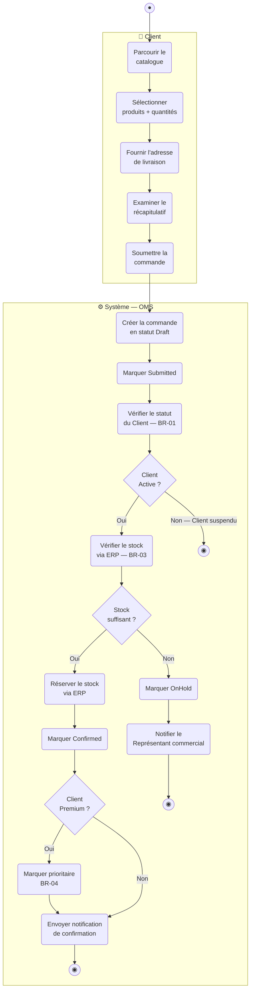
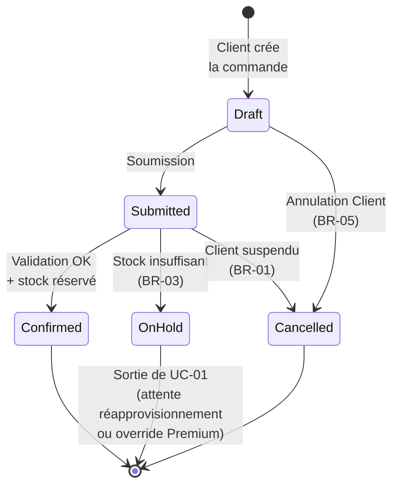
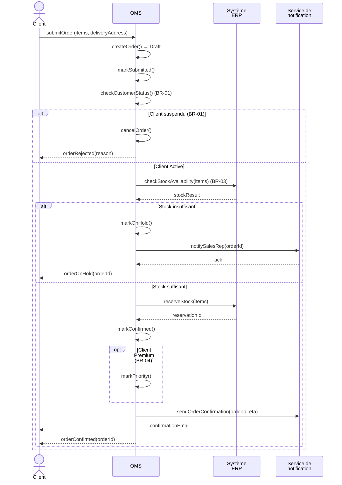

# Solution — UC-01 Passer une Commande (Place Order)

**Livrable du Study Case :** 03 (troisième livrable de la feuille de route)
**Énoncé :** voir le document maître `Study Case.md`, Section 4 (UC-01)
**Périmètre couvert :** comportement détaillé du cas d'utilisation *Place Order* sous trois angles complémentaires — diagramme d'Activité (chaîne d'actions et règles de décision), diagramme d'États (cycle de vie de la `Order` limité aux états atteignables dans UC-01), et diagramme de Séquence (interactions avec les systèmes secondaires)

Ce document est la solution attendue pour le livrable 03 du Study Case NovaTrade. Il modélise UC-01 *Passer une Commande* à travers les trois diagrammes UML pertinents pour ce cas d'utilisation, dans la cohérence stricte avec le diagramme BPMN (livrable 01) et le diagramme de cas d'utilisation (livrable 02).

---

## 1. Cadrage du Cas d'Utilisation

| Élément | Valeur |
|---|---|
| **Acteur principal** | Client (ou Représentant commercial agissant en son nom) |
| **Acteurs secondaires** | Système ERP (vérification et réservation de stock), Service de notification (envoi de la confirmation) |
| **Déclencheur** | Le Client initie une nouvelle commande via le portail OMS |
| **Préconditions** | Client `Active` (BR-01) ; au moins un Produit dans le catalogue |
| **États `Order` traversés** | `Draft` → `Submitted` → `Confirmed` (chemin nominal) ou `OnHold` (stock insuffisant) ou `Cancelled` (annulation) |
| **Règles métier mobilisées** | BR-01 (statut Client), BR-02 (au moins une ligne), BR-03 (réservation de stock), BR-04 (priorité Premium), BR-05 (annulation possible avant `InFulfilment`) |

> **📝 Lien avec les livrables précédents**
>
> Ce livrable détaille au Niveau UML ce que le **sous-processus BPMN « Recevoir et confirmer la commande »** (couloir Vente du livrable 01, fichier `Study Case - BPMN - Niveau 2.1 Vente.bpmn`) avait esquissé au niveau métier. Les trois diagrammes ci-dessous reprennent strictement le vocabulaire de la Section 2 du document `Study Case.md` et restent cohérents avec le cas d'utilisation `Place Order` du livrable 02.

---

## 2. Diagramme d'Activité

Le diagramme d'Activité respecte la **convention « Couloirs Acteurs / Système »** (cf. en-tête du document `Study Case.md`) : un couloir par acteur effectivement impliqué dans le flux, plus un couloir Système pour l'OMS. Pour UC-01 nominal, deux couloirs suffisent — **Client** (point d'interaction humain) et **Système** (toutes les actions automatiques de l'OMS, y compris les appels à l'ERP et au Service de notification, considérés comme des dépendances internes du système).

> **Lecture du diagramme :** le flux part toujours du couloir **Client** (cinq actions d'interaction = cinq écrans candidats de l'application) puis bascule dans le couloir **Système** à la soumission. Les actions du couloir Système (création, validation, réservation, marquage, notification) deviendront autant de **méthodes** du diagramme de classes au livrable 06. Trois fins distinctes nommées : `EndOK` (Confirmed), `EndReject` (Client suspendu), `EndHold` (stock insuffisant). La règle de dérivation Activité → Classes est ici visible : chaque action du couloir Client correspond à un écran (catalogue, sélection, adresse, récapitulatif, soumission), chaque action du couloir Système correspond à une opération métier du futur Class Diagram.

> **ℹ️ Note sur le Représentant commercial**
>
> Le Représentant commercial n'apparaît pas dans ce diagramme parce qu'il n'est pas impliqué dans le flux nominal de UC-01. Lorsqu'il agit *au nom du* Client, il opère via les mêmes écrans (couloir Client) et la sémantique du flux est identique. Lorsqu'il **outrepasse** une mise en attente de stock pour un Client Premium (BR-06), c'est le cas d'utilisation séparé `Override Stock Hold` (relation `«extend»` dans le livrable 02) — il aurait alors son propre diagramme d'activité avec un couloir Représentant commercial.

---

## 3. Diagramme d'États — Cycle de vie de la `Order` dans UC-01

Le diagramme d'États est restreint aux **états atteignables dans UC-01**. Les états ultérieurs (`InFulfilment`, `Shipped`, `Delivered`, `Closed`) seront couverts dans les livrables 04 (UC-02) et 05 (UC-03).

> **Lecture du diagramme :** trois états terminaux pour UC-01 — `Confirmed` (chemin nominal réussi, déclenche UC-02 *Fulfil Order*), `OnHold` (sortie temporaire en attente de réapprovisionnement ou d'un override Représentant commercial), `Cancelled` (annulation Client ou rejet pour Client suspendu). Les états `InFulfilment` et au-delà n'apparaissent **pas** ici — ils sont dans le périmètre de UC-02. Cette restriction est **volontaire** : un diagramme d'États doit toujours être borné par le périmètre du cas d'utilisation modélisé.

> **⚠️ Modélisation du rejet pour Client suspendu**
>
> La Section 2 du document `Study Case.md` ne contient pas d'état explicite « Rejected » pour la `Order`. Pragmatiquement, le rejet pour Client suspendu (BR-01) est ici représenté par une transition `Submitted → Cancelled` — le système annule la commande qu'il vient de créer. C'est une convention raisonnable mais discutable ; une variante consisterait à introduire un état `Rejected` distinct (cf. Section 7).

---

## 4. Diagramme de Séquence — Interactions du Chemin Nominal et Exception de Stock

Le diagramme de Séquence est **justifié** par la présence de deux acteurs secondaires de type système (Système ERP et Service de notification) avec lesquels l'OMS interagit (cf. convention « Diagrammes spécifiques » du `Study Case.md`). Il documente le protocole d'échange — ordre des appels, paramètres logiques, alternatives — que les diagrammes d'Activité ne capturent pas finement.

> **Lecture du diagramme :** quatre lignes de vie (*lifelines*) — Client (acteur), OMS (système conçu), Système ERP (système secondaire), Service de notification (système secondaire). Le fragment `alt` extérieur sépare le cas Client suspendu du cas Client Active. À l'intérieur de la branche Active, un second `alt` distingue stock insuffisant vs suffisant. Le fragment `opt` matérialise le traitement prioritaire optionnel pour les Clients Premium. Les messages `OMS->>OMS` représentent les appels internes à l'OMS qui mettent à jour l'état de la `Order` — ils correspondent exactement aux actions du couloir Système du diagramme d'Activité.

---

## 5. Justification des Choix de Modélisation

### Couloirs Client + Système (et non un couloir par acteur secondaire)

Conformément à la convention « Couloirs Acteurs / Système » du `Study Case.md`, on trace **un couloir par acteur effectivement impliqué dans le flux**. Pour UC-01 nominal, l'acteur primaire est le Client. Les acteurs secondaires (Système ERP, Service de notification) sont des **dépendances de l'OMS** : leurs actions sont initiées et orchestrées par l'OMS, donc elles vivent dans le couloir Système. Si l'on traçait un couloir séparé par acteur secondaire, on dupliquerait l'information (déjà visible dans le diagramme de Séquence) sans apporter de valeur pédagogique.

### Validation séquentielle plutôt que parallèle

Au livrable 01 BPMN (Niveau 2.1), on a modélisé les deux contrôles (statut Client + stock) en **parallèle** via une Passerelle Parallèle, pour optimiser le temps de traitement. Au niveau Activité UML, on a fait le choix inverse : validation **séquentielle** (statut Client puis stock). Pourquoi ? Parce que le diagramme d'Activité décrit la **logique métier vue depuis le système**, pas l'optimisation d'exécution. Vérifier d'abord le statut Client est plus efficace conceptuellement : si le Client est suspendu, on rejette tout de suite sans gaspiller un appel ERP. La parallélisation reste une optimisation valide qui peut être réintroduite à l'implémentation si pertinent. Cette divergence entre BPMN (orienté processus) et Activité (orienté système) est elle-même un objet d'apprentissage.

### Le rejet pour Client suspendu transite par `Cancelled`

Le document `Study Case.md` ne fournit pas d'état `Rejected` distinct pour la `Order`. Plutôt que d'inventer un état hors-périmètre, on modélise le rejet pour Client suspendu via une transition `Submitted → Cancelled`. C'est une simplification raisonnable : du point de vue du Client, une commande rejetée par le système et une commande annulée ont le même effet (pas de livraison, pas de facture). Une variante plus expressive avec un état `Rejected` est discutée en Section 7.

### `OnHold` est un état terminal *de UC-01*, pas un état terminal global

Dans le diagramme d'États ci-dessus, `OnHold` est représenté avec une transition vers `[*]` (état final). Cela ne signifie **pas** que `OnHold` est un état mort dans le système — cela signifie que **dans le périmètre de UC-01**, l'instance sort du flux modélisé. La sortie d'`OnHold` (réapprovisionnement, override Premium) est traitée par d'autres cas d'utilisation (`Override Stock Hold` ou un événement de réapprovisionnement). Cette restriction par UC est essentielle pour garder chaque diagramme d'États lisible.

### La séquence diagram montre les `OMS->>OMS` (appels internes)

Inclure les appels internes à l'OMS (`createOrder()`, `markSubmitted()`, `markConfirmed()`…) sur la ligne de vie de l'OMS lui-même n'est pas obligatoire en UML, mais c'est pédagogiquement précieux : ces appels sont précisément les **méthodes** qui apparaîtront sur la classe `Order` au livrable 06 (Class Diagram). Les supprimer rendrait la dérivation Activité → Classes moins traçable.

---

## 6. Cohérence Inter-Diagrammes

Avant de passer au livrable suivant, on vérifie la cohérence entre les trois diagrammes ci-dessus et avec les livrables 01 et 02 :

| Vérification | Statut |
|---|---|
| Acteurs du diagramme d'Activité (Client) ⊆ acteurs du UC `Place Order` (Client / Représentant commercial) du livrable 02 | ✓ |
| États atteints dans le diagramme de Séquence (Draft, Submitted, Confirmed, OnHold, Cancelled) ⊆ états du diagramme d'États | ✓ |
| Actions du couloir Système ⇆ messages `OMS->>OMS` du diagramme de Séquence | ✓ (correspondance ligne à ligne) |
| Règles métier (BR-01, BR-03, BR-04) référencées dans les trois diagrammes | ✓ |
| Tâches de Service du sous-processus BPMN « Vente » (livrable 01) ⇆ actions du couloir Système | ✓ |

---

## 7. Variantes Acceptables

### Introduire un état `Rejected` distinct

Plutôt que de transiter par `Cancelled` lors d'un rejet pour Client suspendu, on peut introduire un état `Rejected` distinct dans la `Order`. Avantage : sémantique plus claire (`Cancelled` = action volontaire du Client ; `Rejected` = refus du système). Inconvénient : ajoute un état non listé dans la Section 2 du `Study Case.md`. **Acceptable** si l'on signale l'extension au document maître.

### Couloirs séparés pour ERP et Service de notification

Une variante consiste à tracer un couloir Système OMS, un couloir Système ERP, et un couloir Service de notification. Avantage : on visualise immédiatement les interactions inter-systèmes dans l'Activité. Inconvénient : on dédouble l'information avec le diagramme de Séquence et on alourdit le diagramme. **Acceptable** dans des contextes où le découpage technique est central, **non recommandé** ici.

### Modéliser la parallélisation des contrôles

Conserver la Passerelle Parallèle du BPMN dans le diagramme d'Activité (ParallelGateway en split + join sur les deux contrôles) reste valide. Avantage : cohérence stricte avec le BPMN. Inconvénient : moins lisible que la version séquentielle. **Acceptable** ; choix orienté par l'audience.

### Diagramme de Séquence sans appels internes

Supprimer les messages `OMS->>OMS` du diagramme de Séquence allège l'image. Avantage : focus sur les vraies interactions externes. Inconvénient : on perd la traçabilité avec les méthodes du futur Class Diagram. **À éviter** dans cette étude de cas car la dérivation Activité → Classes est l'objectif d'apprentissage central.

---

## 8. Cohérence avec les Livrables Suivants

- **Livrable 04 — UC-02 *Fulfil Order*.** Le déclencheur de UC-02 est l'entrée d'une commande en statut `Confirmed` dans la file d'exécution. Le diagramme d'États de UC-02 reprendra `Confirmed` comme état initial et continuera vers `InFulfilment → Shipped → Delivered → Closed`.

- **Livrable 05 — UC-03 *Process Invoice and Payment*.** UC-03 est déclenché par la transition `Shipment → Dispatched`, qui est un produit de UC-02. Pas de chevauchement direct avec UC-01.

- **Livrable 06 — Diagramme de Classes.** Les actions du couloir Système ci-dessus deviendront des méthodes des classes pertinentes :
  - `createOrder()`, `markSubmitted()`, `markConfirmed()`, `markOnHold()`, `markPriority()`, `cancelOrder()` → méthodes de la classe `Order`
  - `checkStockAvailability()`, `reserveStock()` → méthodes interagissant avec `StockReservation` et `Product`
  - `checkCustomerStatus()` → méthode interagissant avec `Customer`
  - `sendOrderConfirmation()`, `notifySalesRep()` → méthodes du service de notification ou méthodes orchestrées par `Order`

- **Livrable 07 — Audit d'Intégration.** Les trois diagrammes ci-dessus seront comparés au sous-processus BPMN « Vente » (livrable 01) pour vérifier la cohérence de bout en bout : chaque tâche BPMN doit avoir son équivalent en action d'Activité, chaque transition d'État doit être déclenchée par une action identifiée, chaque message externe doit apparaître dans le diagramme de Séquence.

---

*Livrable suivant : `Study Case - UC02 Fulfil Order.md`*
