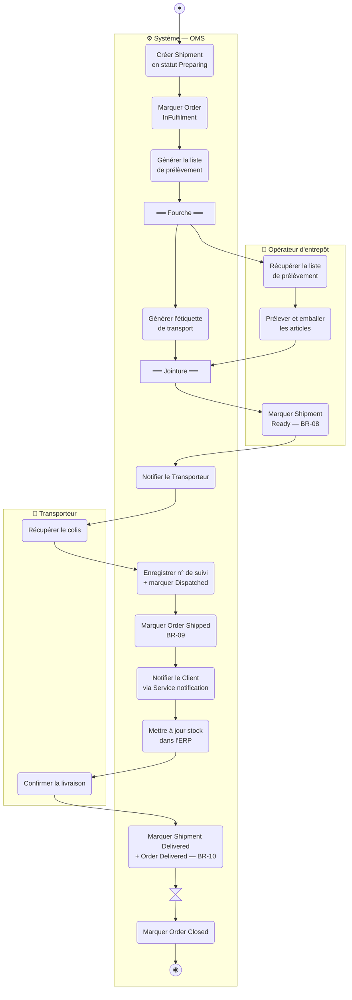
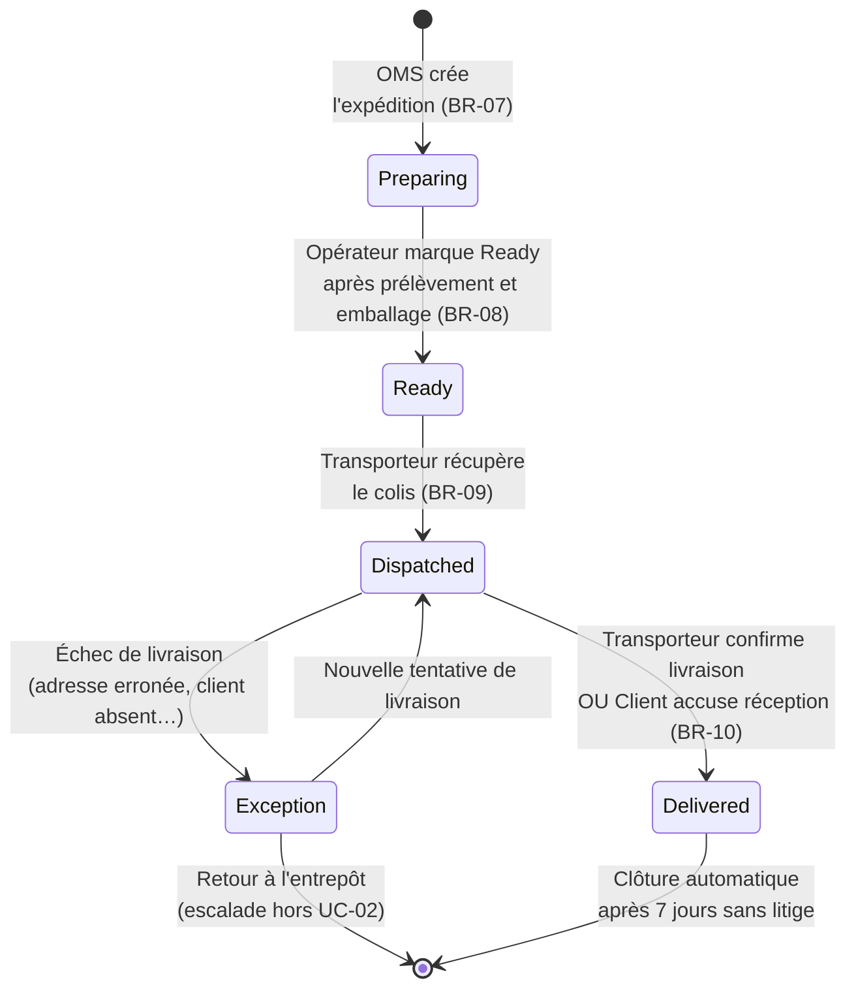
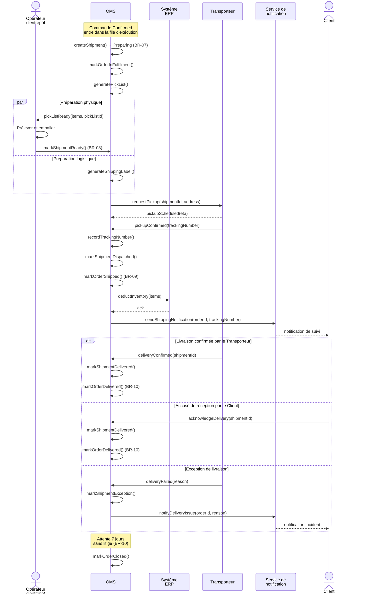

# Solution — UC-02 Exécuter la Commande (Fulfil Order)

**Livrable du Study Case :** 04 (quatrième livrable de la feuille de route)
**Énoncé :** voir le document maître `Study Case.md`, Section 4 (UC-02)
**Périmètre couvert :** comportement détaillé du cas d'utilisation *Fulfil Order* sous trois angles complémentaires — diagramme d'Activité (avec Fork/Join pour les opérations parallèles), diagramme d'États de la `Shipment` (cycle complet de `Preparing` à `Delivered`/`Exception`), et diagramme de Séquence (interactions avec le Transporteur, l'ERP et le Service de notification)

Ce document est la solution attendue pour le livrable 04 du Study Case NovaTrade. Il modélise UC-02 *Exécuter la Commande* à travers les trois diagrammes UML pertinents, dans la cohérence stricte avec le diagramme BPMN (livrable 01), le diagramme de cas d'utilisation (livrable 02) et la sortie de UC-01 (livrable 03).

---

## 1. Cadrage du Cas d'Utilisation

| Élément | Valeur |
|---|---|
| **Acteur principal** | Opérateur d'entrepôt |
| **Acteurs secondaires** | Système ERP (mise à jour de stock), Transporteur (collecte et livraison), Service de notification (suivi Client) |
| **Déclencheur** | Une commande en statut `Confirmed` entre dans la file d'exécution (issue de UC-01) |
| **Préconditions** | `Order` en statut `Confirmed` (BR-07) ; toutes les `StockReservation` de la commande sont `Active` |
| **États `Shipment` traversés** | `Preparing` → `Ready` → `Dispatched` → `Delivered` (chemin nominal) ou `Exception` (échec de livraison) |
| **États `Order` traversés** | `Confirmed` → `InFulfilment` → `Shipped` → `Delivered` → `Closed` |
| **Règles métier mobilisées** | BR-07 (création d'expédition), BR-08 (validation prélèvement/emballage), BR-09 (transition `Shipped` à la collecte), BR-10 (confirmation de livraison + clôture après 7 jours) |

> **📝 Lien avec les livrables précédents**
>
> Ce livrable détaille au Niveau UML ce que le **sous-processus BPMN « Préparer et expédier la commande »** (couloir Exécution du livrable 01, fichier `Study Case - BPMN - Niveau 2.2 Execution.bpmn`) avait esquissé au niveau métier. Il introduit deux notions nouvelles par rapport à UC-01 : **un acteur externe** (Transporteur) qui s'invite dans le flux d'activité, et un **parallélisme Fork/Join** (prélèvement physique + génération d'étiquette de transport) qui réduit le temps de traitement.

---

## 2. Diagramme d'Activité

Trois couloirs sont nécessaires : **Opérateur d'entrepôt** (acteur primaire qui prélève et emballe), **Système** (OMS qui orchestre, génère l'étiquette, déclenche les transitions), et **Transporteur** (acteur externe qui collecte et confirme la livraison). Le Fork/Join central matérialise la parallélisation de la préparation physique et de la préparation logistique.

> **Lecture du diagramme :** la Passerelle Parallèle (Fork) après la génération de la liste de prélèvement lance simultanément deux branches — une physique (l'Opérateur prélève et emballe) et une automatisée (le Système génère l'étiquette de transport). La Fusion Parallèle (Join) attend les deux avant que l'Opérateur marque l'expédition Ready. Trois changements de couloir significatifs : Système → Opérateur (le Fork attribue le prélèvement à l'humain), Opérateur → Système (l'humain remet la main au système quand il marque Ready), Système → Transporteur (l'OMS notifie un acteur externe pour la collecte). Chaque action du couloir Système deviendra une méthode au livrable 06.

> **ℹ️ Note sur la confirmation de livraison**
>
> Le diagramme modélise la confirmation par le Transporteur (chemin nominal). Le Client peut aussi confirmer via accusé de réception (BR-10) — c'est sémantiquement équivalent côté OMS et apparaît comme un chemin alternatif dans le diagramme de Séquence ci-dessous. Pour ne pas alourdir le diagramme d'Activité, cette alternative n'est pas explicitement tracée.

---

## 3. Diagramme d'États — Cycle de vie de la `Shipment`

Le diagramme d'États couvre le **cycle de vie complet** de la `Shipment` dans UC-02, depuis sa création (`Preparing`) jusqu'à sa terminaison (`Delivered` ou `Exception`). Tous les états listés en Section 2 du `Study Case.md` pour `Shipment` sont atteignables ici.

> **Lecture du diagramme :** cinq états traversables, deux états terminaux (`Delivered`, `Exception` en sortie de retour). La transition `Exception → Dispatched` modélise une nouvelle tentative de livraison (l'expédition reprend son cours). La transition `Exception → [*]` représente le retour à l'entrepôt (cas d'échec définitif de livraison) — l'instance sort alors du périmètre UC-02 et entre dans un processus de retour qui est explicitement hors périmètre du Study Case (cf. Section 7 du document `Study Case.md`).

> **🛂 Diagramme d'États de la `Order` dans UC-02**
>
> La `Order` traverse également plusieurs états pendant UC-02 : `Confirmed` → `InFulfilment` → `Shipped` → `Delivered` → `Closed`. Ces transitions sont **synchronisées** avec celles de la `Shipment` :
>
> - `Order: Confirmed → InFulfilment` lors de `Shipment: → Preparing`
> - `Order: InFulfilment → Shipped` lors de `Shipment: → Dispatched` (BR-09)
> - `Order: → Delivered` lors de `Shipment: → Delivered` (BR-10)
> - `Order: Delivered → Closed` automatiquement après 7 jours sans litige (BR-10)
>
> Un diagramme d'États séparé pour la `Order` n'est pas requis à ce livrable car le cycle de la `Order` n'a pas de transitions propres indépendantes de la `Shipment` dans UC-02 — il est entièrement piloté par les transitions de la `Shipment`. Le diagramme d'États global de la `Order` (livrable 07, audit d'intégration) consolidera les transitions issues des trois UC.

---

## 4. Diagramme de Séquence

Le diagramme de Séquence est **justifié** par la présence d'un acteur externe (Transporteur) et de deux systèmes secondaires (ERP, Service de notification) avec lesquels l'OMS interagit. Il documente l'ordre des messages, les fragments alternatifs et les interactions concurrentes que le diagramme d'Activité ne capture pas finement.

> **Lecture du diagramme :** six lignes de vie — l'Opérateur d'entrepôt et le Client comme acteurs (silhouettes), l'OMS comme système conçu, l'ERP, le Transporteur et le Service de notification comme systèmes secondaires. Le fragment `par` matérialise la parallélisation entre la préparation physique (Opérateur) et la préparation logistique (Système), reflet exact du Fork/Join de l'Activity Diagram. Le fragment `alt` à la fin distingue les trois manières dont la livraison peut s'achever : confirmation par le Transporteur, accusé de réception par le Client, exception de livraison. La note finale matérialise l'attente de 7 jours avant clôture automatique — un comportement piloté par minuteur, hors flux d'interaction.

---

## 5. Justification des Choix de Modélisation

### Trois couloirs distincts (Opérateur, Système, Transporteur)

UC-02 implique deux acteurs humains/externes en plus du Système : l'Opérateur d'entrepôt (humain interne) et le Transporteur (organisation externe). Conformément à la convention « Couloirs Acteurs / Système », chacun obtient son couloir. Regrouper Opérateur et Transporteur dans un couloir « Acteurs » serait une violation explicite de la règle (« jamais de couloir générique regroupant plusieurs acteurs distincts »). Les deux ont des actions clairement distinctes — l'Opérateur prélève et emballe, le Transporteur récupère et livre — qui méritent des écrans / interfaces différents dans le Class Diagram à venir.

### Fork/Join sur prélèvement + étiquette de transport

La parallélisation est **réelle** au métier : pendant que l'Opérateur prélève physiquement les articles (action chronophage), l'OMS génère l'étiquette de transport en arrière-plan (action automatisée et instantanée). Modéliser cela en séquence pur masquerait une optimisation importante du processus. Le Fork/Join le rend visible et justifie la conception du Class Diagram : la `Shipment` aura à la fois des données de prélèvement (`pickListId`) et des données logistiques (`shippingLabel`, `trackingNumber`) qui se construisent indépendamment.

### L'ERP n'apparaît que pour la mise à jour de stock

Dans UC-01, l'ERP a vérifié et réservé le stock. Dans UC-02, son rôle est de **déduire** l'inventaire au moment de l'expédition — c'est un appel ponctuel après la transition `Dispatched`. On modélise ce seul échange dans le diagramme de Séquence, pas dans le diagramme d'Activité (où ce serait une action Système parmi d'autres). Une variante consiste à afficher cet appel comme une action explicite dans le couloir Système — défensable mais potentiellement redondant avec la Séquence.

### Trois alternatives de fin de livraison dans la Séquence

BR-10 dit explicitement que la livraison peut être confirmée par le Transporteur OU par le Client. Le fragment `alt` du diagramme de Séquence rend les deux chemins symétriques. Une troisième alternative — l'exception de livraison — est ajoutée pour couvrir le scénario d'échec. Ce sont des alternatives **mutuellement exclusives** sur une même instance d'expédition, donc `alt` est correct (et non `par`).

### La clôture automatique après 7 jours est un comportement piloté par minuteur

L'attente de 7 jours sans litige est représentée dans le diagramme d'Activité par une **Action d'Acceptation d'Événement Temporel** (*Accept Time Event Action*) — forme sablier UML qui matérialise précisément un déclencheur temporel relatif (ici : « 7 jours après l'entrée du jeton dans l'action »). Ce n'est pas une interaction avec un acteur — c'est un comportement temporel propre au système, et le sablier le rend immédiatement lisible. Le diagramme de Séquence complète cette modélisation avec une `Note` qui rend explicite le caractère temporisé hors flux d'interaction.

### Pas de diagramme d'États séparé pour la `Order` dans UC-02

Le cycle de vie de la `Order` pendant UC-02 (`Confirmed → InFulfilment → Shipped → Delivered → Closed`) est entièrement **dérivé** des transitions de la `Shipment` — chaque transition `Order` a un déclencheur dans la `Shipment` (sauf la clôture automatique). Tracer un diagramme d'États séparé pour la `Order` ici dupliquerait l'information sans valeur ajoutée. Le diagramme d'États global de la `Order`, consolidant les trois UC, sera produit à l'audit d'intégration (livrable 07).

---

## 6. Cohérence Inter-Diagrammes

| Vérification | Statut |
|---|---|
| Acteurs du diagramme d'Activité (Opérateur, Système, Transporteur) ⊆ acteurs du UC `Prepare Shipment` / `Confirm Dispatch` du livrable 02 | ✓ |
| États atteints dans le diagramme de Séquence (Preparing, Ready, Dispatched, Delivered, Exception) ⊆ états du diagramme d'États | ✓ |
| Actions du couloir Système ⇆ messages internes (`OMS->>OMS`) du diagramme de Séquence | ✓ (correspondance ligne à ligne) |
| Règles métier (BR-07, BR-08, BR-09, BR-10) référencées dans les trois diagrammes | ✓ |
| Tâches BPMN du sous-processus « Exécution » (livrable 01) ⇆ actions du couloir Système | ✓ |
| Transitions `Order` synchronisées avec transitions `Shipment` (BR-09 sur `Dispatched`, BR-10 sur `Delivered`) | ✓ |

---

## 7. Variantes Acceptables

### Couloir Système séparé pour les sous-systèmes (ERP, Notification)

Tracer un couloir Système OMS, un couloir Système ERP, et un couloir Service de notification au lieu d'un seul couloir Système. Avantage : on visualise immédiatement les frontières inter-systèmes dans l'Activité. Inconvénient : duplication avec le diagramme de Séquence, plus de couloirs à lire. **Acceptable** pour des audiences techniques mais non recommandé ici.

### Modéliser l'exception de livraison comme un sous-processus

L'exception (`Dispatched → Exception → Dispatched` ou `Exception → [*]`) pourrait être encapsulée dans un sous-processus « Gérer l'incident de livraison » avec son propre diagramme d'Activité. Avantage : modularité. Inconvénient : ajoute un niveau d'abstraction pour un cas relativement linéaire. **Acceptable** si les exceptions méritent un développement détaillé.

### Transition temporisée portée par le diagramme d'États

Plutôt qu'une Action d'Acceptation d'Événement Temporel dans l'Activité, on peut porter le minuteur directement sur la transition d'État (par exemple `Delivered --> Closed : after 7 days no claim`). Avantage : un seul artefact pour la sémantique temporelle, et le diagramme d'Activité reste plus court. Inconvénient : on perd la visibilité explicite du moment d'attente dans le flux d'exécution. **Acceptable** ; choix orienté par l'audience.

### Diagramme d'États dédié pour la `Order`

Tracer un second diagramme d'États focalisé sur la `Order` dans UC-02 : `Confirmed → InFulfilment → Shipped → Delivered → Closed`. Avantage : explicite la traçabilité Order. Inconvénient : redondance avec les transitions de la `Shipment` (chaque transition `Order` est déclenchée par une transition `Shipment`). **Acceptable** mais le présent diagramme couvre déjà les transitions critiques.

---

## 8. Cohérence avec les Livrables Suivants

- **Livrable 05 — UC-03 *Process Invoice and Payment*.** UC-03 est déclenché par la transition `Shipment → Dispatched` (cf. BR-11). Le présent diagramme de Séquence montre cette transition explicitement (`OMS->>OMS: markShipmentDispatched()`) — UC-03 prendra le relais à ce point précis.

- **Livrable 06 — Diagramme de Classes.** Les actions du couloir Système ci-dessus deviendront des méthodes des classes pertinentes :
  - `createShipment()`, `recordTrackingNumber()`, `markShipmentReady()`, `markShipmentDispatched()`, `markShipmentDelivered()`, `markShipmentException()` → méthodes de la classe `Shipment`
  - `markOrderInFulfilment()`, `markOrderShipped()`, `markOrderDelivered()`, `markOrderClosed()` → méthodes de la classe `Order`
  - `generatePickList()`, `generateShippingLabel()` → méthodes utilitaires liées à `Shipment`
  - `deductInventory()` → méthode interagissant avec `Product` et l'ERP

- **Livrable 07 — Audit d'Intégration.** Les trois diagrammes ci-dessus seront comparés au sous-processus BPMN « Exécution » (livrable 01) et au cas d'utilisation `Confirm Dispatch` (livrable 02) pour vérifier la cohérence de bout en bout. Les transitions de la `Shipment` et de la `Order` seront consolidées dans des diagrammes d'États globaux.

---

*Livrable suivant : `Study Case - UC03 Invoice Payment.md`*
