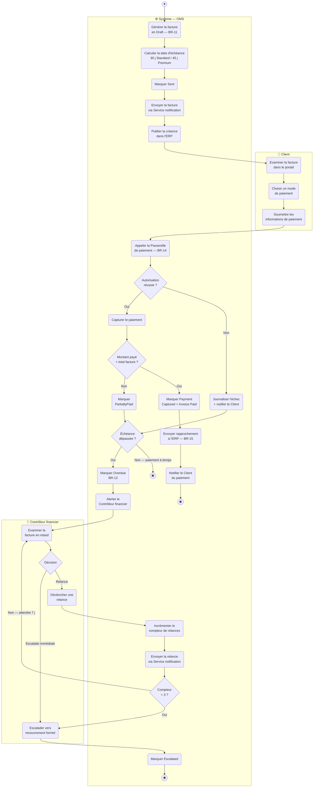
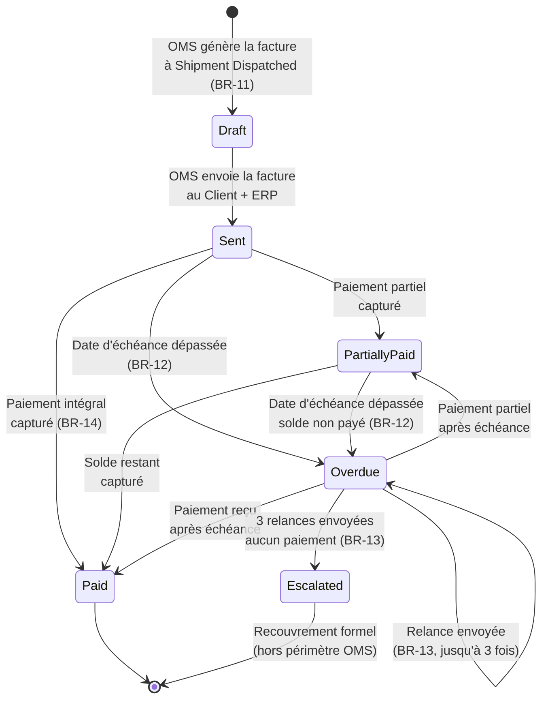
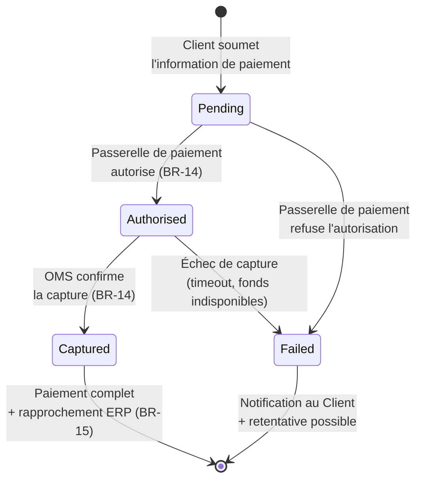
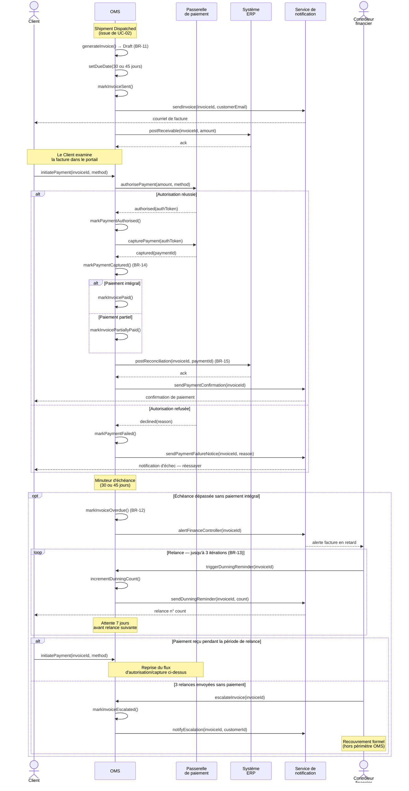

# Solution — UC-03 Traiter la Facture et le Paiement (Process Invoice and Payment)

**Livrable du Study Case :** 05 (cinquième livrable de la feuille de route)
**Énoncé :** voir le document maître `Study Case.md`, Section 4 (UC-03)
**Périmètre couvert :** comportement détaillé du cas d'utilisation *Process Invoice and Payment* sous quatre angles complémentaires — diagramme d'Activité (chemin nominal de paiement + chemin de retard avec boucle de relance), deux diagrammes d'États (cycle de vie complet de la `Invoice`, incluant les chemins de relance et de paiement partiel ; cycle de vie de la `Payment`), et diagramme de Séquence (interactions avec la Passerelle de paiement, l'ERP et le Service de notification)

Ce document est la solution attendue pour le livrable 05 du Study Case NovaTrade. Il modélise UC-03 *Traiter la Facture et le Paiement* à travers les diagrammes UML pertinents, dans la cohérence stricte avec le diagramme BPMN (livrable 01), le diagramme de cas d'utilisation (livrable 02), et la sortie de UC-02 (livrable 04) — UC-03 étant déclenché par la transition `Shipment → Dispatched` produite à la fin de UC-02.

---

## 1. Cadrage du Cas d'Utilisation

| Élément | Valeur |
|---|---|
| **Acteur principal** | Contrôleur financier (chemin de retard et relances) ; Client (initiation du paiement) |
| **Acteurs secondaires** | Passerelle de paiement (autorisation et capture), Système ERP (rapprochement comptable), Service de notification (envoi facture, confirmations, relances) |
| **Déclencheur** | Une `Shipment` passe à l'état `Dispatched` (issue de UC-02) — l'OMS génère automatiquement une `Invoice` pour la commande associée |
| **Préconditions** | `Order` en statut `Shipped` ; aucune `Invoice` n'existe déjà pour cette commande |
| **États `Invoice` traversés** | `Draft` → `Sent` → `Paid` (chemin nominal) ; `Sent` → `PartiallyPaid` → `Paid` (paiement partiel) ; `Sent` → `Overdue` → `Escalated` (chemin de retard) |
| **États `Payment` traversés** | `Pending` → `Authorised` → `Captured` (chemin nominal) ou `Pending` → `Failed` (échec d'autorisation) |
| **Règles métier mobilisées** | BR-11 (génération automatique de facture, échéance 30/45 j), BR-12 (passage à `Overdue`), BR-13 (jusqu'à 3 relances espacées de 7 j), BR-14 (un paiement n'est complet qu'à la capture), BR-15 (rapprochement ERP à la capture) |

> **📝 Lien avec les livrables précédents**
>
> Ce livrable détaille au Niveau UML ce que le **sous-processus BPMN « Facturation et Recouvrement »** (couloir Finance du livrable 01) avait esquissé au niveau métier. Il introduit deux notions nouvelles par rapport à UC-01 et UC-02 : **un acteur externe critique** (Passerelle de paiement) qui matérialise la frontière entre l'OMS et le monde des paiements, et une **boucle de relance** bornée par un compteur (BR-13, jusqu'à 3 itérations) qui modélise un comportement temporel récurrent. UC-03 produit également **deux diagrammes d'États** (un pour `Invoice`, un pour `Payment`), seul UC du Study Case dans ce cas — parce que les deux entités ont des cycles de vie distincts et complémentaires qu'aucune des deux ne porte intégralement.

---

## 2. Diagramme d'Activité

Trois couloirs sont nécessaires : **Client** (point d'interaction humain pour l'examen de la facture et l'initiation du paiement), **Contrôleur financier** (acteur primaire du chemin de retard — alerte, envoi des relances, escalade), et **Système** (toutes les actions automatiques de l'OMS, incluant les appels à la Passerelle de paiement, à l'ERP et au Service de notification, considérés comme des dépendances internes du système). Les trois acteurs n'agissent **pas** simultanément : le Client est sollicité sur le chemin nominal, le Contrôleur financier est sollicité uniquement si l'échéance est dépassée.

> **Lecture du diagramme :** le flux démarre **automatiquement** dans le couloir Système (`S1` — `S5`) au moment de la transition `Shipment → Dispatched` héritée de UC-02. Le couloir **Client** intervient ensuite pour les trois actions d'interaction (examen, choix du mode, soumission) — autant d'écrans candidats du portail OMS. Le couloir Système orchestre l'autorisation et la capture via la Passerelle de paiement. La décision `S15` ouvre le **chemin de retard** : si l'échéance est dépassée sans paiement complet, le Contrôleur financier entre dans le flux pour décider d'envoyer une relance ou d'escalader. La boucle `F1 → F2 → S18 → S19 → S20 → F1` matérialise les trois itérations de relance espacées de 7 jours (BR-13) ; elle se termine soit par un paiement reçu (sortie hors de la boucle vers `EndOK`/`EndPartial`, non re-tracée pour la lisibilité), soit par escalade (`EndEsc`). Trois fins distinctes nommées : `EndOK` (facture entièrement payée), `EndPartial` (paiement partiel, solde encore dû mais à temps), `EndEsc` (escalade après 3 relances). Chaque action du couloir Système deviendra une méthode au livrable 06.

> **ℹ️ Note sur la simplification du diagramme**
>
> Pour rester lisible, le diagramme ne re-trace pas le retour dans la boucle de relance lorsqu'un paiement complet arrive **pendant** la période de relance (l'échéance est dépassée mais le Client paie après une relance). Sémantiquement, ce chemin est couvert par les transitions `Overdue → Paid` et `Overdue → PartiallyPaid` du diagramme d'États ci-dessous. Une variante plus exhaustive (cf. Section 8) pourrait expliciter ces sorties dans le diagramme d'Activité, au prix d'un croisement de flux supplémentaire.

---

## 3. Diagramme d'États — Cycle de vie de la `Invoice`

Le diagramme d'États couvre le **cycle de vie complet** de la `Invoice` dans UC-03, depuis sa création (`Draft`) jusqu'à sa terminaison (`Paid`, `Escalated` ou `Cancelled`). Tous les états listés en Section 2 du `Study Case.md` pour `Invoice` sont atteignables ici, à l'exception de `Cancelled` (qui correspond à un retour, hors périmètre du Study Case — listé pour cohérence mais non tracé en transition active).

> **Lecture du diagramme :** sept états traversables, deux états terminaux (`Paid` et `Escalated`). La transition réflexive `Overdue → Overdue` modélise les itérations de relance — chaque envoi de relance reste dans l'état `Overdue` mais incrémente un compteur de relances (attribut `dunningCount` à matérialiser dans le Class Diagram livrable 06). La symétrie `Sent → Overdue` et `PartiallyPaid → Overdue` reflète BR-12 : tant que le solde n'est pas réglé à la date d'échéance, la facture bascule en retard, qu'un paiement partiel ait été reçu ou non. Les deux transitions `Overdue → Paid` et `Overdue → PartiallyPaid` permettent au Client de régler **après** la date d'échéance — la facture sort de retard sans escalade tant que le compteur n'a pas atteint 3.

---

## 4. Diagramme d'États — Cycle de vie de la `Payment`

Contrairement à UC-01 et UC-02, UC-03 produit un **second diagramme d'États** parce que `Payment` a un cycle de vie propre, indépendant de celui de `Invoice`. Une `Invoice` peut être associée à plusieurs `Payment` (paiement initial échoué, retentative, paiement partiel, solde…) et chaque `Payment` traverse son propre cycle.

> **Lecture du diagramme :** quatre états, deux états terminaux (`Captured`, `Failed`). BR-14 est explicitement matérialisé par les deux transitions vers `Authorised` puis `Captured` — un paiement seulement `Authorised` n'est **pas** considéré comme complet, ce qui justifie la transition supplémentaire vers `Captured`. La transition `Authorised → Failed` couvre le cas (rare mais réel) où l'autorisation réussit mais la capture échoue ultérieurement (par exemple en cas de timeout côté Passerelle ou de fonds devenus indisponibles entre l'autorisation et la capture). À la transition `Captured → [*]`, l'OMS déclenche le rapprochement ERP (BR-15) et marque la `Invoice` associée comme `Paid` (ou `PartiallyPaid` selon le montant) — c'est le point de jonction entre les deux diagrammes d'États.

> **🛂 Synchronisation `Invoice` ↔ `Payment`**
>
> Les transitions critiques de `Invoice` sont **déclenchées** par les transitions de `Payment` :
>
> - `Payment: → Captured` ⇒ `Invoice: → Paid` (si `payment.amount = invoice.amount`) ou `Invoice: → PartiallyPaid` (si `payment.amount < invoice.amount`)
> - `Payment: → Failed` ⇒ aucun changement d'état de la `Invoice` (elle reste `Sent` ou `Overdue` selon où elle se trouve)
>
> Cette double horloge (cycle propre `Invoice` + cycle propre `Payment`) reflète la réalité métier : une facture peut **survivre** plusieurs paiements échoués avant d'être réglée. C'est pourquoi modéliser un seul diagramme d'États en fusionnant les deux cycles serait incorrect — on perdrait la distinction entre le cycle de la créance et celui de la transaction.

---

## 5. Diagramme de Séquence

Le diagramme de Séquence est **justifié** par la présence de la Passerelle de paiement (système externe critique dont le contrat d'interaction doit être documenté précisément) et de deux systèmes secondaires (ERP, Service de notification). Il documente l'ordre des messages, les fragments alternatifs (succès/échec d'autorisation, paiement complet/partiel, chemin de retard) et la boucle bornée des relances que le diagramme d'Activité ne capture pas finement.

> **Lecture du diagramme :** six lignes de vie — le Client et le Contrôleur financier comme acteurs (silhouettes), l'OMS comme système conçu, la Passerelle de paiement, l'ERP et le Service de notification comme systèmes secondaires. Le premier fragment `alt` distingue autorisation réussie vs. autorisation refusée — la branche succès contient un sous-fragment imbriqué qui distingue paiement intégral vs. paiement partiel (cohérent avec les deux transitions sortantes `Sent → Paid` / `Sent → PartiallyPaid` du diagramme d'États). Le fragment `opt` modélise le chemin de retard, conditionnel : il n'est exécuté que si l'échéance est dépassée. À l'intérieur, le fragment `loop` matérialise BR-13 (jusqu'à 3 itérations de relance) et la note d'attente de 7 jours rend explicite le caractère temporisé de la boucle. Le second fragment `alt` final tranche entre une issue heureuse (paiement reçu pendant la période de relance) et une issue d'escalade.

---

## 6. Justification des Choix de Modélisation

### Trois couloirs distincts (Client, Contrôleur financier, Système)

UC-03 implique deux acteurs humains qui agissent à des **moments distincts** du processus : le Client paie, le Contrôleur financier traite les retards. Aucun ne se substitue à l'autre. Conformément à la convention « Couloirs Acteurs / Système », chacun obtient son couloir. Regrouper Client et Contrôleur financier dans un couloir « Acteurs humains » serait une violation explicite de la règle (« jamais de couloir générique regroupant plusieurs acteurs distincts ») et masquerait surtout le fait que ces deux rôles auront des **écrans applicatifs différents** — un portail Client pour le paiement, une console Finance pour le traitement des retards.

### Deux diagrammes d'États distincts (`Invoice` et `Payment`)

`Invoice` représente la **créance** ; `Payment` représente la **transaction** qui la règle. Une créance peut survivre plusieurs transactions échouées (retentatives) ou être réglée par plusieurs transactions partielles. Fusionner les deux cycles en un seul diagramme produirait un état hybride non interprétable (par exemple, que signifierait `Invoice: Sent / Payment: Failed` dans un état combiné ?). Les deux entités méritent leur propre cycle de vie, avec des points de synchronisation explicites (cf. encart « Synchronisation `Invoice` ↔ `Payment` »). Cette séparation est **justifiée** par BR-14 : le standard métier distingue explicitement l'autorisation et la capture, et la même `Invoice` peut être associée à plusieurs `Payment`.

### Boucle de relance bornée par compteur (BR-13)

La boucle `Overdue → Overdue` (transition réflexive dans le diagramme d'États) et le fragment `loop` (dans le diagramme de Séquence) matérialisent la même règle BR-13 sous deux angles complémentaires : le diagramme d'États rend visible le maintien dans l'état `Overdue` à chaque relance ; le diagramme de Séquence rend visible le caractère temporisé (7 jours d'attente entre itérations) et l'arrêt à 3 itérations. Le **compteur de relances** (`dunningCount`) sera un attribut de `Invoice` au livrable 06 — il pilote la décision `S20` du diagramme d'Activité.

### La génération de facture est une action automatique en couloir Système

La génération de la facture (BR-11) est déclenchée **automatiquement** par la transition `Shipment → Dispatched` héritée de UC-02 — il n'y a **pas** d'acteur humain qui appuie sur un bouton « Générer la facture ». Modéliser cela comme une action humaine du Contrôleur financier serait incorrect (le Contrôleur ne crée pas les factures, il traite uniquement les retards). C'est pourquoi le diagramme d'Activité commence directement par `S1` dans le couloir Système, sans précondition d'action humaine.

### La Passerelle de paiement n'apparaît qu'en Séquence, pas en Activité

Comme dans UC-01 et UC-02, les acteurs secondaires de type « système » (Passerelle de paiement, ERP, Service de notification) ne sont **pas** modélisés comme des couloirs séparés du diagramme d'Activité. Ils sont considérés comme des **dépendances internes** de l'OMS du point de vue de l'Activité (les actions sont dans le couloir Système avec mention « via Passerelle de paiement », « via ERP »…) et apparaissent comme lignes de vie distinctes du diagramme de Séquence (qui est précisément l'outil approprié pour documenter les interactions inter-systèmes). Cette répartition évite la duplication entre Activité et Séquence, et conserve la lisibilité du diagramme d'Activité (3 couloirs au lieu de 6).

### Distinction `authorisePayment` vs. `capturePayment` (BR-14)

BR-14 stipule explicitement qu'un paiement n'est complet qu'à la **capture**, pas à la simple **autorisation**. Cette distinction est intrinsèque au modèle de paiement par carte (réservation de fonds → débit effectif). Le diagramme de Séquence fait apparaître les deux appels distincts à la Passerelle (`authorisePayment` puis `capturePayment`) et le diagramme d'États de `Payment` fait apparaître les deux transitions distinctes (`Pending → Authorised → Captured`). Modéliser un appel unique « processPayment » qui ferait les deux à la fois masquerait BR-14 et empêcherait de représenter le cas (rare mais réel) d'une autorisation réussie suivie d'une capture échouée.

### Paiement partiel modélisé comme état distinct, pas comme variation d'attribut

Le paiement partiel n'est **pas** simplement « la même chose que `Paid` mais avec un montant inférieur ». C'est un état **distinct** (`PartiallyPaid`) parce qu'il déclenche un comportement différent de l'OMS (suivi du solde restant, alerte au Contrôleur financier, possibilité que l'échéance soit ensuite dépassée pour le solde). Le diagramme d'États rend ce comportement visible avec ses propres transitions sortantes (`PartiallyPaid → Paid`, `PartiallyPaid → Overdue`).

---

## 7. Cohérence Inter-Diagrammes

| Vérification | Statut |
|---|---|
| Acteurs du diagramme d'Activité (Client, Contrôleur financier, Système) ⊆ acteurs des UC `Process Invoice` / `Process Payment` / `Send Dunning Reminder` du livrable 02 | ✓ |
| États atteints dans le diagramme de Séquence (`Draft`, `Sent`, `Paid`, `PartiallyPaid`, `Overdue`, `Escalated`) ⊆ états du diagramme d'États `Invoice` | ✓ |
| États de `Payment` (`Pending`, `Authorised`, `Captured`, `Failed`) du diagramme de Séquence ⊆ états du diagramme d'États `Payment` | ✓ |
| Actions du couloir Système ⇆ messages internes (`OMS->>OMS`) du diagramme de Séquence | ✓ (correspondance ligne à ligne) |
| Règles métier (BR-11, BR-12, BR-13, BR-14, BR-15) référencées dans les diagrammes appropriés | ✓ |
| Tâches BPMN du sous-processus « Facturation et Recouvrement » (livrable 01) ⇆ actions du couloir Système | ✓ |
| Synchronisation `Invoice` ↔ `Payment` documentée (transition `Captured` ⇒ marquage `Invoice`) | ✓ |
| Déclencheur UC-03 cohérent avec sortie UC-02 (`markShipmentDispatched()` du livrable 04 ⇆ `Shipment Dispatched` en note initiale) | ✓ |

---

## 8. Variantes Acceptables

### Couloirs Système séparés pour les sous-systèmes (Passerelle de paiement, ERP, Notification)

Tracer un couloir Système OMS, un couloir Passerelle de paiement, un couloir Système ERP, et un couloir Service de notification dans le diagramme d'Activité, au lieu d'un seul couloir Système. Avantage : on visualise immédiatement les frontières inter-systèmes. Inconvénient : duplication avec le diagramme de Séquence, plus de couloirs à lire. **Acceptable** pour des audiences techniques mais non recommandé ici.

### Modéliser la boucle de relance comme un sous-processus

La boucle `S18 → S19 → S20` (incrémenter, envoyer, vérifier) pourrait être encapsulée dans un sous-processus « Gérer le cycle de relance » avec son propre diagramme d'Activité. Avantage : modularité et réutilisabilité (la même logique de relance avec compteur peut s'appliquer à d'autres contextes). Inconvénient : ajoute un niveau d'abstraction pour un cas relativement simple. **Acceptable** si la logique de relance doit évoluer indépendamment.

### Sortir de la boucle de relance par un paiement reçu

Le diagramme d'Activité ci-dessus ne re-trace pas explicitement la sortie de la boucle de relance par un paiement Client (le paiement après échéance est mentionné en note et couvert par le diagramme d'États). Une variante plus complète tracerait une transition supplémentaire `F1 → S6` (le Contrôleur examine la facture en retard, le Client paie pendant ce temps, le flux retourne à l'autorisation de paiement). Avantage : exhaustivité. Inconvénient : croisement de flux supplémentaire qui réduit la lisibilité du diagramme. **Acceptable** dans une seconde itération.

### Bordure Minuteur explicite pour l'échéance

Plutôt qu'une décision `S15` (Échéance dépassée ?), on peut modéliser un Événement Intermédiaire Minuteur (*Boundary Timer Event*) attaché à l'état `Sent` qui déclenche automatiquement la transition vers `Overdue` à la date d'échéance. C'est plus expressif mais moins lisible pour les apprenants débutants. **Acceptable** dans une seconde itération du modèle ou pour une formalisation BPMN équivalente.

### Diagramme d'États unifié `Invoice + Payment`

Tracer un seul diagramme d'États qui combine les états de `Invoice` et de `Payment` sous forme d'états composites (par exemple, un état `Sent` contenant un sous-état `Payment.Pending`, etc.). Avantage : une seule vue de la dynamique complète. Inconvénient : perte de la séparation conceptuelle entre la créance et la transaction, lisibilité réduite, difficile à maintenir si le nombre de paiements partiels augmente. **Non recommandé** mais acceptable comme exercice avancé sur les états composites UML.

---

## 9. Cohérence avec les Livrables Suivants

- **Livrable 06 — Diagramme de Classes.** Les actions du couloir Système ci-dessus deviendront des méthodes des classes pertinentes :
  - `generateInvoice()`, `setDueDate()`, `markInvoiceSent()`, `markInvoicePaid()`, `markInvoicePartiallyPaid()`, `markInvoiceOverdue()`, `markInvoiceEscalated()`, `incrementDunningCount()` → méthodes de la classe `Invoice` (avec attribut `dunningCount` pour la borne de BR-13)
  - `markPaymentAuthorised()`, `markPaymentCaptured()`, `markPaymentFailed()` → méthodes de la classe `Payment` (et héritage `StripePayment` / `BankTransfer` selon le mode choisi par le Client à l'action `C2`)
  - `authorisePayment()`, `capturePayment()` → méthodes utilitaires de la classe `Payment` qui interagissent avec la Passerelle de paiement
  - `postReceivable()`, `postReconciliation()` → méthodes interagissant avec le Système ERP
  - `triggerDunningReminder()`, `escalateInvoice()` → méthodes de `Invoice` invoquées depuis l'écran du Contrôleur financier

- **Livrable 07 — Audit d'Intégration.** Les diagrammes ci-dessus seront comparés au sous-processus BPMN « Facturation et Recouvrement » (livrable 01) et aux cas d'utilisation `Process Invoice`, `Process Payment` et `Send Dunning Reminder` (livrable 02) pour vérifier la cohérence de bout en bout. Les transitions de la `Invoice` et de la `Payment` seront consolidées dans les diagrammes d'États globaux, et les méthodes identifiées dans la Section 9 ci-dessus seront vérifiées comme présentes dans le diagramme de Classes (livrable 06) — chaque méthode du Class Diagram doit avoir au moins une action d'Activité qui la déclenche, et inversement, chaque action Système doit posséder sa méthode correspondante.

---

*Livrable suivant : `Study Case - Class Diagram.md`*
