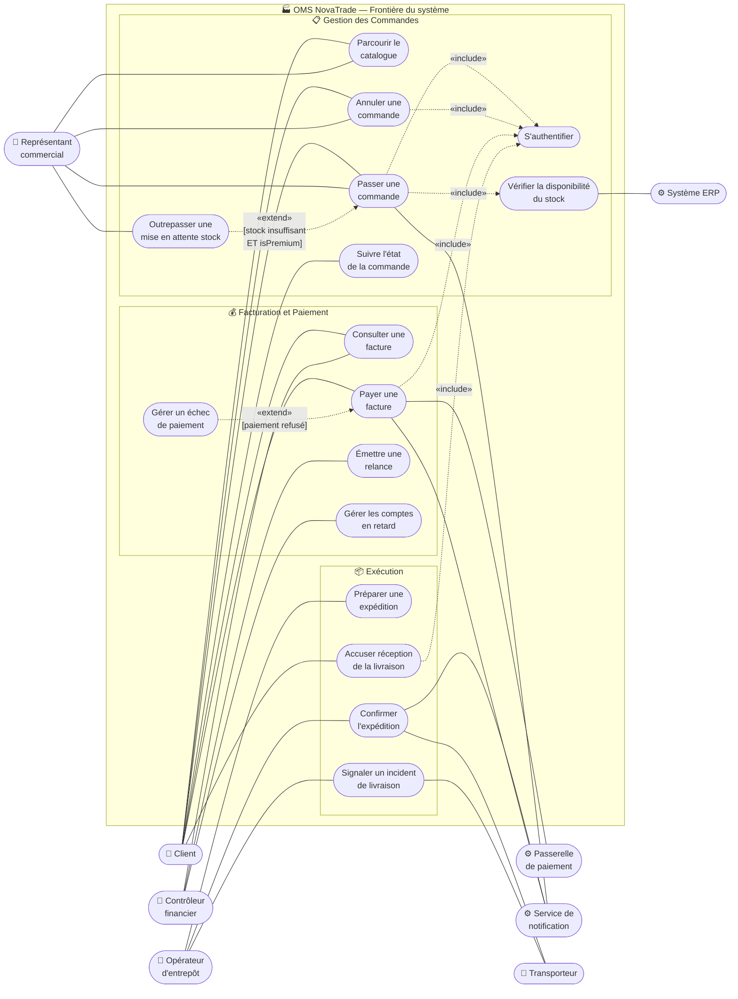

# Solution — Diagramme de Cas d'Utilisation OMS NovaTrade

**Livrable du Study Case :** 02 (deuxième livrable de la feuille de route)
**Énoncé :** voir le document maître `Study Case.md`
**Périmètre couvert :** identification des acteurs, inventaire des cas d'utilisation que l'OMS NovaTrade doit offrir, frontière du système, relations d'inclusion (*include*) et d'extension (*extend*) entre cas d'utilisation

Ce document est la solution attendue pour le diagramme de cas d'utilisation (*Use Case Diagram*) du Study Case NovaTrade. Il présente les acteurs identifiés, l'inventaire des cas d'utilisation regroupés par domaine métier, le diagramme complet, les relations d'inclusion et d'extension, et la transition vers les livrables d'analyse fonctionnelle qui suivront (UC-01, UC-02, UC-03).

---

## 1. Cadrage de l'Exercice

Le diagramme de cas d'utilisation est dérivé du **diagramme BPMN** produit au livrable 01 selon la **table de transposition BPMN ↔ UML** (Section 5.1 du document `Study Case.md`) :

- Les **piscines externes** (Client, Transporteur) deviennent des **acteurs primaires/secondaires**.
- Les **couloirs internes** de NovaTrade (Vente, Exécution, Finance) correspondent aux **acteurs primaires** humains (Représentant commercial, Opérateur d'entrepôt, Contrôleur financier).
- Les **tâches métier supportées par le système** dans le BPMN deviennent des **cas d'utilisation candidats**.
- Les **systèmes invoqués** par l'OMS (ERP, Passerelle de paiement, Service de notification) deviennent des **acteurs secondaires de type système**.

> **📝 Mémo de cadrage**
>
> - **Frontière du système :** OMS NovaTrade — toutes les fonctionnalités sont à l'intérieur de la frontière ; les acteurs sont à l'extérieur.
> - **Acteurs primaires (4) :** Client, Représentant commercial, Opérateur d'entrepôt, Contrôleur financier — initient des cas d'utilisation pour atteindre un objectif.
> - **Acteurs secondaires (4) :** Système ERP, Passerelle de paiement, Service de notification, Transporteur — sont invoqués par l'OMS ou reçoivent ses sorties.
> - **L'OMS lui-même n'est PAS un acteur** : c'est la frontière du système, contenant les cas d'utilisation (cf. Section 1 du document `Study Case.md`).

---

## 2. Identification des Acteurs

| Acteur                                               | Type                 | Position graphique | Objectif principal / interaction                                  |
| ---------------------------------------------------- | -------------------- | ------------------ | ----------------------------------------------------------------- |
| **Client** (*Customer*)                              | Primaire (humain)    | Gauche             | Passer une commande, suivre la livraison, payer la facture        |
| **Représentant commercial** (*Sales Representative*) | Primaire (humain)    | Gauche             | Assister les clients, gérer les exceptions de stock               |
| **Opérateur d'entrepôt** (*Warehouse Operator*)      | Primaire (humain)    | Gauche             | Préparer et expédier les commandes                                |
| **Contrôleur financier** (*Finance Controller*)      | Primaire (humain)    | Gauche             | Gérer les factures en retard, déclencher les relances             |
| **Système ERP** (*ERP System*)                       | Secondaire (système) | Droite             | Répondre aux requêtes de stock, recevoir les écritures comptables |
| **Passerelle de paiement** (*Payment Gateway*)       | Secondaire (système) | Droite             | Autoriser et capturer les paiements                               |
| **Service de notification** (*Notification Service*) | Secondaire (système) | Droite             | Délivrer les courriels et SMS aux clients                         |
| **Transporteur** (*Carrier*)                         | Secondaire (externe) | Droite             | Collecter et livrer les expéditions, fournir les numéros de suivi |

---

## 3. Inventaire des Cas d'Utilisation

Les cas d'utilisation sont regroupés par domaine métier. Chacun satisfait les **trois critères de validité** d'un cas d'utilisation : (a) délivre une valeur observable à au moins un acteur, (b) est initié par un acteur (pas auto-déclenché par le système seul), (c) a un objectif clair qui peut réussir ou échouer du point de vue de l'acteur.

### Domaine Gestion des Commandes (*Order Management*)

| Cas d'Utilisation | Acteur(s) initiateur(s) | Description |
|---|---|---|
| **Parcourir le catalogue** (*Browse Catalogue*) | Client / Représentant commercial | Consulter les produits disponibles |
| **Passer une commande** (*Place Order*) | Client / Représentant commercial | Créer et soumettre une commande |
| **Annuler une commande** (*Cancel Order*) | Client / Représentant commercial | Annuler une commande avant `InFulfilment` (BR-05) |
| **Suivre l'état d'une commande** (*Track Order Status*) | Client | Consulter l'avancement de sa commande |
| **Outrepasser une mise en attente stock** (*Override Stock Hold*) | Représentant commercial | Autoriser une expédition partielle pour un Client Premium (BR-06) — *cas d'extension* |

### Domaine Exécution (*Fulfilment*)

| Cas d'Utilisation | Acteur(s) initiateur(s) | Description |
|---|---|---|
| **Préparer une expédition** (*Prepare Shipment*) | Opérateur d'entrepôt | Prélever, emballer, marquer prête (BR-08) |
| **Confirmer l'expédition** (*Confirm Dispatch*) | Opérateur d'entrepôt | Marquer l'expédition comme remise au Transporteur (BR-09) |
| **Accuser réception de la livraison** (*Acknowledge Delivery*) | Client | Confirmer la livraison reçue (BR-10) |
| **Signaler un incident de livraison** (*Report Delivery Issue*) | Opérateur d'entrepôt / Transporteur | Gérer une exception de livraison |

### Domaine Facturation et Paiement (*Invoice & Payment*)

| Cas d'Utilisation | Acteur(s) initiateur(s) | Description |
|---|---|---|
| **Consulter une facture** (*View Invoice*) | Client / Contrôleur financier | Visualiser une facture émise |
| **Payer une facture** (*Pay Invoice*) | Client | Régler une facture via Passerelle de paiement (BR-14) |
| **Gérer un échec de paiement** (*Handle Payment Failure*) | — | Réagir à un refus de la Passerelle de paiement — *cas d'extension* |
| **Émettre une relance** (*Issue Dunning Reminder*) | Contrôleur financier | Envoyer une relance pour facture en retard (BR-13) |
| **Gérer les comptes en retard** (*Manage Overdue Accounts*) | Contrôleur financier | Suivre les factures `Overdue` jusqu'à l'escalade |

### Cas d'utilisation inclus (*included*)

| Cas d'Utilisation | Inclus par |
|---|---|
| **S'authentifier** (*Authenticate User*) | Passer une commande, Annuler une commande, Payer une facture, Accuser réception |
| **Vérifier la disponibilité du stock** (*Check Stock Availability*) | Passer une commande |

---

## 4. Le Diagramme Complet

> **Lecture du diagramme :** quatre acteurs primaires à gauche, quatre acteurs secondaires à droite, frontière du système au centre regroupant **trois domaines métier** (Gestion des Commandes, Exécution, Facturation et Paiement) — la même structure que les couloirs de la piscine NovaTrade au Niveau 1 BPMN. Les associations directes entre acteurs et cas d'utilisation sont en traits pleins. Les relations `«include»` (toujours exécutées) et `«extend»` (conditionnellement exécutées) sont en pointillés avec leur stéréotype et, pour les `«extend»`, leur condition de déclenchement entre crochets.

---

## 5. Relations d'Inclusion et d'Extension

### Relations « include » — comportements obligatoires

Une relation `«include»` exprime un comportement **toujours** exécuté par le cas d'utilisation incluant. Si le sous-comportement peut être absent dans certaines exécutions, ce n'est pas un `«include»`.

| Cas incluant → Cas inclus | Justification |
|---|---|
| Passer une commande → S'authentifier | Aucune commande ne peut être passée sans authentification (BR-01) |
| Passer une commande → Vérifier la disponibilité du stock | Le contrôle de stock est systématique avant confirmation (BR-03) |
| Annuler une commande → S'authentifier | L'annulation requiert l'identification de l'initiateur |
| Payer une facture → S'authentifier | Tout paiement requiert l'authentification |
| Accuser réception → S'authentifier | L'accusé de réception requiert l'authentification du Client |

### Relations « extend » — comportements conditionnels

Une relation `«extend»` exprime un comportement **conditionnel** qui s'ajoute au cas étendu uniquement dans certaines circonstances. Le cas étendu doit pouvoir réussir sans l'extension.

| Cas étendant → Cas étendu | Condition de déclenchement |
|---|---|
| Outrepasser une mise en attente stock → Passer une commande | `[stock insuffisant ET isPremium = true]` (BR-06) |
| Gérer un échec de paiement → Payer une facture | `[Passerelle de paiement renvoie un statut refusé]` (BR-14) |

> **⚠️ Règle de décision : `«include»` ou `«extend»` ?**
>
> Question diagnostique : « Le cas étendu peut-il réussir sans le sous-comportement ? » Si **non**, c'est un `«include»`. Si **oui**, c'est un `«extend»`. *Vérifier le stock* est obligatoire pour passer une commande → `«include»`. *Outrepasser la mise en attente* n'arrive que dans un cas particulier (stock insuffisant ET Premium) → `«extend»`. La distinction n'est pas cosmétique : elle dictera la structure des diagrammes d'activité aux livrables suivants.

---

## 6. Justification des Choix de Modélisation

### L'OMS est la frontière du système, pas un acteur

L'OMS NovaTrade est le système qu'on conçoit. Il apparaît comme la **frontière du système** (*system boundary*) dans laquelle les cas d'utilisation sont placés. Modéliser l'OMS comme un acteur (silhouette à l'extérieur de la frontière) constituerait une erreur conceptuelle fondamentale : un acteur **interagit avec** le système ; le système **n'interagit pas avec lui-même**. Cf. l'avertissement dédié dans la Section 1 du document `Study Case.md`.

### Service de notification : acteur secondaire, pas cas d'utilisation

Le Service de notification est un système externe qui **délivre** les messages que l'OMS génère. Ce n'est pas une fonctionnalité initiée par un acteur — c'est un service appelé par l'OMS lors de l'exécution d'autres cas d'utilisation (*Place Order*, *Confirm Dispatch*, *Pay Invoice*). Modéliser « Envoyer une notification » comme un cas d'utilisation top-level serait une erreur : ce comportement n'a pas d'acteur initiateur ni d'objectif observable indépendant.

### Pas de généralisation entre Client et Représentant commercial

Le Représentant commercial peut faire tout ce qu'un Client peut faire (parcourir le catalogue, passer une commande, l'annuler) plus des actions Sales-spécifiques (outrepasser une mise en attente). On pourrait être tenté de modéliser une relation de généralisation `Représentant commercial —|>— Client`. **À éviter** dans NovaTrade : un Représentant commercial s'authentifie avec un compte employé, dispose de droits administratifs, et n'est pas un Client au sens métier. Modéliser deux acteurs indépendants partageant des associations sur les mêmes cas d'utilisation est plus fidèle et plus sûr.

### `Vérifier la disponibilité du stock` est un `«include»`, pas un cas top-level

La vérification de stock est déclenchée automatiquement par l'OMS lors de la soumission d'une commande. Aucun acteur ne l'initie de manière autonome avec un objectif distinct. C'est donc un comportement **inclus** dans `Passer une commande`. Si NovaTrade décidait d'offrir un cas d'utilisation séparé (par exemple un Représentant commercial qui prépare un devis et veut consulter le stock indépendamment), on aurait alors un cas top-level — ce n'est pas le scénario du Study Case actuel.

### `Générer la facture` n'est pas un cas d'utilisation

La génération de la facture est déclenchée automatiquement quand une expédition passe à `Dispatched` (BR-11). Aucun humain ne l'initie. Ce n'est pas un cas d'utilisation top-level mais un **comportement système interne** déclenché par `Confirmer l'expédition`. Le diagramme d'activité de UC-03 (livrable 05) modélisera cette automatisation.

### Pourquoi quatre acteurs humains primaires distincts

NovaTrade pourrait être modélisé avec un acteur abstrait « Employé » qui généralise Représentant commercial / Opérateur d'entrepôt / Contrôleur financier. **Choix non retenu** ici : les trois rôles ont des cas d'utilisation strictement disjoints (un Représentant commercial ne fait pas d'expédition, un Opérateur d'entrepôt ne traite pas les paiements). La généralisation n'apporterait rien et masquerait la séparation des responsabilités qui sera reflétée dans les couloirs des diagrammes d'activité.

---

## 7. Variantes Acceptables

### Modéliser `S'authentifier` comme acteur secondaire

Au lieu d'un cas d'utilisation inclus, certains praticiens modélisent un acteur secondaire « Système d'authentification » connecté à `Passer une commande`, `Payer une facture`, etc. Avantage : on rend visible la dépendance à un service externe (typiquement un Identity Provider). Inconvénient : on perd la sémantique du `«include»` qui précise que l'authentification fait partie du flux du cas d'utilisation. **Acceptable** pour un projet où l'authentification est un service tiers identifié et critique.

### Élever `Vérifier la disponibilité du stock` au rang de cas top-level

Si le métier permet à un Représentant commercial de vérifier le stock indépendamment (par exemple pour préparer un devis avant qu'un Client ne passe commande), on a alors un cas d'utilisation autonome avec un acteur initiateur. Ce n'est pas le scénario du Study Case mais une variante crédible.

### Regrouper les cas du domaine Exécution

On pourrait fusionner `Préparer une expédition` et `Confirmer l'expédition` en un seul cas d'utilisation `Traiter une expédition`. **Non recommandé** : ces deux étapes ont des conditions de garde différentes (BR-08 sur la préparation, BR-09 sur la confirmation), des moments d'exécution différents (l'attente du Transporteur entre les deux), et la séparation prépare proprement les diagrammes d'activité de UC-02.

### Hiérarchie d'acteurs internes NovaTrade

On pourrait introduire un acteur abstrait « Employé NovaTrade » qui généralise les trois rôles internes. Avantage : factoriser le cas d'utilisation transverse `S'authentifier` qui s'applique à tous. Inconvénient : alourdir le diagramme alors que les rôles ont des associations disjointes. **Optionnel** selon la complexité du contexte — pour cet exercice, on s'en passe.

---

## 8. Cohérence avec les Livrables Suivants

Le diagramme de cas d'utilisation est l'**ancrage fonctionnel** de la chaîne d'analyse. Les livrables suivants en dériveront directement :

- **Livrables 03 à 05 — Diagrammes d'Activité par UC.** Chaque UC clé du Study Case (UC-01 *Place Order*, UC-02 *Fulfil Order*, UC-03 *Process Invoice and Payment*) sera détaillé dans son propre diagramme d'activité, avec **un couloir par acteur de ce UC** plus un couloir Système. Les acteurs présents dans les couloirs d'un diagramme d'activité doivent être **strictement les mêmes** que ceux associés au UC correspondant dans le présent diagramme — c'est la règle de cohérence inter-diagrammes (cf. Section 5.2 du document `Study Case.md`).

- **Livrable 06 — Diagramme de Classes.** Les méthodes du diagramme de classes émergeront des actions Système des diagrammes d'activité (cf. règle de dérivation Activité → Classes énoncée en début du document `Study Case.md`). Les attributs viendront des objets manipulés. Aucun cas d'utilisation du présent diagramme ne devient directement une classe — la traduction passe par les activités.

- **Livrable 07 — Audit d'Intégration Complète.** Le diagramme de cas d'utilisation sera comparé au diagramme BPMN (livrable 01) selon la table de transposition de la Section 5.1 du document `Study Case.md`. Chaque tâche métier supportée par le système dans le BPMN doit correspondre à un cas d'utilisation ici (ou à un comportement encapsulé dans un `«include»` / `«extend»`).

---

*Livrable suivant : `Study Case - UC01 Place Order.md`*
