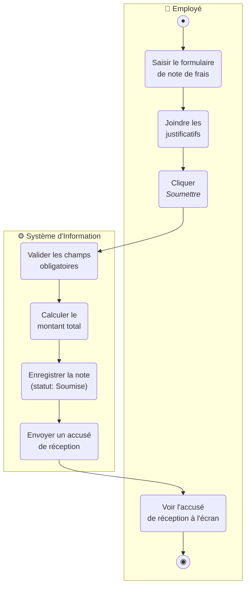
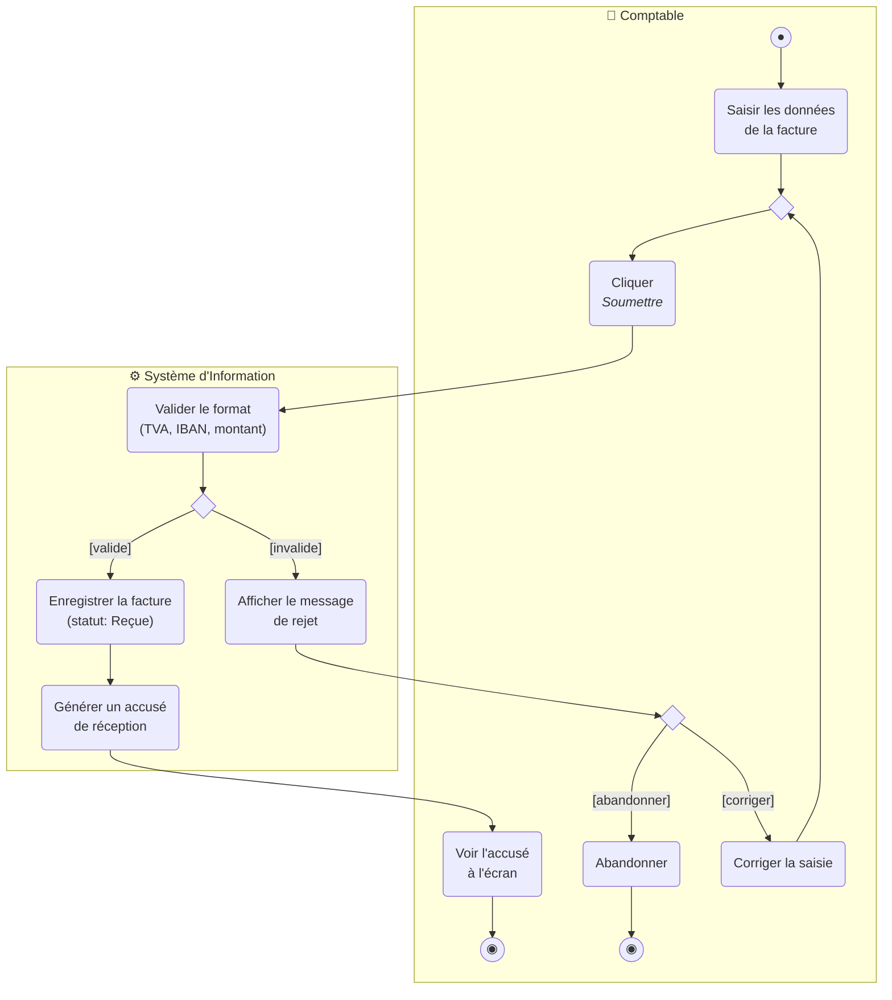
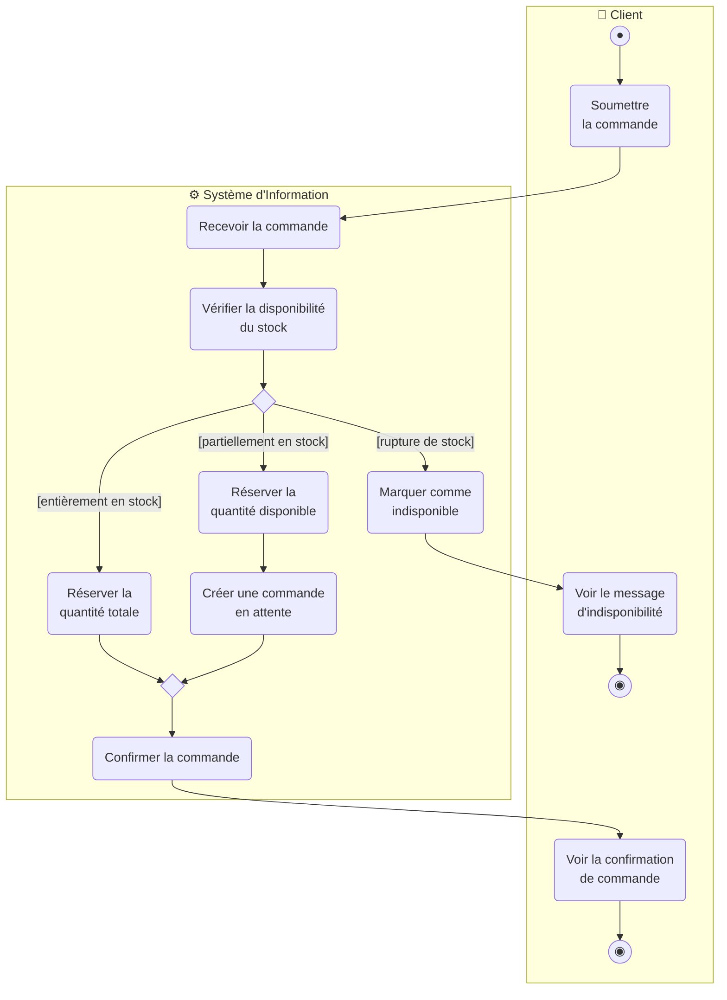
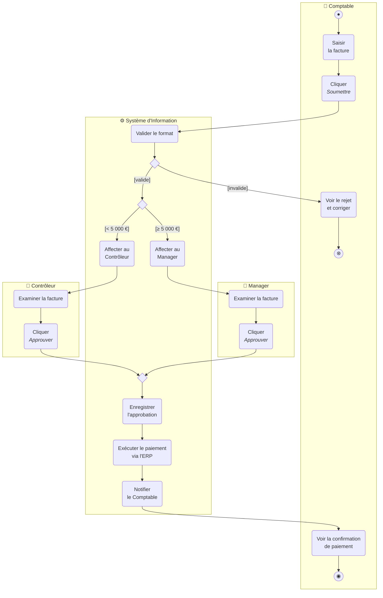
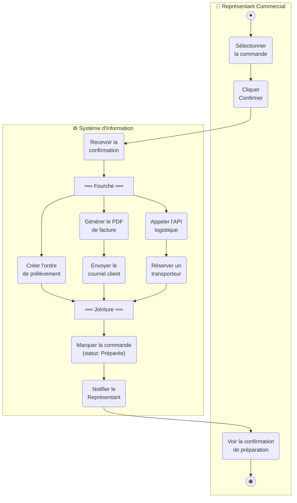
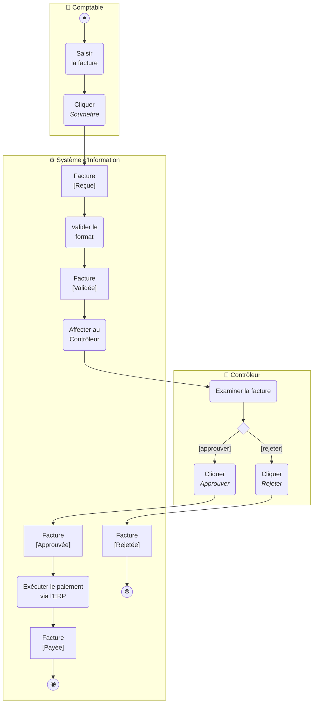
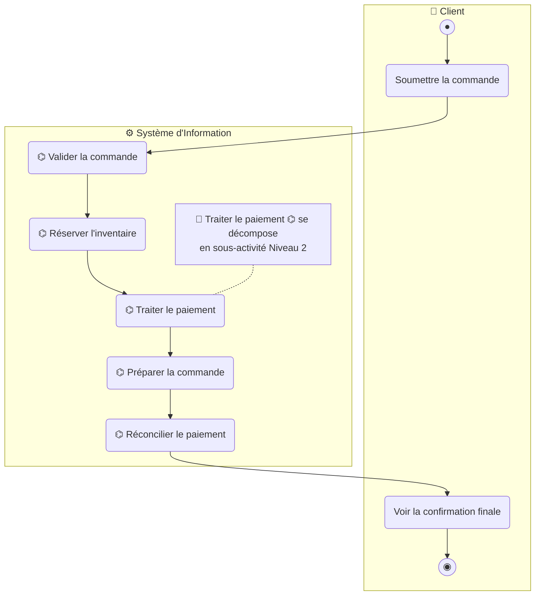
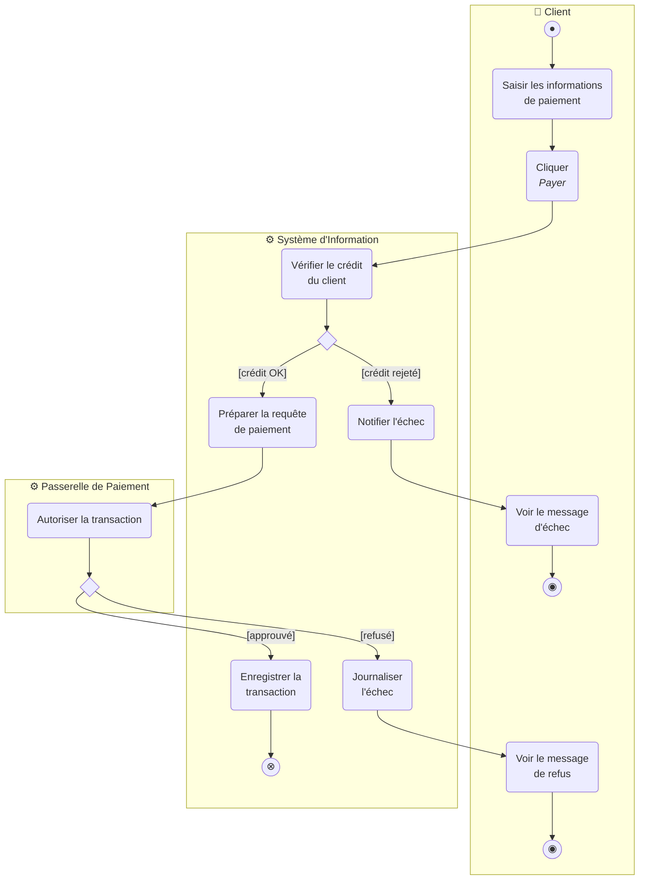
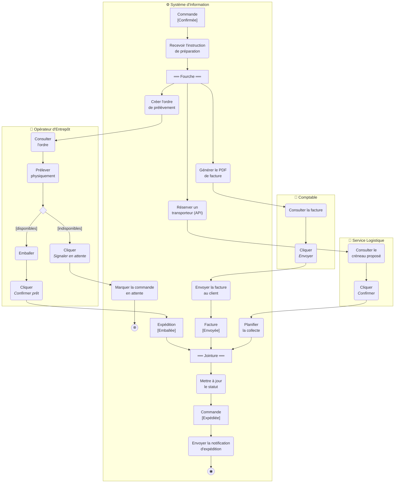
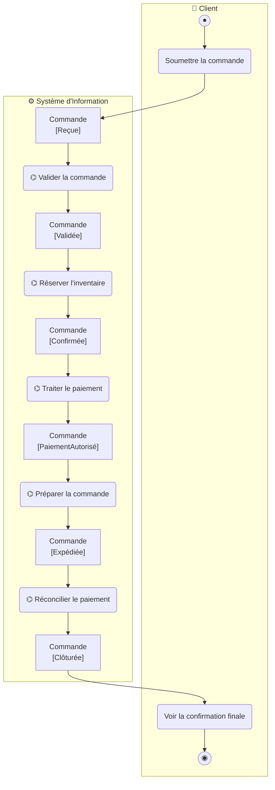

# UML — Diagramme d'Activité — Solutions des Exercices

Cette page rassemble les solutions modèles des neuf exercices sur le diagramme d'activité (*Activity Diagram*) UML appliqué à la spécification de Système d'Information. Chaque solution comporte un diagramme Mermaid corrigé, une justification des choix de modélisation et, lorsque c'est pertinent, les variantes acceptables.

---

## Exercice 01 — Soumission d'une Note de Frais

### Solution proposée

### Justification des choix

**Deux partitions strictement séparées.** Léa décrit un flux entre un humain qui agit via une interface et un système qui exécute du traitement automatisé. Le pattern Acteur + SI matérialise cette frontière : à gauche/dessus le couloir `Employé` (frontend), à droite/dessous le couloir `Système d'Information` (backend). Cette séparation est non négociable dans cette formation — c'est elle qui permet la dérivation cohérente vers les Classes (les actions SI deviennent les opérations) et vers la Séquence (les traversées de partition deviennent les messages).

**Critère de placement des actions.** Léa formule la règle avec précision : « ce qui est fait par le collaborateur via l'interface » → couloir Acteur ; « ce qui est fait par le SI tout seul » → couloir SI. En pratique : si l'action s'exécute sans interface visible (validation, calcul, persistance, envoi), elle est dans SI. Si elle implique un geste utilisateur (saisie, clic, consultation), elle est dans le couloir de l'acteur.

**Action de retour `Voir l'accusé à l'écran` côté Employé.** Sans elle, le diagramme ne montre pas que l'utilisateur a un retour visuel — le flux semble se terminer dans le SI sans boucler vers l'humain. Côté frontend, chaque action SI qui produit un résultat utilisateur doit déclencher une action de réception/affichage côté Acteur. C'est une discipline qui rend le diagramme complet de bout en bout.

**Flux de Contrôle pleins, y compris à la traversée de partition.** En UML Activity, les Flux de Contrôle restent pleins quelle que soit la partition traversée. C'est différent de BPMN où un flux entre piscines distinctes (organisations différentes) devient un Flux de Messages en pointillés. Ici, l'Employé et le SI font partie de la **même organisation** ; les couloirs représentent des rôles à l'intérieur du système global, pas des organisations indépendantes.

### Variantes acceptables

- Le Nœud Final d'Activité peut être placé dans le couloir SI plutôt que dans le couloir Employé si l'on considère que le SI termine l'activité après envoi de l'accusé. Pédagogiquement, le placer côté Employé renforce le message « le flux finit quand l'utilisateur a vu son résultat ».
- L'action `Joindre les justificatifs` peut être omise si le scénario simplifie cette étape — la solution l'inclut pour respecter fidèlement le récit de Léa.

---

## Exercice 02 — Validation d'une Facture avec Décision

### Solution proposée

### Justification des choix

**Deux décisions distinctes, dans deux couloirs distincts.** C'est le point pédagogique central. Karim a précisé qu'on a en réalité deux niveaux de décision :

- Une **décision automatique** dans le couloir SI sur le verdict de validation (`valide` / `invalide`) — c'est le système qui tranche.
- Une **décision humaine** dans le couloir Comptable (`corriger` / `abandonner`) — c'est l'humain qui choisit après avoir vu le rejet.

Les placer toutes les deux dans le couloir SI serait sémantiquement faux : la décision « j'abandonne ou je recommence » appartient à l'utilisateur, pas au système.

**Nœud de Fusion (*Merge Node*) avant `Cliquer Soumettre`.** Deux flux mènent à cette action : le flux nominal (depuis `Saisir les données`) et le flux de retour de correction (depuis `Corriger la saisie`). Pour ne pas dupliquer l'action `Cliquer Soumettre`, on utilise un Merge Node qui fusionne les deux entrées. Sans ce nœud, soit on duplique l'action (incohérence), soit on dessine deux flèches qui convergent sans nœud explicite (sémantique ambiguë).

**Action explicite `Abandonner` avant le Nœud Final.** Karim insiste : sans cette action, on aurait juste une flèche qui sort du Nœud de Décision vers le Nœud Final, ce qui ne capturerait pas le **geste métier** de l'abandon. L'action explicite rend le geste traçable et journalisable — c'est un détail métier important pour la conformité.

**Action SI `Afficher le message de rejet` qui transite directement vers la décision humaine.** Pas d'action intermédiaire « Voir le message de rejet » dans le couloir Comptable, parce que la décision elle-même implique d'avoir vu le message : la voir et la considérer sont la même chose côté analyse. Si l'on voulait insister sur la consultation, on pourrait ajouter une action `Voir le message de rejet` avant le Nœud de Décision — c'est une variante acceptable.

### Variantes acceptables

- Une action `Voir le message de rejet` peut être insérée dans le couloir Comptable avant le Nœud de Décision humaine, pour rendre explicite la consultation. Pédagogiquement, l'omettre montre que voir le rejet et décider sont conceptuellement liés.
- La branche `Corriger la saisie` peut elle-même contenir une action explicite `Modifier la saisie` plutôt qu'une simple flèche de retour vers `Saisir les données` — choix de granularité.

---

## Exercice 03 — Vérification de Stock à Trois Voies

### Solution proposée

### Justification des choix

**Nœud de Décision à trois sorties.** Antoine décrit explicitement trois résultats possibles, pas deux. UML autorise les Nœuds de Décision avec un nombre arbitraire de sorties, à condition que les gardes soient mutuellement exclusives et complètement couvrantes. Ici les trois gardes (`[entièrement en stock]`, `[partiellement en stock]`, `[rupture de stock]`) couvrent tous les cas sans recouvrement — l'apprenant qui modélise quatre sorties ou des gardes qui se chevauchent introduit du non-déterminisme.

**Branche partielle = deux actions séquentielles.** Antoine précise que dans le cas partiel, on fait deux choses « dans la foulée » : réserver le disponible, puis créer le backorder. Donc cette branche contient deux actions séquentielles, pas une seule action composée — chaque action est observable et testable indépendamment.

**Nœud de Fusion (*Merge Node*) avant `Confirmer la commande`.** C'est le second point pédagogique central. Antoine l'a explicitement demandé : « la même conclusion pour les deux, ce qui fait qu'on n'écrit l'action de confirmation qu'une seule fois ». Sans le Nœud de Fusion, on aurait soit deux actions `Confirmer la commande` dupliquées (sale), soit deux flèches convergeant sur la même action sans nœud explicite (sémantique ambiguë). Le Nœud de Fusion rend l'unification du flux explicite.

**Deux Nœuds Finaux d'Activité distincts.** Les deux issues sont des **fins normales** d'activité (pas une normale et une exception) — donc deux Nœuds Finaux d'Activité, l'un côté succès, l'autre côté indisponibilité. Si l'on souhaitait insister sur la nature exceptionnelle de la rupture totale, on pourrait utiliser un Nœud Final de Flux à la place ; ici Antoine a précisé que les deux issues sont des fins normales.

### Variantes acceptables

- L'ordre des branches sortant du Nœud de Décision n'a pas de sémantique ; l'apprenant peut les ordonner différemment selon la lisibilité.
- L'action `Marquer comme indisponible` peut être étoffée d'une action de notification au client pour préfigurer un mécanisme de relance ultérieure (rupture partielle).

---

## Exercice 04 — Approbation de Facture Multi-Acteurs

### Solution proposée

### Justification des choix

**Quatre couloirs : trois acteurs humains + un SI.** Patricia décrit explicitement trois rôles humains (Comptable, Contrôleur, Manager) plus le SI. Chacun a sa partition. Toute tentative de fusion (par exemple un seul couloir « Approbateur » qui regroupe Contrôleur et Manager) gommerait la distinction métier qui justifie l'existence des deux rôles.

**Toutes les décisions de routage dans le couloir SI.** C'est le point pédagogique central. Patricia est explicite : « toutes les décisions de routage et toutes les opérations automatisées sont dans le couloir SI ; les couloirs humains ne contiennent que des actions effectuées via l'interface ». Donc :

- La validation du format → SI.
- Le routage par montant (`< 5 000 €` vs. `≥ 5 000 €`) → SI.
- Les actions d'affectation (`Affecter au Contrôleur`, `Affecter au Manager`) → SI, **pas** dans les couloirs humains. Ce sont des actions automatiques du système qui poussent la facture *vers* l'approbateur.

L'erreur classique consiste à placer `Affecter au Contrôleur` dans le couloir Contrôleur, par confusion entre « pour qui c'est destiné » et « qui exécute ». L'exécution est faite par le SI, donc dans le couloir SI.

**Nœud de Fusion (*Merge Node*) après les deux clics d'approbation.** Deux flux convergent vers `Enregistrer l'approbation` (depuis Contrôleur et depuis Manager). Comme à l'Exercice 03, le Merge Node rend l'unification explicite et évite la duplication.

**Nœud Final de Flux (`⊗`) sur la branche d'erreur de format.** Patricia l'a souligné : « cette branche d'erreur s'arrête là **sans terminer toute l'activité** ». En UML, le **Nœud Final de Flux** (*Flow Final Node*, double cercle barré ou symbole ⊗) termine uniquement la branche courante, sans arrêter l'activité globale. C'est la sémantique exacte demandée. Utiliser un Nœud Final d'Activité ici (`◉`) terminerait toute l'activité, ce qui empêcherait — par exemple — d'autres factures parallèles d'être traitées dans une instance plus large.

### Variantes acceptables

- Le Nœud Final de Flux peut être remplacé par un retour vers `Saisir la facture` pour modéliser explicitement la boucle de correction (comme à l'Exercice 02). La solution actuelle reste plus économique.
- Les deux couloirs Contrôleur et Manager peuvent être consolidés en un seul couloir « Approbateur » avec une décision interne de routage si l'organisation veut souligner la fonction métier commune. Patricia ayant nommé deux rôles distincts, on les modélise distinctement.

---

## Exercice 05 — Préparation de Commande Parallèle (Fourche/Jointure dans le SI)

### Solution proposée

### Justification des choix

**Fourche (*Fork*) pour le démarrage parallèle.** Pauline décrit explicitement trois branches qui « partent simultanément, sans condition entre elles ». C'est la sémantique exacte d'une Fourche UML : un seul jeton entrant, *N* jetons sortants. Aucune garde sur les sorties — toutes les branches sont activées sans condition. Si l'apprenant ajoute des gardes ou utilise un Nœud de Décision à la place, il transforme le parallélisme en alternative et perd la sémantique.

**Jointure (*Join*) pour la synchronisation.** La Jointure attend que les *N* jetons entrants soient tous arrivés avant d'émettre un seul jeton sortant. Pauline a insisté : « une fois les trois branches terminées ». Sans Jointure, le SI continuerait dès la première branche terminée — il marquerait la commande `Préparée` alors qu'elle ne l'est que partiellement.

**Branches asymétriques (1, 2, 2 actions).** La branche Entrepôt n'a qu'une action (`Créer l'ordre de prélèvement`), les deux autres en ont deux séquentielles. C'est cohérent avec ce que décrit Pauline. À l'intérieur d'une branche d'une paire Fourche/Jointure, le flux peut être arbitrairement complexe — séquence, sous-décision, etc. Ce qui compte c'est qu'il finisse par envoyer un jeton à la Jointure.

**Tout le parallélisme dans le couloir SI.** Le Représentant Commercial reste séquentiel — il fait une seule chose à la fois (sélectionner, cliquer, voir). Le parallélisme est purement backend. L'erreur classique consiste à étendre la Fourche à plusieurs couloirs ; ici elle reste interne au SI parce que les opérations parallèles sont toutes des opérations système.

### Variantes acceptables

- Si l'organisation ajoute un mécanisme de notification du Représentant **dès** le démarrage (avant la fin des trois branches), on peut ajouter une quatrième branche purement notificationnelle — qui se synchronise plus tard ou qui termine en flux final dans le SI sans rejoindre la Jointure principale.
- Les libellés des actions peuvent être adaptés au vocabulaire interne ; les noms ici suivent fidèlement le récit de Pauline.

---

## Exercice 06 — Cycle de Vie d'une Facture avec Nœuds d'Objet

### Solution proposée

### Justification des choix

**Nœuds d'Objet entre les actions clés.** Sophie a demandé explicitement de matérialiser les transitions d'état de l'objet `Facture`. Les Nœuds d'Objet (rectangles simples avec étiquette `EntitéMétier [État]`) se placent **entre** les actions ou les nœuds de contrôle ; ils représentent un *jeton d'objet* en transit dans le flux, à un état précis. Cinq Nœuds d'Objet ici : `[Reçue]`, `[Validée]`, `[Approuvée]`, `[Rejetée]`, `[Payée]`.

**Décision Contrôleur : deux clics distincts, pas un Nœud de Décision SI.** Sophie l'a souligné comme « point critique » : ce n'est pas une décision système. C'est un humain qui voit la facture et choisit entre deux boutons distincts dans son interface. La modélisation reflète exactement cela : dans le couloir Contrôleur, après `Examiner la facture`, on a un Nœud de Décision qui sépare deux **actions** (deux clics distincts), pas une condition automatique. Le Nœud de Décision est ici utilisé pour *un branchement humain* — c'est valide en UML, à condition que les actions de chaque branche soient effectivement des gestes utilisateur distincts.

**Cohérence stricte des noms d'états avec le Diagramme de Classes.** Sophie a insisté pour son audit : les étiquettes `Reçue`, `Validée`, `Approuvée`, `Rejetée`, `Payée` doivent strictement correspondre à l'énumération `StatutFacture` du Diagramme de Classes. Une variante orthographique (`Approuvee` sans accent) ou un synonyme (`Validee` au lieu de `Validée`) compromettrait la traçabilité inter-diagrammes — un développeur lisant les deux diagrammes en parallèle doit y trouver exactement les mêmes valeurs.

**Deux types de nœuds finaux distincts.** Le rejet utilise un Nœud Final de Flux (`⊗`), parce que c'est une fin de **branche** — la décision Contrôleur a effectivement été prise et tracée, mais l'activité globale (à plus haut niveau, dans une instance multi-factures) peut continuer. Le succès utilise un Nœud Final d'Activité (`◉`), parce que pour cette instance de facture, on a bien atteint la fin nominale (`Payée`).

### Variantes acceptables

- Les Nœuds d'Objet peuvent être placés en marge du flux principal (à côté des actions, reliés par une flèche pointillée) plutôt que dans la séquence linéaire. Les deux conventions sont valides en UML ; placer dans le flux est plus pédagogique.
- L'action `Affecter au Contrôleur` peut être omise si l'on considère que l'apparition de `[Validée]` côté SI déclenche directement la consultation par le Contrôleur — c'est une simplification acceptable. Conserver l'action explicite renforce la traçabilité.

---

## Exercice 07 — Décomposition Order-to-Cash avec Sous-Activités

### Niveau 1 — Vue d'ensemble

### Niveau 2 — Sous-activité Traiter le paiement

### Justification des choix

**Niveau 1 : cinq Actions d'Appel de Comportement (Call Behavior Actions).** Vincent a demandé de représenter chaque sous-activité non comme une action atomique, mais comme un **appel** vers une activité définie ailleurs. Le marqueur râteau ⌬ (rake symbol) est la convention UML pour indiquer « ceci est appelé, le détail se trouve dans un autre diagramme ». C'est l'analogue en Activity du Sous-processus replié en BPMN.

**Note attachée à `Traiter le paiement ⌬`.** Vincent a précisé qu'une note explicite doit signaler qu'on a déplié cette sous-activité au Niveau 2. C'est une convention de lisibilité — elle aide le lecteur à savoir où aller pour le détail. UML représente ces notes comme des post-its rattachés par une ligne pointillée à l'élément annoté.

**Niveau 2 : trois couloirs (Client, SI, Passerelle).** La Passerelle de Paiement est un acteur secondaire système — externe au SI principal mais partie prenante de l'interaction. Conformément au Use Case (acteur secondaire à droite), on lui accorde un couloir distinct.

**Distinction Nœud Final de Flux (`⊗`) vs. Nœud Final d'Activité (`◉`).** C'est le point pédagogique central de l'exercice. Vincent l'a explicité :

- **Succès Niveau 2 : Nœud Final de Flux (`⊗`)** — termine seulement la sous-activité `Traiter le paiement` et **rend le contrôle au Niveau 1**. L'activité parente continue avec `Préparer la commande ⌬`. Utiliser un Nœud Final d'Activité ici terminerait toute l'activité parente, ce qui contredirait la sémantique d'appel.
- **Échecs côté Client : Nœuds Finaux d'Activité (`◉`)** — pour le Client, c'est terminé, l'activité parente s'arrête aussi. Le Client ne va pas continuer à voir une commande se préparer après un échec de paiement.

Cette distinction est la subtilité UML la plus délicate des exercices — elle est fondamentale pour les hiérarchies d'activités emboîtées.

### Variantes acceptables

- Le Niveau 2 peut être étoffé d'une boucle de retry sur certains échecs Passerelle (timeout, erreur réseau) avant de basculer en `Journaliser l'échec`. L'exercice se contente du flux nominal pour rester abordable.
- Les autres sous-activités (`Valider la commande`, `Réserver l'inventaire`, etc.) peuvent être dépliées de la même manière à des fins pédagogiques — l'Exercice 09 fait précisément cela pour deux d'entre elles.

---

## Exercice 08 — Préparation de Commande Complète Multi-Acteurs

### Solution proposée

### Justification des choix

**Quatre couloirs : trois acteurs humains + SI.** Pauline décrit explicitement trois rôles humains (Opérateur d'Entrepôt, Comptable, Service Logistique) plus le SI orchestrateur. Chacun a sa partition. Le parallélisme s'étend aux quatre couloirs simultanément — c'est ce qui distingue cet exercice de l'Exercice 05 où le parallélisme restait interne au SI.

**Décision « disponibles / indisponibles » dans le couloir Opérateur, pas dans le SI.** Pauline l'a souligné : c'est l'humain qui constate physiquement la disponibilité du stock après prélèvement. La décision est donc dans le couloir Opérateur, et les deux branches contiennent des actions humaines (cliquer "Confirmer prêt" ou cliquer "Signaler en attente"). L'erreur classique consiste à placer cette décision dans le SI — ce serait sémantiquement faux : le SI ne peut pas constater l'état physique du stock, il peut seulement enregistrer ce que l'humain lui dit.

**Branche d'arrêt en attente : Nœud Final de Flux (`⊗`).** Pauline a précisé le cas particulier : si l'Opérateur signale en attente, la branche s'arrête localement. Pas un Nœud Final d'Activité, parce que les autres branches continuent. C'est cohérent avec la doctrine de l'Exercice 04 sur la branche d'erreur de format.

**Limitation acceptée et signalée : la Jointure attend toujours trois jetons.** Pauline a explicitement reconnu cette limitation dans son discours. Si la branche entrepôt s'arrête (Nœud Final de Flux), la Jointure n'aura jamais que deux jetons, donc elle bloque. C'est une limite **sémantique** d'UML standard pour ce type de cas, et la solution la signale honnêtement plutôt que de l'occulter par une modélisation magique. Pour la corriger formellement, il faudrait introduire un mécanisme d'annulation (par exemple, une `Interruptible Activity Region` qui annule les autres branches en cas d'arrêt local) — hors périmètre de cet exercice.

**Nœuds d'Objet aux frontières et aux états intermédiaires.** Conformément à la demande de Pauline : `Commande [Confirmée]` à l'entrée, `Commande [Expédiée]` à la sortie, plus les états intermédiaires `Expédition [Emballée]` (sortie de la branche Entrepôt après emballage) et `Facture [Envoyée]` (sortie de la branche Facture après envoi). La traçabilité des états est complète et alignée avec le Diagramme de Classes.

### Variantes acceptables

- L'Interruptible Activity Region peut être ajoutée pour rendre formellement correct le cas « stock indisponible » — au prix d'une complexité supplémentaire qui dépasse le niveau pédagogique attendu ici.
- Les libellés `Expédition [Emballée]` et `Facture [Envoyée]` peuvent être enrichis (par exemple `[Emballée, Étiquetée]`) selon la granularité souhaitée.

---

## Exercice 09 — Activité Order-to-Cash Complète + Cohérence Inter-Diagrammes

### Niveau 1 enrichi avec Nœuds d'Objet

### Niveau 2 — Réconcilier le paiement

### Justification des choix

**Niveau 1 enrichi : Nœud d'Objet `Commande [<État>]` entre chaque sous-activité.** Vincent a demandé d'expliciter la transition d'état à chaque étape. C'est le moyen le plus direct de matérialiser la traçabilité du cycle de vie au niveau de la vue d'ensemble. Une fois ces six états (`Reçue` → `Validée` → `Confirmée` → `PaiementAutorisé` → `Expédiée` → `Clôturée`) en place, ils servent d'**ancrage** pour la cohérence avec le Diagramme de Classes (l'énumération `Commande.statut`) et avec le diagramme d'État de `Commande` s'il existe.

**Niveau 2 — Réconcilier le paiement : Action d'Acceptation d'Événement.** C'est le seul exercice qui introduit cette construction UML. Vincent l'a justifié : « le SI **n'exécute pas activement** une opération, il **attend un événement externe** ». C'est la sémantique exacte d'une **Accept Event Action** (*Accept Event Action*) — pictogramme **pentagone concave** avec encoche à gauche, rendu en Mermaid par la forme asymétrique `>"text"]` qui matérialise précisément cette encoche. Le flux se met en pause à ce nœud jusqu'à ce que l'événement attendu (ici, la soumission du paiement par le Client) soit reçu ; l'événement « entre » par l'encoche gauche, et le flux reprend.

**Boucle vers l'Action d'Acceptation d'Événement.** Si le paiement est en retard, le SI envoie une relance et **boucle** vers l'Accept Event Action pour attendre à nouveau. Cette boucle modélise un comportement réaliste de relance : on n'abandonne pas après le premier retard, on relance et on attend à nouveau. La condition de sortie de la boucle (un nombre maximum de relances avant escalade juridique) n'est pas modélisée ici par souci de concision — Vincent a accepté ce simplifié pour le diagramme d'activité, le détail vivant dans le diagramme de Séquence.

### Tableau de cohérence inter-diagrammes

| Action SI | Opération de Classe | Message de Séquence | État du Nœud d'Objet | Cohérent ? |
|---|---|---|---|---|
| Valider la commande | `Commande.valider()` | `creerCommande(panier)` | `Commande [Validée]` | ✅ |
| Vérifier le catalogue produit | `Produit.estDisponible()` | — | — | ⚠️ Pas de message Séquence |
| Réserver l'inventaire | `Inventaire.reserver(article)` | `reserverArticle(idArticle, qte)` | `Commande [Confirmée]` | ✅ |
| Vérifier le crédit | `Client.obtenirLimiteCredit()` | — | — | ⚠️ Manquant en Séquence |
| Autoriser le paiement (Passerelle) | `ProcesseurPaiement.autoriser()` | `traiterPaiement(montant)` | `Commande [PaiementAutorisé]` | ✅ |
| Enregistrer la transaction | `Paiement.enregistrer()` | — | — | ⚠️ Op. de Classe à confirmer |
| Mettre à jour le statut Préparée | `Commande.preparer()` | — | `Expédition [Emballée]` | ❌ Op. absente du Diag. de Classes |
| Réconcilier le paiement | `Facture.marquerCommePayee()` | — | `Facture [Payée]` | ⚠️ Manquant en Séquence |
| Mettre à jour le statut Clôturée | `Commande.cloturer()` | — | `Commande [Clôturée]` | ❌ Op. absente du Diag. de Classes |
| Envoyer notification d'expédition | `ServiceNotification.envoyer()` | `envoyerCourrielConfirmation(commande)` | — | ⚠️ Nom incohérent |

> **⚠️ Divergences inter-diagrammes — Recommandations de résolution**
>
> - **`Commande.preparer()` absente du Diagramme de Classes** : ajouter cette opération à la classe `Commande`, ou réutiliser une opération existante équivalente.
> - **`Commande.cloturer()` absente du Diagramme de Classes** : ajouter l'opération ; cohérent avec la transition d'état finale du diagramme d'État de `Commande`.
> - **Action « Vérifier le catalogue produit » sans message Séquence** : ajouter un message `verifierProduit(idProduit)` dans le Diagramme de Séquence avant la réservation d'inventaire.
> - **Action « Vérifier le crédit » sans message Séquence** : ajouter un message correspondant dans le Diagramme de Séquence — c'est un point d'audit critique pour la conformité.
> - **Action « Enregistrer la transaction » : opération de Classe à confirmer** : valider avec l'architecte si `Paiement.enregistrer()` existe ou si l'on doit la créer.
> - **Nom incohérent `ServiceNotification.envoyer()` vs. `envoyerCourrielConfirmation`** : standardiser sur un nom unique entre tous les diagrammes (probablement `envoyerCourrielConfirmation` puisque c'est le nom utilisé en Séquence).

### Justification du tableau de cohérence

**Le tableau est un outil de découverte, pas une checklist de validation.** Les lignes les plus précieuses sont celles marquées ⚠️ ou ❌ — elles révèlent des écarts qui deviendront des défauts d'implémentation s'ils ne sont pas résolus. L'apprenant qui produit un tableau sans aucune divergence soit n'a pas correctement audité, soit a aligné artificiellement les noms sans interroger les vrais diagrammes.

**Trois colonnes de référence (Classe, Séquence, État du Nœud d'Objet)** parce que l'action SI doit être cohérente avec les **trois** dimensions :
- Classe : il faut une **opération** sur la classe destinataire pour exécuter l'action.
- Séquence : il faut un **message** dans le diagramme de séquence quand l'action implique une interaction inter-composants.
- État : quand l'action change l'état d'un objet métier, le Nœud d'Objet aval doit refléter le nouvel état.

Trois écarts différents = trois points d'attention différents. Le tableau les rend tous visibles d'un coup d'œil.

### Variantes acceptables

- Le tableau peut comporter plus de dix lignes si l'apprenant a été exhaustif. Dix est un minimum.
- Les recommandations de résolution peuvent être plus détaillées (deux à trois phrases par divergence) sur les points les plus critiques — la solution se contente d'une phrase pour l'économie.

---

*Énoncés associés : voir `UML Activity Enonces.md`.*
