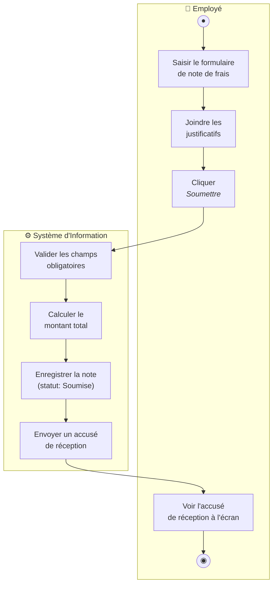
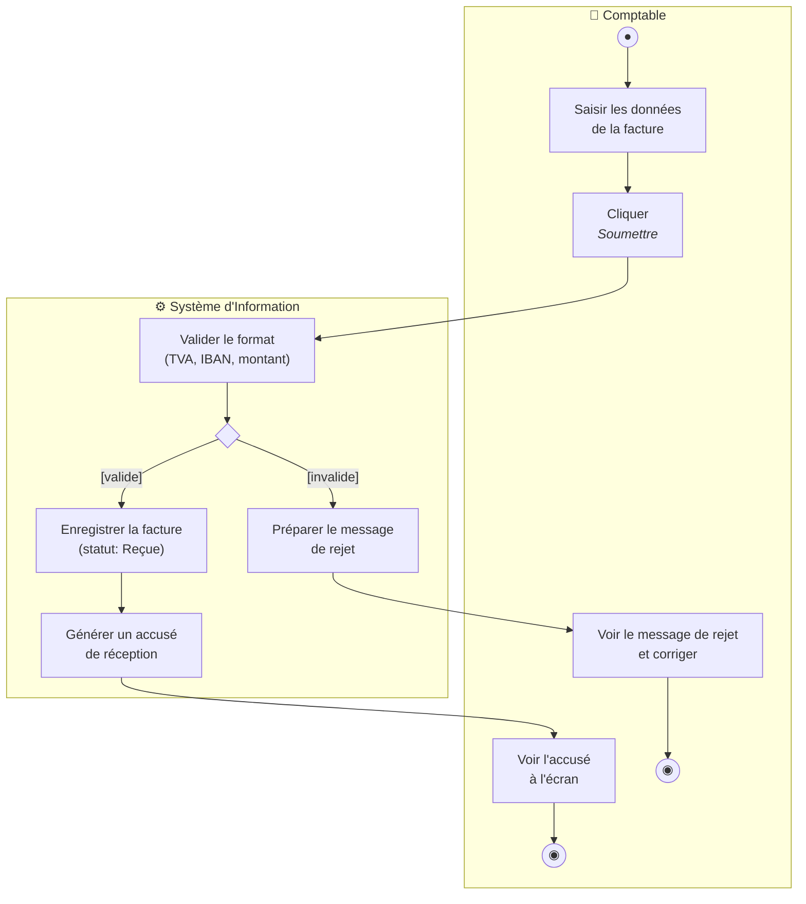
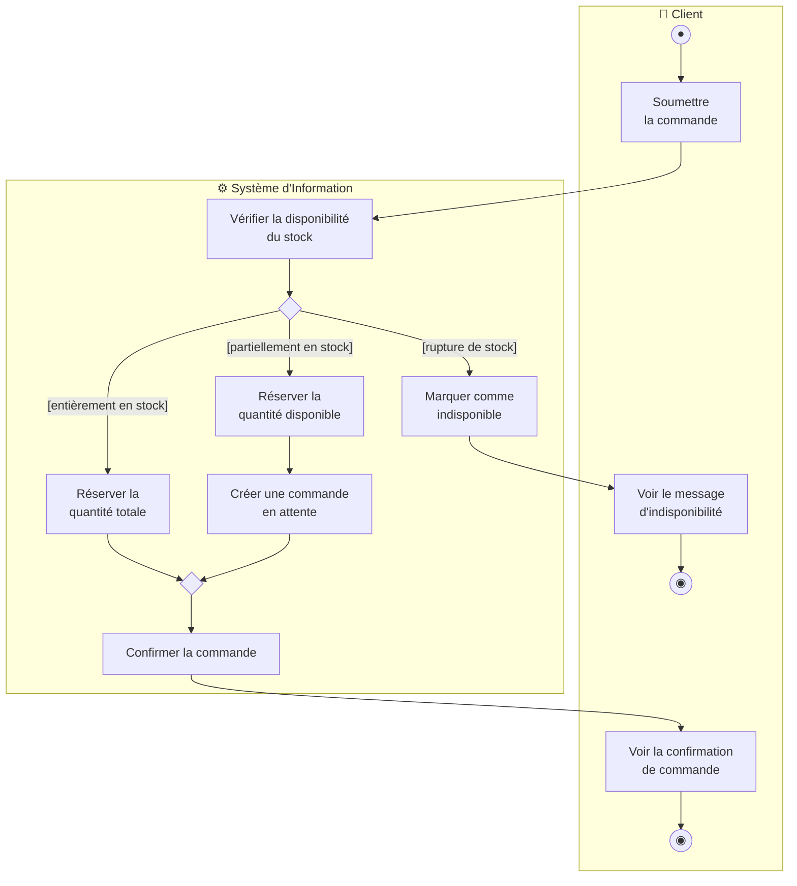
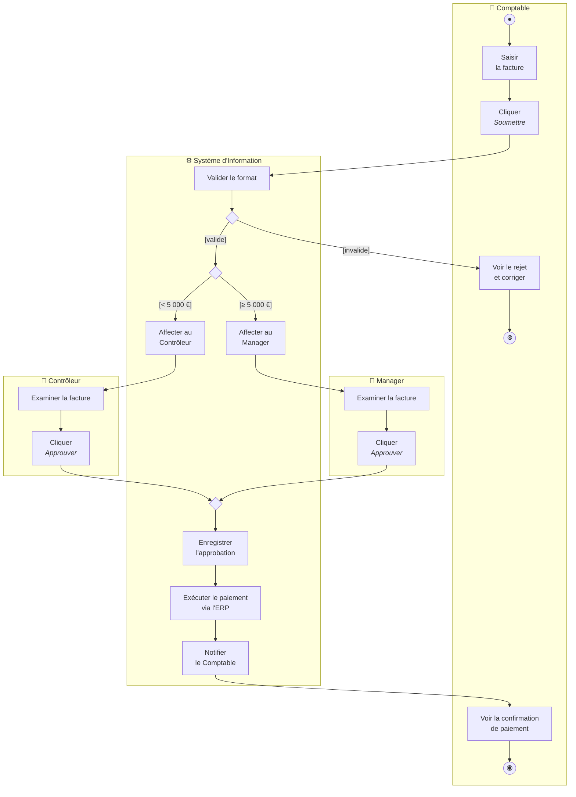
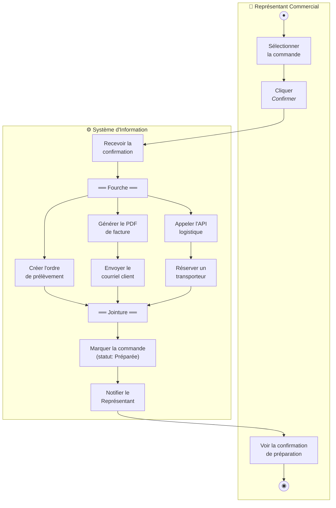
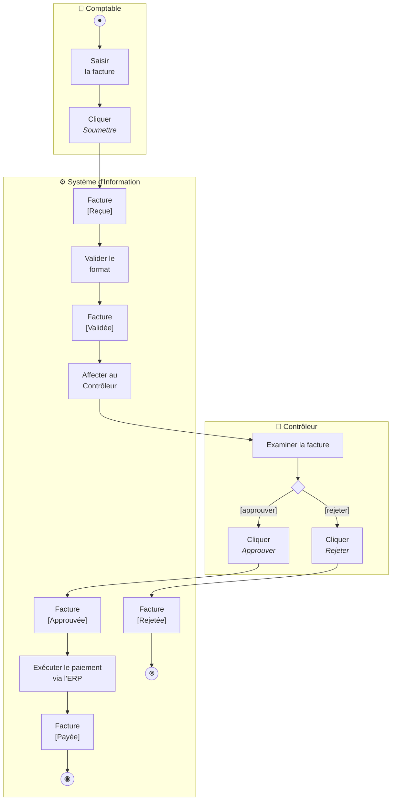
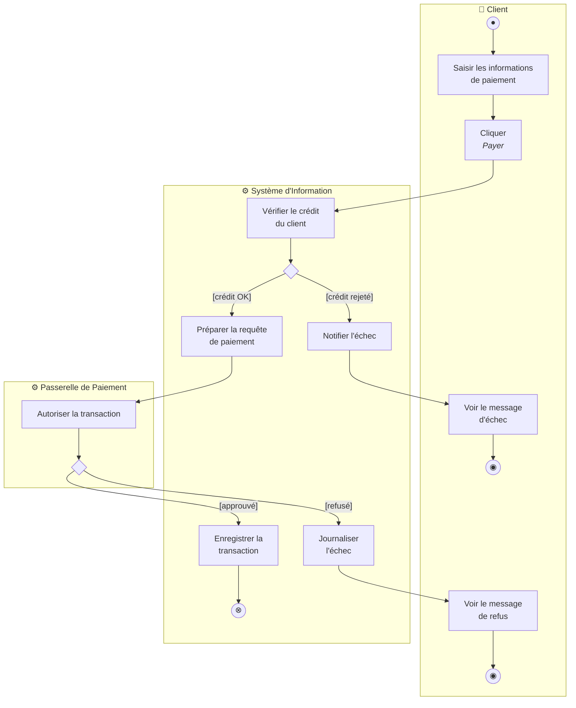
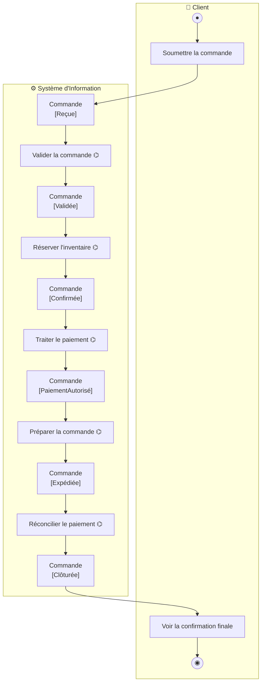
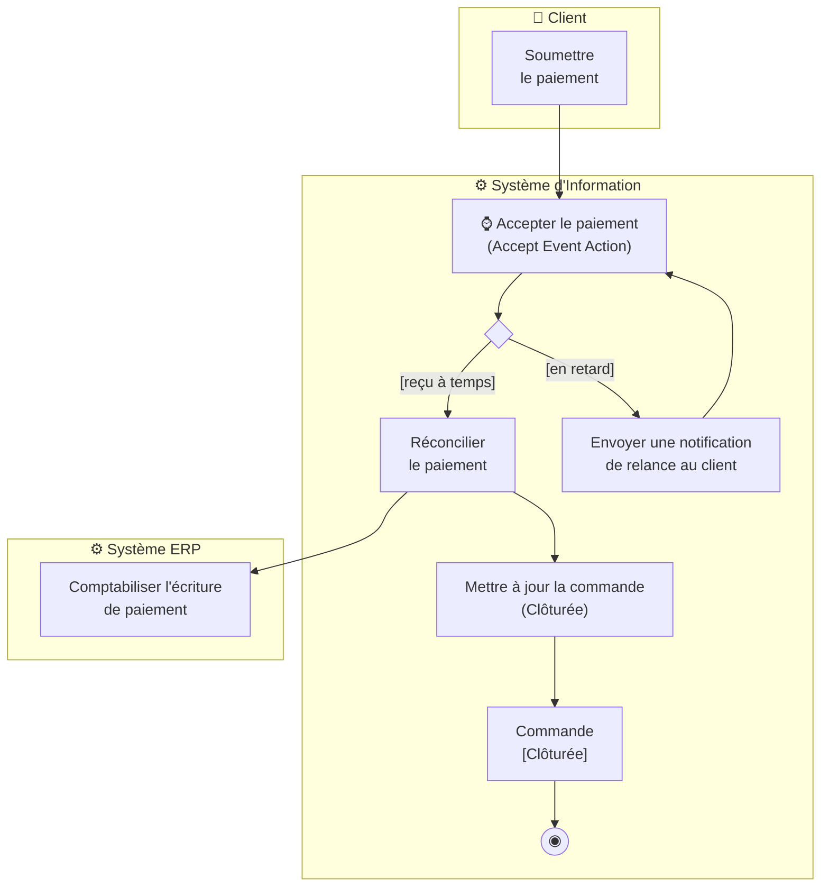

# Exercices — Diagramme d'Activité UML
## 🟢 Niveau Débutant
### Exercice 01 — Soumission d'une Note de Frais

### Exercice 02 — Validation d'une Facture avec Décision

### Exercice 03 — Vérification de Stock à Trois Voies

## 🟡 Niveau Intermédiaire
### Exercice 04 — Approbation de Facture Multi-Acteurs

### Exercice 05 — Préparation de Commande Parallèle (Fourche/Jointure dans le SI)

### Exercice 06 — Cycle de Vie d'une Facture avec Nœuds d'Objet

## 🔴 Niveau Avancé
### Exercice 07 — Décomposition Order-to-Cash avec Sous-Activités

**Niveau 1 — Vue d'ensemble**

**Niveau 2 — Sous-activité Traiter le paiement**

### Exercice 08 — Préparation de Commande Complète Multi-Acteurs

### Exercice 09 — Activité Order-to-Cash Complète + Cohérence Inter-Diagrammes

**Niveau 1 enrichi avec Nœuds d'Objet**

**Niveau 2 — Réconcilier le paiement**

**Tableau de Cohérence Inter-Diagrammes**

| Action SI | Opération de Classe | Message de Séquence | État du Nœud d'Objet | Cohérent ? |
|---|---|---|---|---|
| Valider la commande | `Commande.valider()` | `creerCommande(panier)` | `Commande [Validée]` | ✅ |
| Vérifier le catalogue produit | `Produit.estDisponible()` | — | — | ⚠️ Pas de message Séquence |
| Réserver l'inventaire | `Inventaire.reserver(article)` | `reserverArticle(idArticle, qte)` | `Commande [Confirmée]` | ✅ |
| Vérifier le crédit | `Client.obtenirLimiteCredit()` | — | — | ⚠️ Manquant en Séquence |
| Autoriser le paiement (Passerelle) | `ProcesseurPaiement.autoriser()` | `traiterPaiement(montant)` | `Commande [PaiementAutorisé]` | ✅ |
| Enregistrer la transaction | `Paiement.enregistrer()` | — | — | ⚠️ Op. de Classe à confirmer |
| Mettre à jour le statut Préparée | `Commande.preparer()` | — | `Expédition [Emballée]` | ❌ Op. absente du Diag. de Classes |
| Réconcilier le paiement | `Facture.marquerCommePayee()` | — | `Facture [Payée]` | ⚠️ Manquant en Séquence |
| Mettre à jour le statut Clôturée | `Commande.cloturer()` | — | `Commande [Clôturée]` | ❌ Op. absente du Diag. de Classes |
| Envoyer notification d'expédition | `ServiceNotification.envoyer()` | `envoyerCourrielConfirmation(commande)` | — | ⚠️ Nom incohérent |

> [!warning] Divergences inter-diagrammes — recommandations
> - **`Commande.preparer()` absente du Diagramme de Classes** : ajouter cette opération à la classe `Commande`, ou réutiliser une opération existante.
> - **`Commande.cloturer()` absente du Diagramme de Classes** : ajouter l'opération ; cohérent avec la transition d'état de la [[UML State|Machine à États]] de la facture.
> - **Action « Vérifier le catalogue produit » sans message Séquence** : ajouter un message `verifierProduit(idProduit)` dans le Diagramme de Séquence avant la réservation d'inventaire.
> - **Nom incohérent `ServiceNotification.envoyer()` vs. `envoyerCourrielConfirmation`** : standardiser sur un nom unique entre tous les diagrammes.
