# Exercices — Diagramme de Classes UML
## 🟢 Niveau Débutant
### Exercice 01 — Modéliser une Classe Unique

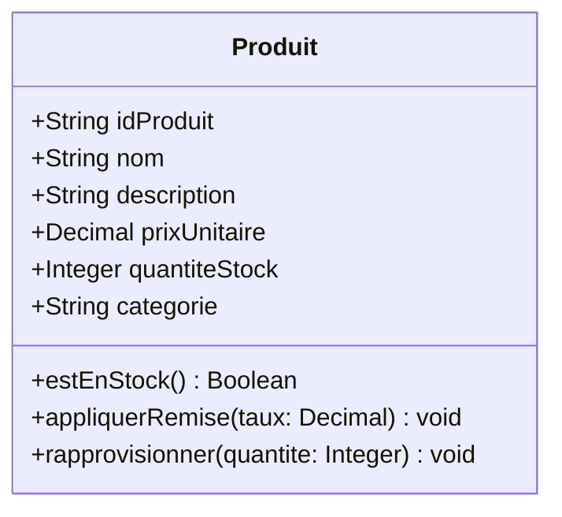

### Exercice 02 — Attributs, Visibilité et Valeurs par Défaut

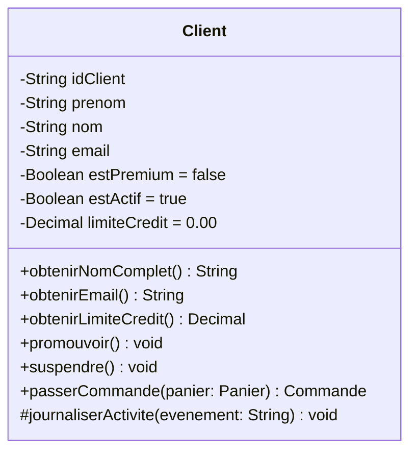

### Exercice 03 — Modéliser un Fragment à Trois Classes

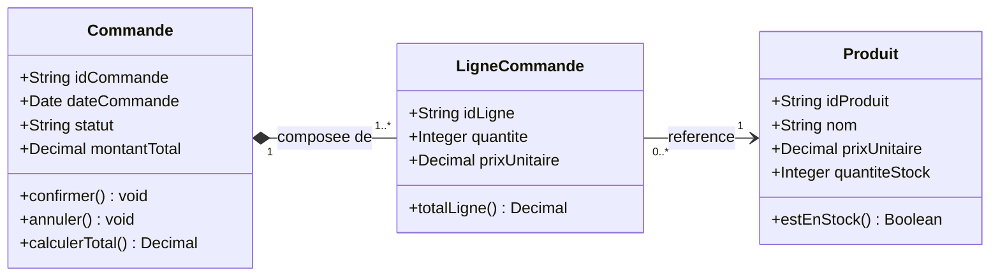
**Erreurs Courantes**

- Utiliser une Association simple (trait plein, sans losange) au lieu d'une Composition entre Commande et LigneCommande — une LigneCommande n'a aucun sens en dehors d'une Commande et est supprimée quand sa Commande est supprimée. C'est la définition manuel de la Composition. Toujours demander : « le cycle de vie de la partie dépend-il du tout ? »
- Placer le losange plein côté `LigneCommande` au lieu du côté `Commande` — le losange se trouve côté *tout* (le contenant), pas côté partie. Commande possède les LigneCommande, donc le losange est côté Commande.
- Écrire la multiplicité `*` au lieu de `1..*` pour LigneCommande — le scénario indique qu'une Commande doit avoir *au moins une* LigneCommande. `*` signifie zéro ou plusieurs, ce qui autoriserait une Commande vide — une violation de règle métier.

## 🟡 Niveau Intermédiaire
### Exercice 04 — Choisir le Bon Type de Relation

**1 — Agrégation**
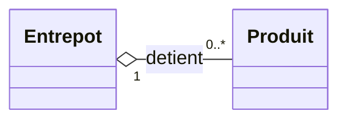
*Justification : les Produits survivent à la destruction d'un Entrepôt (ils peuvent être déplacés), donc la partie a un cycle de vie indépendant — l'Agrégation est correcte.*

**2 — Composition**
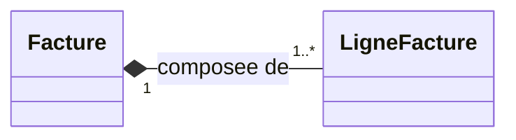
*Justification : une LigneFacture n'a aucun sens sans sa Facture et est détruite quand la Facture est supprimée — la Composition modélise cette dépendance de cycle de vie.*

**3 — Dépendance**
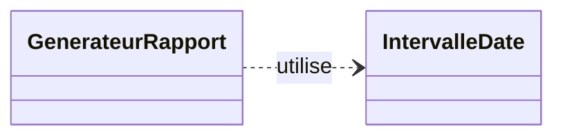
*Justification : `IntervalleDate` n'est utilisé que comme paramètre de méthode — aucune référence permanente n'est stockée comme attribut — ce qui en fait une utilisation transitoire, c.-à-d. une Dépendance.*

**4 — Généralisation**
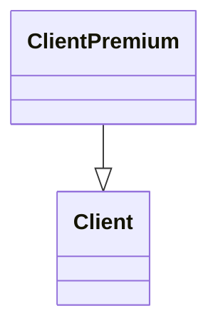
*Justification : « ClientPremium est un Client » passe le test « est-un » et hérite de tous les attributs et opérations de Client — la Généralisation est la relation correcte.*

**5 — Réalisation**
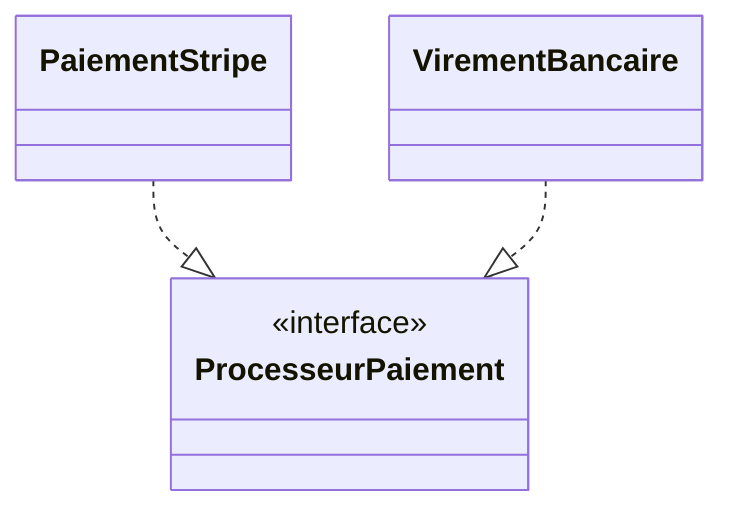
*Justification : les deux classes s'engagent à implémenter les opérations déclarées par le contrat d'interface — la Réalisation exprime cette relation « implémente ».*

### Exercice 05 — Le Fragment du Domaine Facture et Paiement

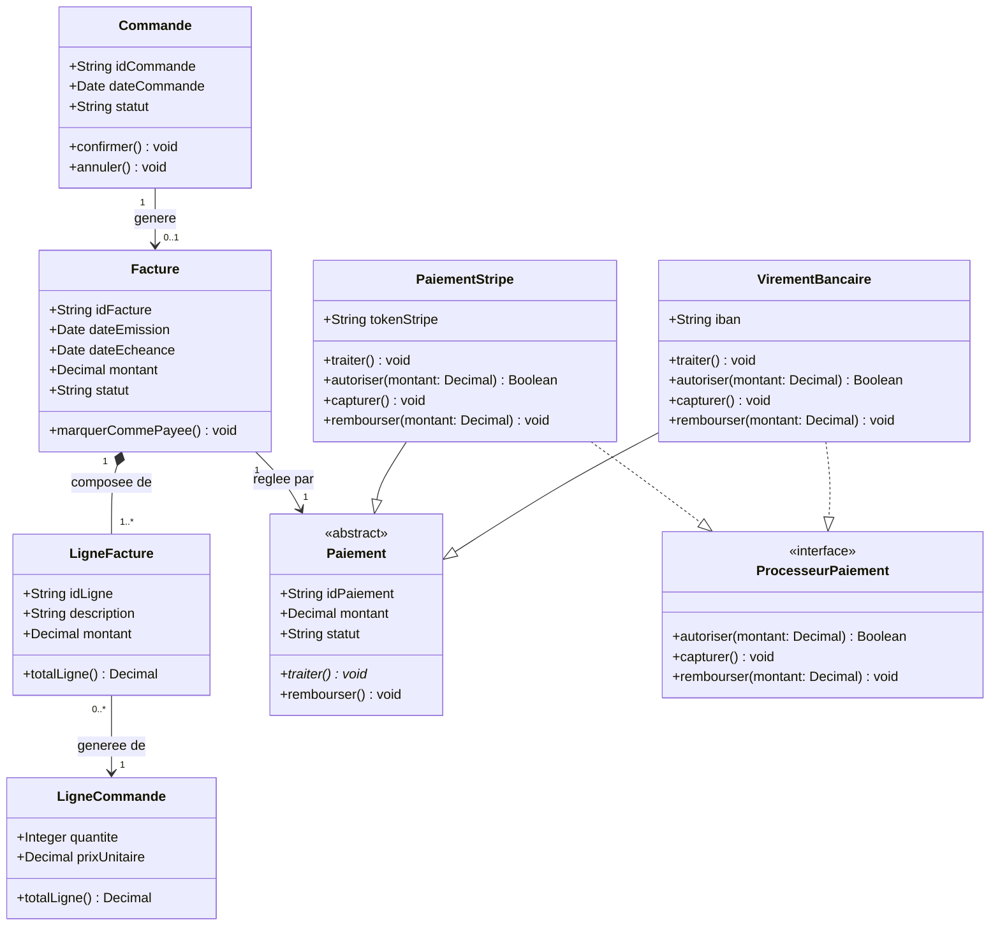

**Erreurs Courantes**
- Utiliser la Composition pour Facture → Paiement (losange plein) — une Facture ne *possède* pas un Paiement au sens du cycle de vie. Le Paiement existe indépendamment ; il est lié à la Facture, pas détruit avec elle. L'Association est correcte.
- Dessiner la relation LigneFacture → LigneCommande comme une Composition — le scénario indique que supprimer une LigneFacture ne supprime pas la LigneCommande. Lire la règle de cycle de vie avant de choisir le type de losange est la discipline la plus importante de cet exercice.
### Exercice 06 — Hiérarchie de Généralisation et Classes Abstraites

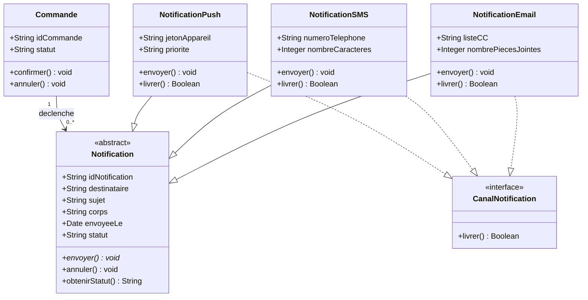

## 🔴 Niveau Avancé
### Exercice 07 — Construire le Modèle de Domaine NovaTrade Complet

**Vue Client & Commande**

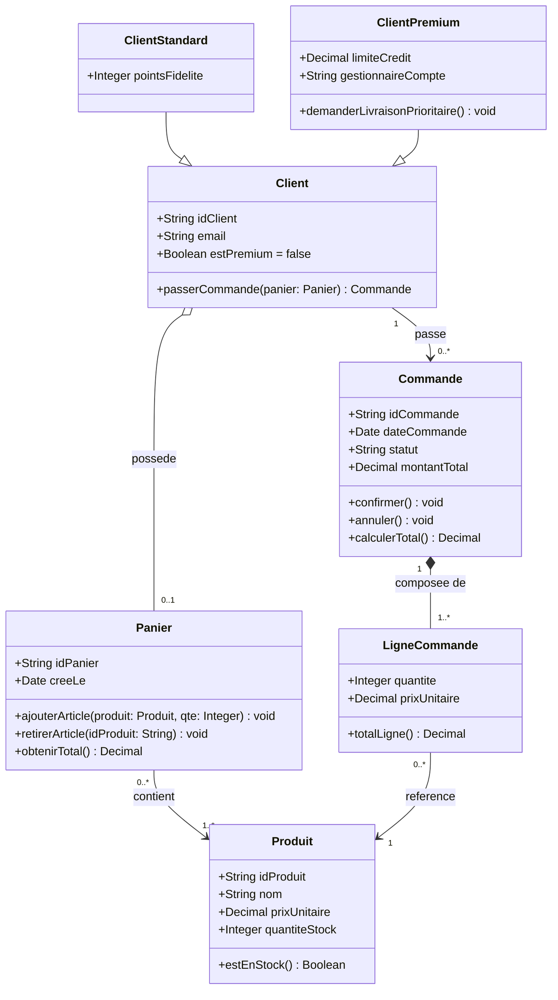

**Vue Facture & Paiement**

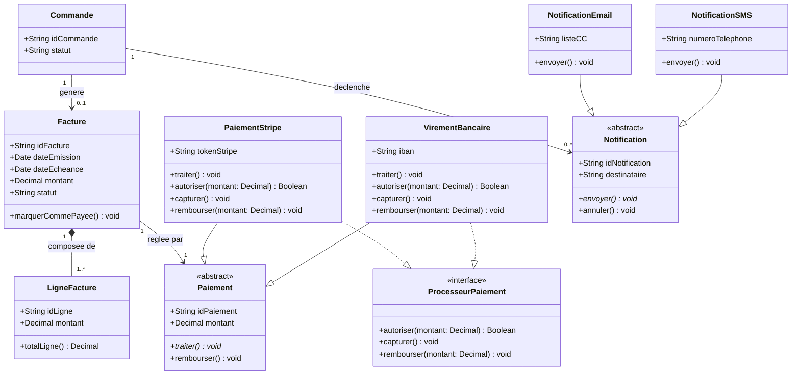

> [!warning] Décisions de Modélisation
> - **`Client` est concrète, pas abstraite :** NovaTrade crée des instances de Client directement dans certains flux historiques ; les sous-classes ajoutent des fonctionnalités sans rendre l'instanciation de base invalide. Si chaque Client était toujours soit Standard soit Premium, le rendre abstrait serait correct.
> - **`Panier` utilise une Agrégation, pas une Composition :** un Panier peut être abandonné et recréé sans affecter l'existence du Client, et les Produits dans le Panier ne lui appartiennent pas — ils restent dans le catalogue.
> - **`Facture → Paiement` est une Association, pas une Composition :** un objet Paiement pourrait théoriquement être réutilisé (par ex., un seul virement bancaire réglant plusieurs factures dans une version future). La Composition rendrait cela impossible en couplant le cycle de vie du Paiement à une seule Facture.

### Exercice 08 — Diagnostiquer et Corriger un Diagramme de Classes Défectueux

**Analyse des Écarts**

1. `contactFournisseur` utilise le camelCase — les noms de classes doivent être en PascalCase : `ContactFournisseur`.
2. `traiteurCommande` utilise le camelCase — devrait être `TraiteurCommande` ou, mieux, `ServiceBonCommande` pour suivre la convention de nom commun au singulier.
3. `Fournisseur.commandes` est un attribut de type « commandes » — ce n'est pas un type primitif. Les relations vers d'autres classes doivent être dessinées comme des associations, pas stockées comme des attributs. `commandes` doit être remplacé par une Association de `Fournisseur` vers `BonCommande`.
4. `BonCommande.Date` est en majuscules — les noms d'attributs doivent être en camelCase : `dateCommande: Date`.
5. `BonCommande.approuve` n'a pas de type — tous les attributs doivent déclarer un type. `approuve: Boolean` est la forme correcte.
6. Le losange entre `Fournisseur` et `contactFournisseur` est creux — un losange creux signifie une Agrégation (ContactFournisseur survit indépendamment de Fournisseur). Dans le contexte NovaTrade, un enregistrement de contact n'a aucun sens sans son Fournisseur — le losange correct est plein (Composition).
7. La Généralisation de `BonCommande` vers `Fournisseur` est sémantiquement incorrecte — un BonCommande n'est pas un type de Fournisseur. Cela échoue complètement au test « est-un » et doit être remplacé par une Association.
8. La Dépendance entre `traiteurCommande` et `BonCommande` est dessinée comme une flèche pleine — une Dépendance est toujours une flèche pointillée, jamais pleine. Une flèche pleine est une Association dirigée.
9. Aucune multiplicité sur aucune relation — chaque association doit avoir une multiplicité aux deux extrémités. L'omettre produit une spécification incomplète et non implémentable.

**Diagramme Corrigé**

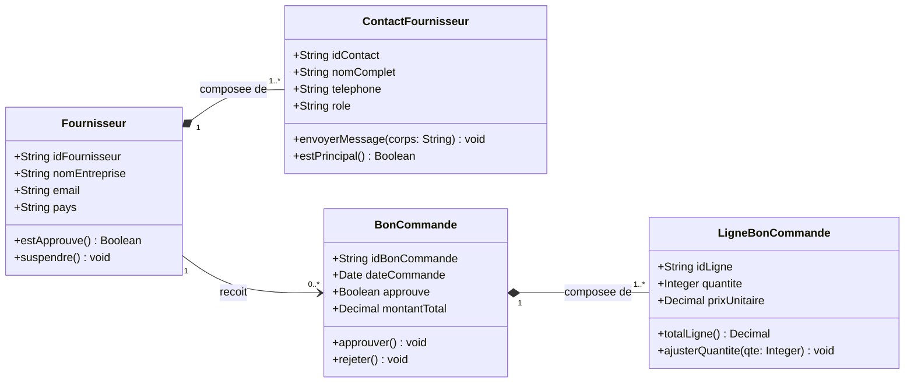

*Note sur `traiteurCommande` : retiré du diagramme corrigé. Une classe nommée avec un verbe (`traiteurCommande`) décrit une fonction, pas un concept métier. Ses opérations (`traiterCommande`, `valider`, `envoyerAuFournisseur`) doivent être assignées à `BonCommande` ou à une classe `ServiceBonCommande` correctement nommée si une couche service est nécessaire.*

### Exercice 09 — Spécification de Classes Complète comme Référence Vocabulaire

**Énumérations**

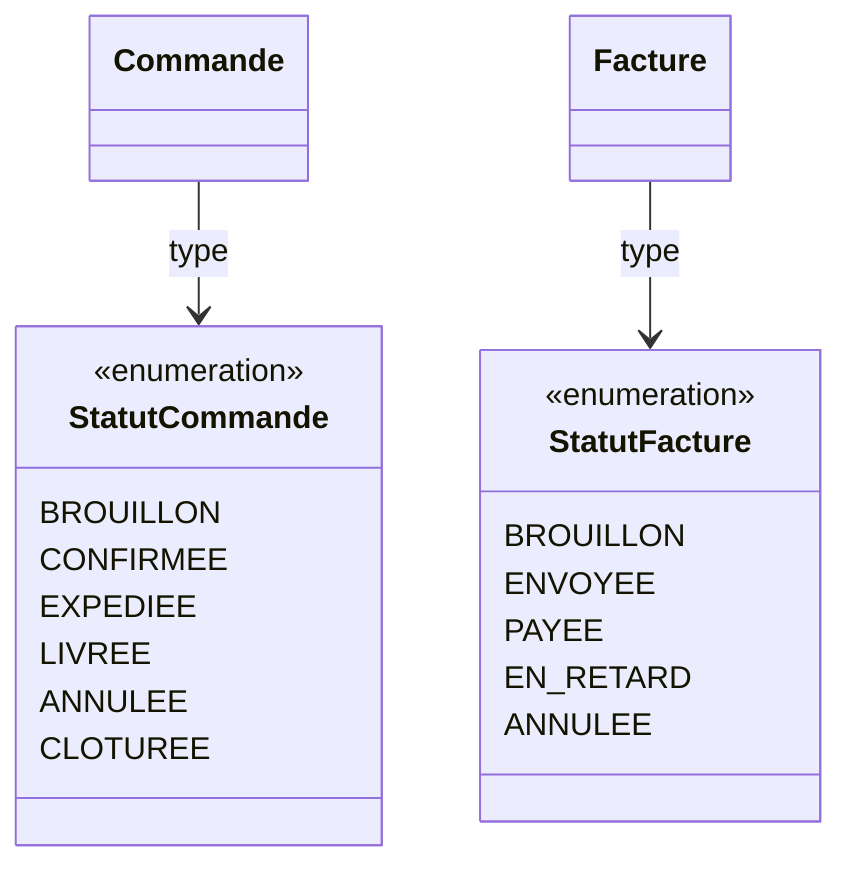

**Tableau de Registre des Classes**

| Classe | Type | Attributs Clés | Référencée Dans |
|---|---|---|---|
| `Client` | Concrète | `idClient`, `email`, `estPremium` | Cas d'Utilisation, Activité, Séquence, État |
| `Commande` | Concrète | `idCommande`, `statut: StatutCommande`, `montantTotal` | Cas d'Utilisation, Activité, Séquence, État, BDD |
| `LigneCommande` | Concrète | `quantite`, `prixUnitaire` | Activité, Séquence, BDD |
| `Produit` | Concrète | `idProduit`, `prixUnitaire`, `quantiteStock` | Activité, Séquence, BDD |
| `Facture` | Concrète | `idFacture`, `statut: StatutFacture`, `montant` | Activité, Séquence, État, BDD |
| `Paiement` | Abstraite | `idPaiement`, `montant`, `statut` | Séquence, BDD |
| `PaiementStripe` | Concrète | `tokenStripe` | Séquence |
| `VirementBancaire` | Concrète | `iban` | Séquence |
| `ProcesseurPaiement` | Interface | — | Séquence |
| `Notification` | Abstraite | `destinataire`, `sujet`, `statut` | Activité, Séquence |

> [!warning] Divergences avec le Diagramme de Séquence
> - `[[UML Sequence]]` appelle `ServiceCommande.creerCommande(panier)` mais le Diagramme de Classes déclare `Client.passerCommande(panier: Panier): Commande` — ce sont deux opérations différentes sur des classes différentes. Le Diagramme de Séquence implique une couche service qui n'est pas reflétée dans le modèle de domaine. Décision requise : ajouter `ServiceCommande` comme classe, ou aligner le Diagramme de Séquence pour appeler `client.passerCommande()`.
> - `[[UML Sequence]]` appelle `PasserellePaiement.traiterPaiement(montant)` mais le Diagramme de Classes déclare `ProcesseurPaiement.autoriser(montant: Decimal): Boolean` — les noms diffèrent. Aligner sur un nom unique entre les deux diagrammes avant l'implémentation.
