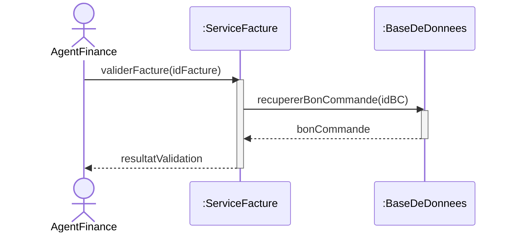
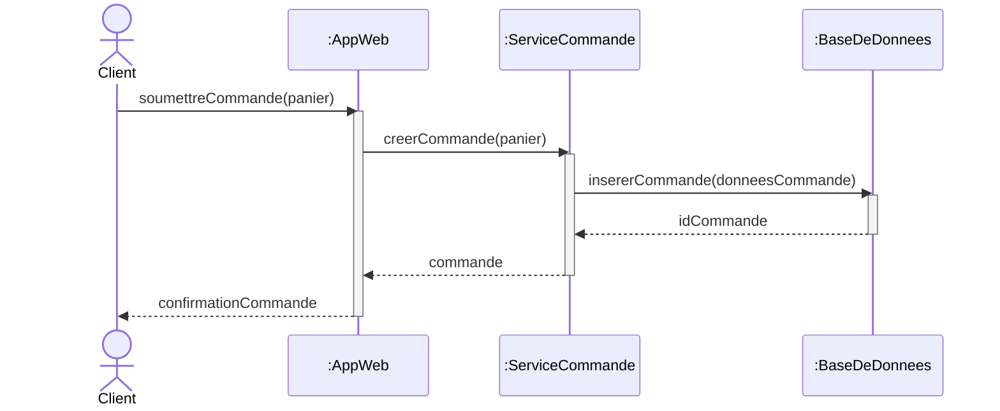
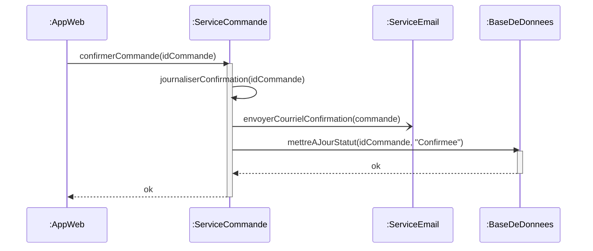
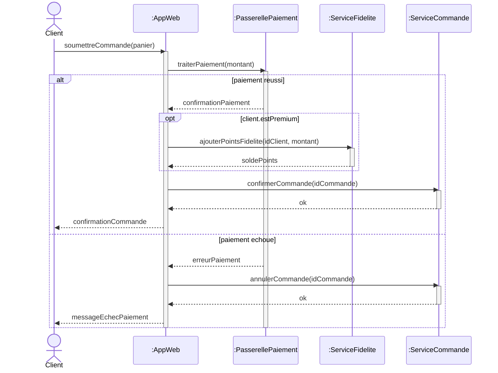
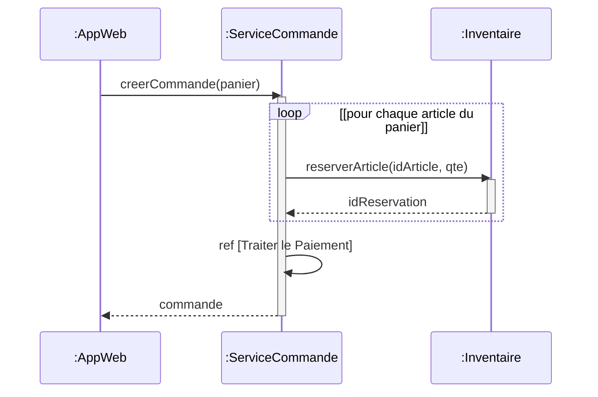
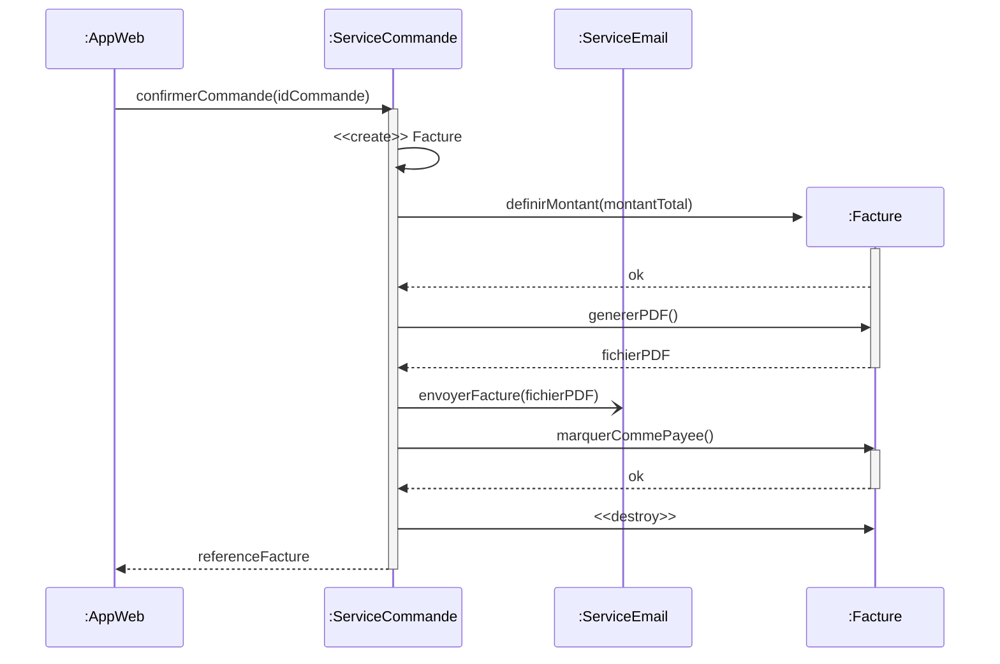
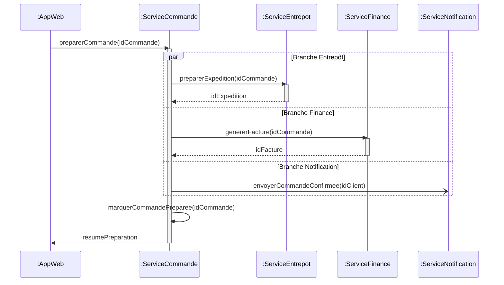
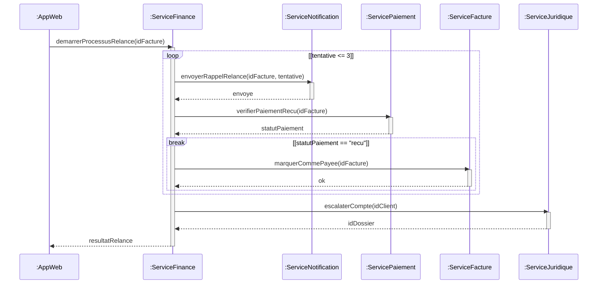
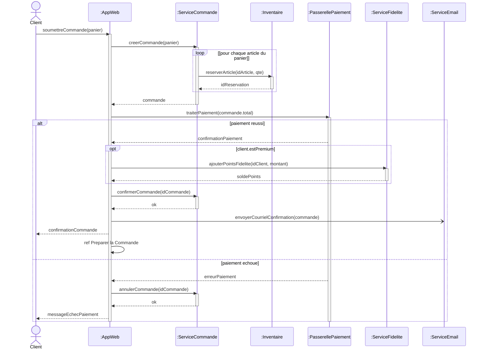

# UML — Diagramme de Séquence — Solutions des Exercices

Cette page rassemble les solutions modèles des neuf exercices sur le diagramme de séquence (*Sequence Diagram*) UML. Chaque solution comporte un diagramme Mermaid corrigé, une justification des choix de modélisation et, lorsque c'est pertinent, les variantes acceptables.

---

## Exercice 01 — Valider une Facture (Trois Lignes de Vie)

### Solution proposée

### Justification des choix

**`AgentFinance` est un acteur, pas un participant.** Léa décrit un humain qui clique dans une application — c'est par définition un acteur (extérieur au système). Les conventions UML le représentent avec un pictogramme bonhomme, à l'extrémité gauche, sans préfixe `:` (qui désigne une instance de classe).

**Trois lignes de vie de gauche à droite, dans l'ordre d'apparition.** L'agent à gauche, le service au milieu, la base à droite. Cet ordre matérialise le flux d'appel : on lit le diagramme de gauche à droite et de haut en bas.

**Flèches pleines (`->>`) pour les appels synchrones, flèches pointillées (`-->>`) pour les retours.** Léa précise « chacun attend la réponse de celui qu'il a appelé avant de continuer » — c'est exactement la sémantique d'un appel synchrone. Une flèche pleine signifie « l'appelant se bloque » ; une flèche pointillée signifie « je rends une valeur ».

**Barres d'activation imbriquées.** `:ServiceFacture` est actif depuis la réception de `validerFacture` jusqu'à l'envoi de `resultatValidation` — il englobe tout le traitement. `:BaseDeDonnees` est active uniquement pendant l'exécution de sa propre requête (de la réception de `recupererBonCommande` au retour de `bonCommande`). La barre de la base est donc imbriquée *à l'intérieur* de la barre du service. La profondeur d'empilement communique la profondeur d'appel.

**L'acteur n'a pas de barre d'activation** — un acteur représente un agent extérieur dont on ne modélise pas l'activité interne ; on ne sait pas (et on ne veut pas savoir) ce qu'il fait pendant qu'il attend.

### Variantes acceptables

- L'`AgentFinance` peut être représenté avec une barre d'activation pendant l'attente s'il est important de souligner qu'il est synchrone (par exemple dans un diagramme qui décrit un chat avec un autre acteur). Pas nécessaire ici.
- La base de données peut être nommée `:DBFactures` ou similaire pour préciser la base concernée — le préfixe `:` reste obligatoire pour signifier qu'on parle d'une instance.

---

## Exercice 02 — Passer une Commande (Quatre Lignes de Vie)
### Solution proposée

### Justification des choix

**Imbrication des barres d'activation à trois niveaux.** L'AppWeb est activée du premier au dernier message — elle bloque pendant toute l'interaction. Le ServiceCommande est imbriqué dans cette activation, et la BaseDeDonnees est imbriquée à son tour dans celle du ServiceCommande. Cette structure visuelle communique la *profondeur d'appel synchrone* : pour qu'un participant retourne, tous les participants imbriqués doivent avoir retourné avant lui.

**Le retour `idCommande` revient à `:ServiceCommande`, pas à `:AppWeb`.** Bruno l'a dit : la base répond à qui l'a appelée. Le chemin de retour reflète exactement le chemin d'appel à l'envers — chaque retour remonte d'un cran dans la pile d'appels. Si l'on dessinait `BD-->>AW: idCommande`, on contredirait le principe synchrone et on créerait un court-circuit qui n'existe pas dans la réalité du code.

**Tous les retours sont étiquetés.** Une flèche de retour sans étiquette force le lecteur à deviner ce qui est retourné. `idCommande`, `commande`, `confirmationCommande` sont les valeurs retournées et doivent figurer comme étiquettes — c'est ce qui permet au diagramme de servir de contrat d'API.

**Les arguments figurent sur les messages d'appel.** `soumettreCommande(panier)`, `creerCommande(panier)`, `insererCommande(donneesCommande)` — pas seulement les noms de méthodes. Sans les arguments, le diagramme ne dit pas quelles données traversent les frontières des composants.

### Variantes acceptables

- La `BaseDeDonnees` peut retourner directement la `commande` complète plutôt que seulement l'`idCommande` (le ServiceCommande n'aurait alors pas à reconstruire l'objet). Choix architectural ; les deux sont valides. Si l'on retourne `commande`, supprimer l'étape de re-récupération implicite côté ServiceCommande.

---

## Exercice 03 — Notification Asynchrone et Auto-Message

### Solution proposée

### Justification des choix

**Trois types de messages cohabitent dans ce diagramme**, chacun avec sa propre notation et sa propre sémantique :

- **Auto-message** (`SC->>SC: journaliserConfirmation`) — flèche en boucle sur la même ligne de vie. Représente une logique interne : une méthode appelle une autre méthode du même objet. Aucun participant externe n'est impliqué.
- **Asynchrone fire-and-forget** (`SC-)SE: envoyerCourrielConfirmation`) — flèche avec demi-pointe ouverte (`-)`), **sans flèche de retour**. L'appelant n'attend pas. Bruno est explicite : « on ne veut surtout pas que le ServiceCommande attende la réponse du ServiceEmail ».
- **Synchrone** (`SC->>BD: mettreAJourStatut` + `BD-->>SC: ok`) — flèche pleine pour l'appel, flèche pointillée pour le retour. L'appelant bloque jusqu'à la réponse.

**Pas de barre d'activation sur `:ServiceEmail`.** Une barre d'activation représente la période durant laquelle une ligne de vie *bloque l'appelant pendant qu'elle traite*. Comme le ServiceCommande n'attend pas le ServiceEmail (l'appel est asynchrone), il serait incohérent de montrer une activation côté ServiceEmail dans ce diagramme — cela suggérerait que le ServiceCommande est en attente, ce qui contredit la nature asynchrone.

#### Note sync vs. async (à reproduire sur la page Énoncés en pratique étudiante)

Quand `:ServiceCommande` appelle `mettreAJourStatut` synchroniquement, il se bloque — sa barre d'activation reste ouverte et il ne peut pas continuer tant que `:BaseDeDonnees` n'a pas retourné `ok`. Quand il appelle `envoyerCourrielConfirmation` asynchrone, il déclenche le message et continue immédiatement à l'étape suivante sans attendre. Du point de vue de l'appelant : synchrone = pause et attente ; asynchrone = envoie et passe à autre chose.

### Variantes acceptables

- Si l'envoi du courriel doit confirmer la livraison (par exemple pour un audit de conformité), passer à du synchrone — la décision dépend du compromis latence vs. confirmation.
- L'auto-message peut être omis si l'on considère que la journalisation est un détail d'implémentation non architecturalement significatif. Le seuil pour décider est : « est-ce que cet appel interne change quelque chose dans la lecture du diagramme par un développeur ? ». Si oui, le garder ; sinon, l'omettre.

---

## Exercice 04 — Flux de Paiement avec Embranchements

### Solution proposée

### Justification des choix

**`alt` pour le branchement principal `paiement réussi` vs. `paiement échoué`.** Léna est explicite : « deux scénarios mutuellement exclusifs : soit le paiement réussit, soit il échoue ». C'est exactement la sémantique d'`alt` (alternative) en UML : un seul opérande s'exécute, choisi par évaluation des gardes. Les deux opérandes couvrent ensemble tous les cas possibles.

**`opt` pour la branche premium, et non `alt`.** Léna le souligne : « pour les clients non-premium, on saute simplement cette étape — pas de branche alternative à modéliser, on ne fait juste rien ». C'est le critère qui distingue `opt` (optionnel : exécute si la garde est vraie, ne fait rien sinon) de `alt` (exige plusieurs branches mutuellement exclusives, dont chacune doit être modélisée). Quand la branche `[else]` n'a aucune action, `opt` est sémantiquement plus précis.

**`opt` imbriqué dans l'opérande `[paiement réussi]` du `alt`.** L'imbrication n'est pas une question de mise en page, c'est une *contrainte sémantique*. Donner des points de fidélité ne doit avoir lieu *que si* le paiement a réussi. Placer le `opt` au même niveau que le `alt` (donc en dehors de lui) signifierait que les points sont ajoutés indépendamment du résultat du paiement, y compris en cas d'échec — sémantique métier absurde.

### Variantes acceptables

- Si la politique premium évolue pour inclure d'autres avantages (par exemple un cadeau pour les clients gold), on peut transformer l'`opt` en `alt` à plusieurs branches selon le palier du client. À ne faire que quand au moins une autre branche a une action ; sinon `opt` reste plus précis.
- L'ordre opt-fidélité puis confirmerCommande peut être inversé sans changer la sémantique métier ; vérifier avec Léna quelle ordre reflète l'intention (typiquement : confirmer la commande d'abord, ajouter les points ensuite). Notre solution suit le récit.

---

## Exercice 05 — Réservation d'Inventaire avec Boucle et Référence

### Solution proposée

### Justification des choix

**Fragment `loop` pour la répétition par article.** Antoine décrit un comportement où le ServiceCommande appelle l'Inventaire « une fois par article ». La répétition se modélise avec un fragment `loop` dont la garde — `[pour chaque article du panier]` — est exprimée en termes métier, lisible par un non-développeur. Une garde de niveau code (`articles.taille > 0`) serait moins claire dans un diagramme d'analyse.

**Activation/désactivation de l'Inventaire à chaque itération.** La barre d'activation représente une période de blocage. À chaque itération, l'Inventaire bloque le ServiceCommande pendant qu'il traite *un* `reserverArticle`, puis se désactive au retour. Une barre d'activation continue couvrant toute la boucle suggérerait à tort que l'Inventaire est occupé en continu, alors qu'en réalité il traite des appels successifs.

**Fragment `ref` placé après la boucle, pas dedans.** Le traitement du paiement n'a lieu *qu'une fois* — après que tous les articles ont été réservés. Le placer dans la boucle signifierait un paiement par article, ce qui contredirait la logique métier.

**`ref` plutôt que copie en ligne.** Antoine dit qu'il ne veut pas redessiner tout le flux de paiement ici. Le fragment `ref` intègre par référence un autre diagramme de séquence sans en répéter le contenu, et signale au lecteur « va consulter le diagramme nommé pour les détails ». C'est un outil de gestion de complexité : on évite des diagrammes monstrueux de 50 messages en factorisant les sous-interactions stables et bien nommées.

#### Note sur `ref` (à intégrer au diagramme)

Un fragment `ref` intègre un autre diagramme de séquence nommé par référence sans en répéter le contenu. Utiliser `ref` quand : (a) l'interaction référencée est suffisamment complexe pour mériter son propre diagramme ; (b) la même interaction est réutilisée à travers plusieurs diagrammes parents (par exemple authentification, paiement) ; (c) afficher tous les détails rendrait le diagramme courant trop grand pour être lu. Copier l'interaction référencée en ligne n'est approprié que lorsque le diagramme parent est le seul endroit où cette interaction apparaît et que son détail est essentiel pour comprendre le contexte du parent.

### Variantes acceptables

- La boucle peut être bornée par un compteur (`loop [i = 1..panier.taille]`) si l'on veut être plus explicite sur la borne. Le « pour chaque » UML standard est plus idiomatique.
- Si le panier ne contient qu'un seul article, le `loop` peut être omis. À ne faire que si l'on est certain que c'est toujours le cas — sinon le diagramme cache une boucle implicite, ce qui est trompeur.

---

## Exercice 06 — Création et Destruction d'une Facture

### Solution proposée

### Justification des choix

**`:Facture` n'apparaît pas dans la liste des participants en haut.** Vincent insiste : « la facture n'existait pas avant cet instant ; elle apparaît en cours de diagramme ». Pré-déclarer `:Facture` en haut signifierait qu'elle existe depuis le début de l'interaction — ce qui contredit le fait qu'elle est *créée* au milieu.

**Stéréotype `<<create>>` sur le message de création.** C'est la convention UML pour signaler explicitement l'apparition d'une nouvelle ligne de vie. La ligne de vie `:Facture` débute exactement à la position verticale du message de création.

**Stéréotype `<<destroy>>` pour terminer la ligne de vie.** Le X final (en notation UML, une croix sur la ligne de vie) marque la destruction de l'objet en mémoire. Aucun message ne peut être envoyé à `:Facture` après ce point — les outils UML rigoureux signalent toute violation comme erreur.

**`referenceFacture` retournée à `:AppWeb` *après* destruction de l'objet.** Vincent le souligne : c'est une *référence* — un identifiant ou une URL d'archive — pas l'objet en mémoire. Cette nuance illustre la distinction architecturale fondamentale entre un objet vivant en mémoire (dont la durée de vie est bornée par le cycle d'interaction) et sa représentation persistée en base (durable).

**Asynchrone `envoyerFacture` au ServiceEmail.** Comme à l'Exercice 03 : on ne bloque pas la confirmation de commande pour attendre que le courriel parte.

### Variantes acceptables

- La destruction explicite peut être remplacée par une simple absence de messages ultérieurs si la durée de vie de l'objet n'est pas un sujet pédagogique. Ici, c'est le sujet — donc on rend `<<destroy>>` explicite.
- Le `<<create>>` peut être implicite en représentation Mermaid simplifiée (apparition de la ligne de vie au moment du premier message reçu) ; en notation UML formelle, le rendre explicite est préférable pour la traçabilité.

---

## Exercice 07 — Préparation Parallèle

### Solution proposée

### Justification des choix

**Fragment `par` pour la véritable concurrence.** Pauline insiste : « toutes les trois partent en même temps ». C'est la sémantique exacte de `par` (parallèle) : tous les opérandes s'exécutent simultanément. Utiliser des `alt` à la place transformerait le diagramme en « soit l'une SOIT l'autre SOIT la troisième », ce qui est l'opposé de l'intention.

**Auto-message `marquerCommandePreparee` *après* la fermeture du `par`.** Pauline est explicite : il faut que les deux branches synchrones (Entrepôt et Finance) soient terminées pour pouvoir continuer. La fermeture du fragment `par` matérialise ce point de synchronisation. Placer l'auto-message à l'intérieur du `par` signifierait que la commande peut être marquée préparée avant que les retours de l'Entrepôt et de la Finance soient revenus — sémantiquement faux.

**Pas de barre d'activation sur `:ServiceNotification`.** Identique à l'Exercice 03 : l'appel asynchrone n'implique pas de blocage côté appelé (du point de vue de ce diagramme). Pauline a explicitement demandé de noter ce point pour ses juniors.

#### Note sur l'activation de `:ServiceNotification` (à intégrer au diagramme)

`:ServiceNotification` reçoit un message asynchrone (sans suivi). L'appelant — `:ServiceCommande` — ne se bloque pas et n'attend pas de réponse. Une barre d'activation représente la période durant laquelle une ligne de vie *bloque l'appelant* pendant qu'elle traite. Puisque l'appelant n'est pas bloqué, montrer une barre d'activation sur `:ServiceNotification` impliquerait que `ServiceCommande` l'attend, ce qui contredit la nature asynchrone de l'appel.

### Variantes acceptables

- On peut préfixer chaque opérande du `par` d'une étiquette descriptive (`Branche Entrepôt`, `Branche Finance`…) — c'est ce qu'on fait ici. UML autorise aussi des opérandes anonymes ; les étiquettes améliorent la lisibilité.
- La synchronisation explicite à la sortie du `par` est implicite par défaut (la fin du fragment attend toutes les branches synchrones) ; UML n'oblige pas à l'expliciter mais on peut le faire avec une note pour la pédagogie.

---

## Exercice 08 — Processus de Relance avec Boucle et Sortie Anticipée

### Solution proposée

### Justification des choix

**Fragment `loop [tentative <= 3]` pour la boucle bornée.** Patricia décrit explicitement « jusqu'à trois rappels » — la borne est dans la garde. La boucle contient les deux appels (envoi de rappel + vérification de paiement) qui se répètent à chaque cycle.

**Fragment `break` imbriqué dans la boucle pour la sortie anticipée.** Patricia est précise : « si à un moment quelconque le paiement est reçu, on doit sortir immédiatement de la boucle ». La sémantique UML de `break` est exactement celle-ci : si la garde de `break` est vraie, exécuter le contenu du `break` puis sortir du fragment englobant le plus proche (la `loop`). Utiliser un `alt` à la place modéliserait un chemin alternatif mais ne sortirait pas de la boucle — ce serait sémantiquement faux.

**Le contenu du `break` n'est pas vide** : il contient l'appel `marquerCommePayee` qui doit s'exécuter avant de quitter la boucle. Un `break` vide sortirait sans enregistrer le paiement, perdant l'information critique.

**Appel d'escalade `escalaterCompte` placé *après* la boucle.** Patricia le précise : « cet appel d'escalade se trouve après la boucle — il ne fait pas partie de la boucle, c'est ce qui se passe quand la boucle est sortie sans break ». Le placer dans la boucle escaladerait à chaque cycle, ce qui contredirait la logique métier.

> [!warning] Limite sémantique de cette modélisation
> Telle que dessinée, l'escalade `escalaterCompte` s'exécute *même si* la boucle est sortie via `break` (paiement reçu). Or Patricia ne veut escalader que si les trois tentatives échouent. UML standard ne fournit pas de mécanisme natif pour distinguer « sortie par break » et « sortie par épuisement de la boucle ». Pour rendre ce comportement explicite, on peut envelopper l'escalade dans un `alt [pas de paiement reçu]` après la boucle, ou ajouter un drapeau côté ServiceFinance qui contrôle l'escalade. Ces deux approches sont mentionnées dans les Notes du Formateur comme variante.

### Variantes acceptables

- **Variante avec garde explicite après la boucle** : envelopper `escalaterCompte` dans un `alt [statutPaiement != "recu"]` pour ne pas escalader quand le break a marqué la facture payée. Plus précis sémantiquement, légèrement plus verbeux.
- **Variante avec compteur explicite** : remplacer la garde `[tentative <= 3]` par une boucle bornée numérique — équivalent.

---

## Exercice 09 — Passer une Commande Complète avec Cohérence Inter-Diagrammes

### Solution proposée

### Justification des choix

Cet exercice est une **synthèse** : il combine tous les éléments couverts précédemment (lignes de vie, messages sync/async, auto-messages, fragments `loop`, `alt`, `opt`, `ref`, barres d'activation imbriquées). La justification reprend les choix de chaque exercice antérieur et y ajoute la **cohérence inter-diagrammes** comme nouvelle exigence.

**Imbrication des fragments.** Le `opt [client.estPremium]` est strictement à l'intérieur de l'opérande `[paiement réussi]` du `alt` — comme à l'Exercice 04, c'est une contrainte sémantique. Le `loop` de réservation d'inventaire est en dehors du `alt` (elle a lieu indépendamment de l'issue du paiement futur).

**`ref [Preparer la Commande]` placé dans la branche succès uniquement.** La préparation n'est lancée que si le paiement a réussi. Placer le `ref` en dehors du `alt` signifierait préparer la commande même en cas d'échec de paiement — absurde.

**Désactivation correcte des barres d'activation.** Chaque participant qui s'active doit se désactiver, en respectant l'imbrication. Une activation oubliée est un défaut classique sur ce type de diagramme synthétique.

### Tableau de Cohérence Inter-Diagrammes

| Message | Opération de Classe dans [[UML Class]] | Transition d'État dans [[UML State]] | Cohérent ? |
|---|---|---|---|
| `creerCommande(panier)` | `Client.passerCommande(panier): Commande` | `[*] → Brouillon` | ⚠️ Nom incohérent : `creerCommande` vs `passerCommande` |
| `reserverArticle(idArticle, qte)` | — | — | ❌ Pas d'op. de Classe, pas de transition d'État |
| `traiterPaiement(commande.total)` | `Paiement.traiter()` | `Brouillon → Confirmée` (partiel) | ⚠️ Signature incohérente : pas de paramètre `montant` dans la Classe |
| `confirmerCommande(idCommande)` | `Commande.confirmer()` | `Brouillon → Confirmée` | ✅ |
| `annulerCommande(idCommande)` | `Commande.annuler()` | `Brouillon → Annulée` | ✅ |
| `envoyerCourrielConfirmation(commande)` | — | — | ❌ Pas d'op. de Classe définie |
| `ajouterPointsFidelite(idClient, montant)` | — | — | ❌ `ServiceFidelite` absent du Diagramme de Classes |
| `confirmationPaiement` (retour) | `Paiement.traiter(): void` | — | ⚠️ Type de retour incohérent : op. de Classe retourne `void` |
| `ref [Préparer la Commande]` | — | `Confirmée → Preparation` | ⚠️ Pas d'op. de Classe ; transition d'État existe |
| `marquerCommePayee(idFacture)` | `Facture.marquerCommePayee()` | `AttenteDePaiement → Payée` | ✅ |

> [!warning] Divergences Inter-Diagrammes — Recommandations de résolution
> - **`creerCommande` vs. `passerCommande` :** le Diagramme de Classes déclare `Client.passerCommande()` mais ce diagramme de séquence appelle `ServiceCommande.creerCommande()`. Ce sont des opérations différentes sur des classes différentes — probablement correct dans une architecture en couches mais le Diagramme de Classes a besoin d'une classe `ServiceCommande` avec une opération `creerCommande()`. Recommandation : ajouter `:ServiceCommande` comme classe avec cette opération.
> - **`reserverArticle` absent du Diagramme de Classes :** ajouter `reserverArticle(idArticle: String, qte: Integer): String` à une classe `Inventaire` ou `ServiceInventaire`.
> - **Signature incohérente de `traiterPaiement` :** `Paiement.traiter()` ne prend pas de paramètres dans le Diagramme de Classes, mais le diagramme de séquence passe `commande.total` comme argument. Aligner en ajoutant `traiter(montant: Decimal): Boolean` à la classe `Paiement`.
> - **`envoyerCourrielConfirmation` et `ajouterPointsFidelite` absents du Diagramme de Classes :** ajouter les classes `ServiceEmail` et `ServiceFidelite` avec les opérations correspondantes au modèle de domaine, ou accepter que ce sont des services d'infrastructure en dehors de la frontière du domaine et documenter cette décision.
> - **Retour `confirmationPaiement` vs. `void` :** changer le type de retour de `Paiement.traiter()` en `ConfirmationPaiement` ou `Boolean` dans le Diagramme de Classes pour correspondre à ce que le diagramme de séquence attend en retour.

### Note de traçabilité Cas d'Utilisation

Ce diagramme implémente les étapes 3–9 du flux principal `Passer une commande` de l'Exercice 03 de UML Use Case Exercices — couvrant la validation du panier, la vérification du stock, l'autorisation du paiement et la confirmation de la commande. La branche `alt [paiement échoué]` correspond directement au Flux Alternatif B (échec de crédit/paiement) de la même description textuelle.

### Variantes acceptables

- Le diagramme peut être éclaté en plusieurs diagrammes plus petits liés par `ref` (par exemple un `ref [Réserver l'Inventaire]` à la place de la boucle expansée). Pour ce diagramme synthétique, on garde tout en ligne pour exercer la lecture d'un diagramme dense.
- Le tableau de cohérence peut être étendu à plus de dix lignes si l'apprenant a identifié d'autres messages dignes d'être audités. Dix est un minimum, pas un maximum.