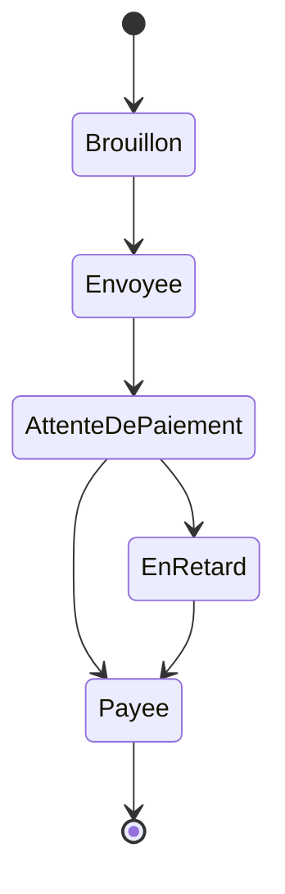
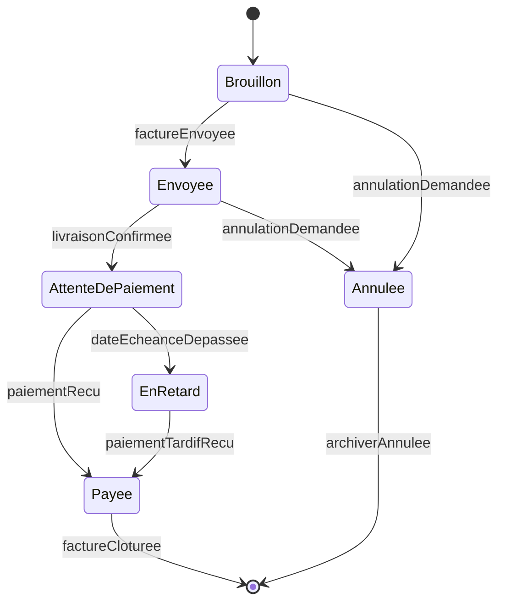
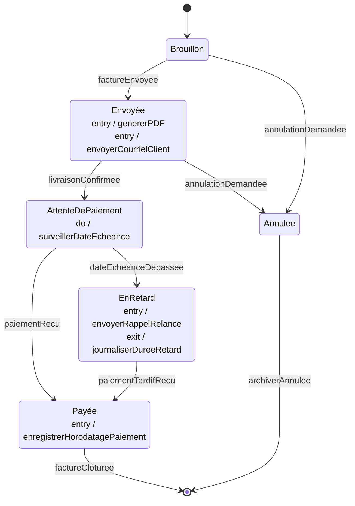
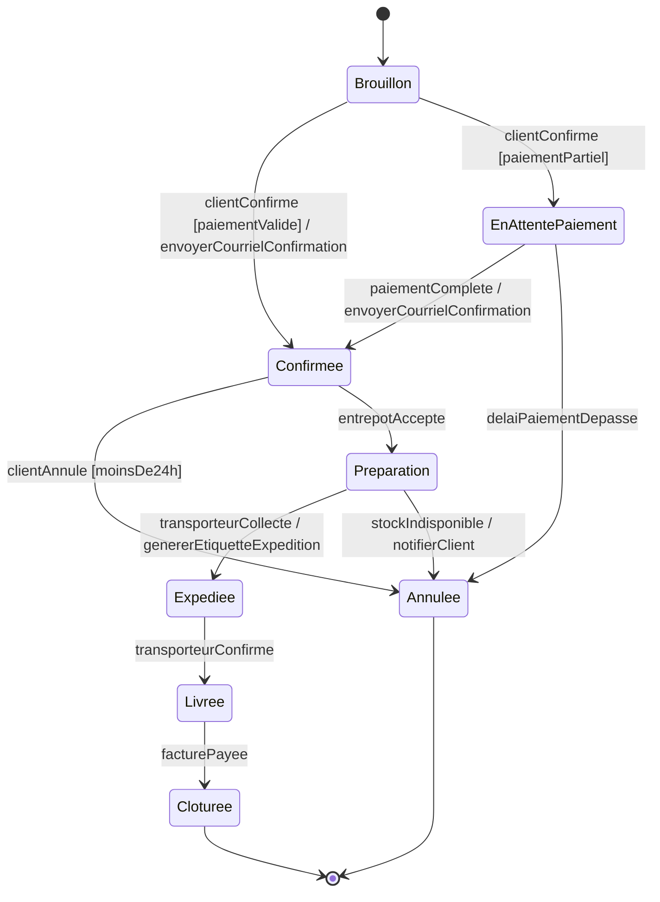
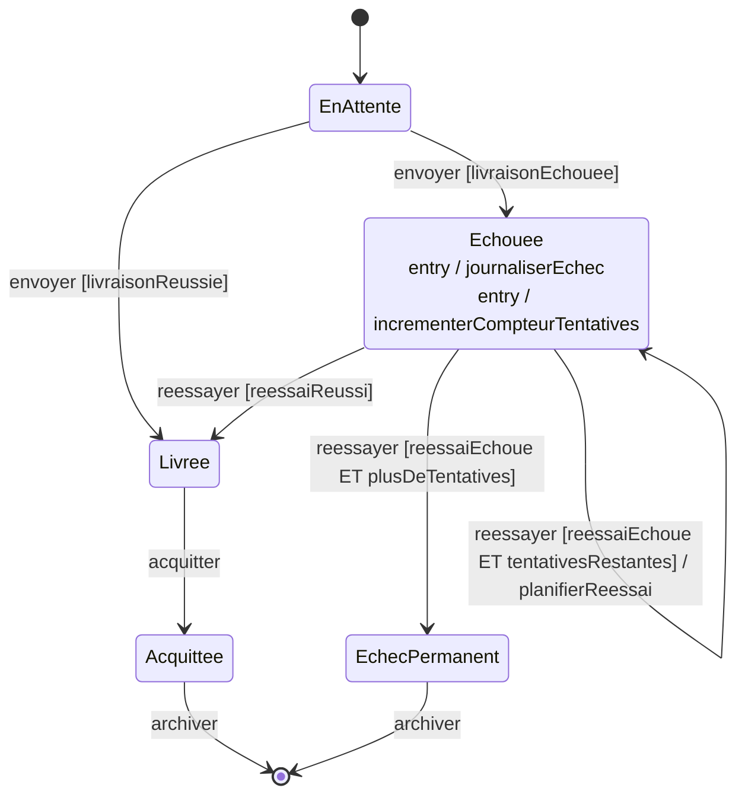
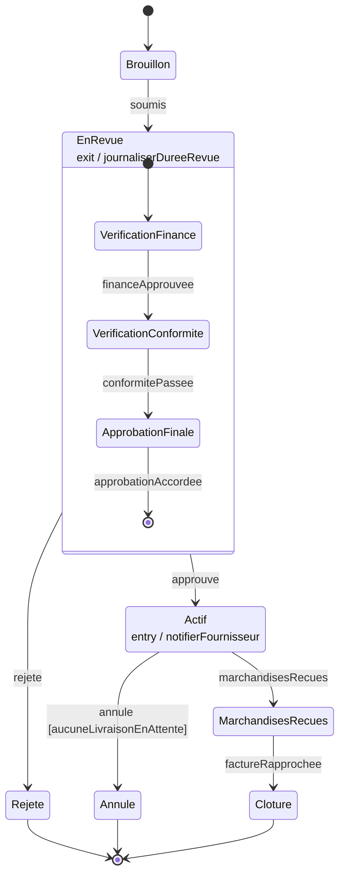
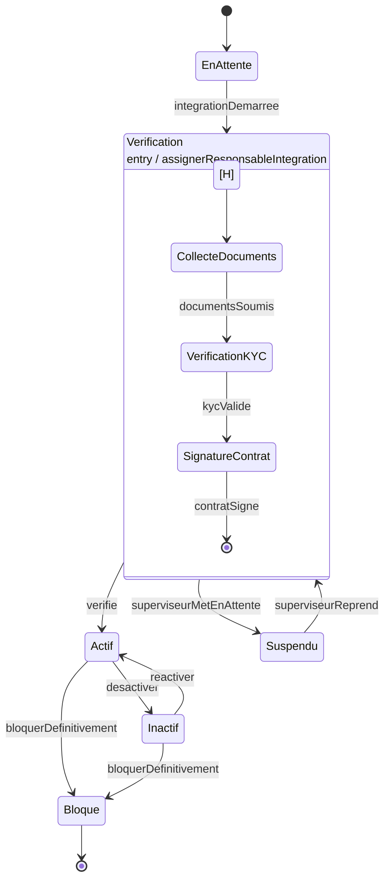
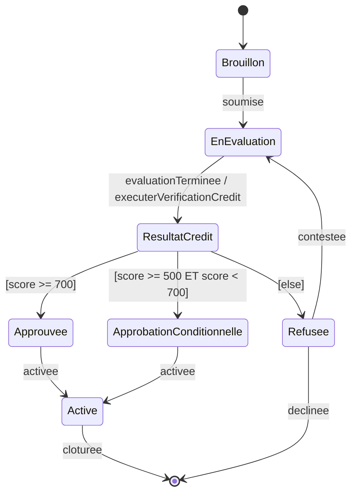
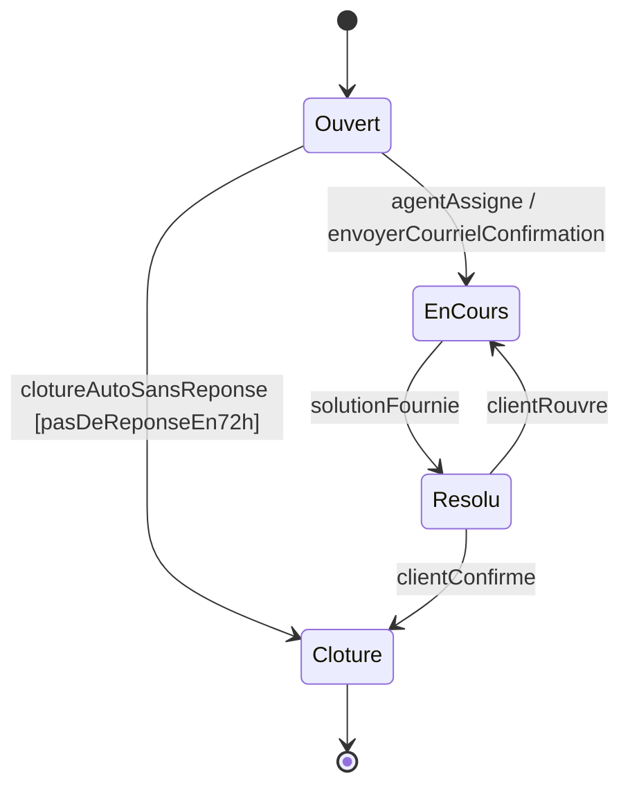
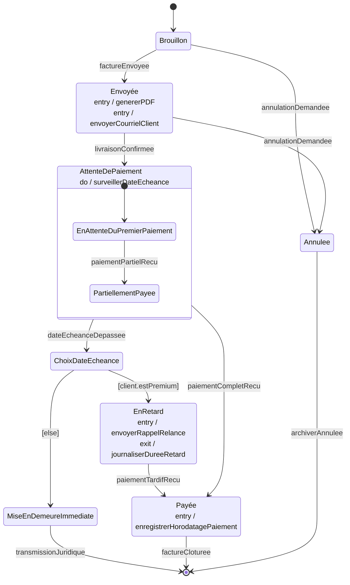

# UML — Diagramme d'État — Solutions des Exercices

Cette page rassemble les solutions modèles des neuf exercices sur le diagramme d'état (*State Machine Diagram*) UML. Chaque solution comporte un diagramme Mermaid corrigé, une justification des choix de modélisation et, lorsque c'est pertinent, les variantes acceptables.

---

## Exercice 01 — Cycle de Vie de la Facture (Linéaire)

### Solution proposée

### Justification des choix

Camille a décrit cinq états distincts, qui correspondent chacun à un statut métier réellement vécu par la facture : `Brouillon`, `Envoyee`, `AttenteDePaiement`, `EnRetard`, `Payee`. Ils deviennent les **états** (*states*) du diagramme.

Le **Pseudo-état Initial** (*Initial Pseudostate*, le cercle plein noir `[*]`) est obligatoire : sans lui, l'état de départ d'un objet `Facture` nouvellement créé n'est pas défini. Il pointe vers `Brouillon` parce que Camille dit explicitement « une facture commence sa vie chez nous comme un brouillon ».

L'**État Final** (*Final State*) est attaché uniquement à `Payée`, et non à `EnRetard`, parce qu'une facture en retard *n'est pas terminée* — Camille précise qu'« elle peut très bien finir par être payée plus tard ». Ne pas confondre « état terminal sur le chemin nominal » et « fin du cycle de vie de l'objet ». Seule `Payée` met fin à l'existence d'une instance de `Facture`.

Aucune transition ne porte d'étiquette : c'est volontaire à ce stade. Camille a explicitement demandé « pas d'événements précis pour le moment ». Les étiquettes seront ajoutées à l'Exercice 02.

### Variantes acceptables

- L'État Final peut être omis si l'on considère que `Payee` est déjà un état terminal absorbant. La spec UML recommande cependant de le rendre explicite pour différencier « état d'où l'on ne sort plus » et « cycle de vie achevé ».
- L'ordre des deux transitions sortantes de `AttenteDePaiement` est interchangeable ; aucune sémantique d'ordre n'est portée par la position graphique.

---

## Exercice 02 — Ajouter les Événements de Transition

### Solution proposée

### Justification des choix

**La transition initiale ne porte pas d'étiquette.** C'est une règle UML : la transition issue du Pseudo-état Initial se déclenche automatiquement à la création de l'objet, sans événement déclencheur externe. Toutes les autres transitions, en revanche, en exigent une.

**Le même nom d'événement (`annulationDemandee`) déclenche deux transitions différentes** depuis deux états sources différents (`Brouillon` et `Envoyée`). C'est parfaitement valide : un même événement peut produire des effets différents selon l'état courant — c'est précisément la valeur ajoutée d'une machine à états par rapport à un simple `if/else`. La machine exprime que « interpréter `annulationDemandee` quand je suis dans `Envoyée` » est sémantiquement différent de l'interpréter dans `Brouillon`, même si le client appelle la même méthode.

**Deux transitions distinctes mènent à l'État Final** : `factureCloturee` depuis `Payée` et `archiverAnnulee` depuis `Annulée`. Chaque chemin terminal a son propre événement métier qui matérialise la fin de vie de la facture.

### Variantes acceptables

- L'événement de fin sur `Annulée` peut être appelé `archiverAnnulee` ou simplement `annulationArchivee` selon la convention de nommage interne. Le nom importe moins que la cohérence avec les autres diagrammes (Classes, Séquence).

---

## Exercice 03 — Actions d'Entrée, de Sortie et d'Activité

### Solution proposée

### Justification des choix

Trois types d'actions internes coexistent en UML, et chacun répond à un besoin temporel différent :

- **`entry /`** s'exécute à chaque entrée dans l'état, *immédiatement, une fois*. Bruno dit « dès qu'une facture passe en envoyée, deux choses doivent partir automatiquement » — c'est le marqueur lexical de `entry /`.
- **`do /`** s'exécute *en continu* tant que l'objet réside dans l'état. Bruno précise « pas une action ponctuelle, c'est *en continu*, tant qu'on est dans cet état » — c'est `do /` sans ambiguïté. La surveillance de la date d'échéance peut tourner pendant des jours ou des semaines, ce qui est cohérent avec la durée de séjour dans `AttenteDePaiement`.
- **`exit /`** s'exécute à chaque sortie de l'état, *peu importe la transition empruntée*. Bruno dit « peu importe pourquoi, qu'elle soit payée ou autrement » — c'est exactement la sémantique de `exit /` : indépendant de la transition de sortie.

#### Action de transition vs. action d'entrée

Un point pédagogique central de cet exercice : `enregistrerHorodatagePaiement` est placé en **action d'entrée** sur `Payée`, pas en action de transition. Pourquoi ? Parce que `Payée` est atteignable depuis **deux** transitions différentes (`paiementRecu` depuis `AttenteDePaiement` et `paiementTardifRecu` depuis `EnRetard`). Une action d'entrée garantit que l'horodatage est enregistré quel que soit le chemin emprunté ; une action de transition obligerait à dupliquer l'instruction sur les deux flèches, avec le risque qu'elle soit oubliée sur l'une ou l'autre. **Quand un comportement est invariant à l'état d'arrivée, le placer en `entry /` plutôt qu'en action de transition.**

### Variantes acceptables

- Plusieurs actions `entry /` peuvent être combinées en une seule ligne séparée par virgules (`entry / genererPDF, envoyerCourrielClient`) selon le style de l'outil ; les garder sur des lignes distinctes améliore la lisibilité et la testabilité unitaire.
- Si l'on souhaite être plus précis, `do / surveillerDateEcheance` peut être remplacé par une activité formellement définie (par exemple un `do / cron('00 02 * * *', verifierEcheances)`), mais cela mélange spécification et implémentation et n'est pas standard UML.

---

## Exercice 04 — Conditions de Garde sur le Cycle de Vie d'une Commande

### Solution proposée

### Justification des choix

Le triplet `événement [garde] / action` est la syntaxe complète d'une transition UML. Antoine décrit deux types de conditions qui se traduisent en deux usages distincts des gardes :

- Une **garde de routage** quand un même événement (`clientConfirme`) doit produire des effets différents selon une condition (`[paiementValide]` vs. `[paiementPartiel]`). Les deux gardes sont **mutuellement exclusives et complémentaires** — ensemble, elles couvrent tous les cas où l'événement peut survenir. Si elles ne l'étaient pas, la machine serait non déterministe (deux transitions actives en même temps).
- Une **garde de validité** qui restreint quand l'événement peut produire son effet (`[moinsDe24h]` sur `clientAnnule`). Si l'événement survient et que la garde est fausse, *la transition n'a tout simplement pas lieu* — elle est ignorée. C'est différent d'une transition vers un état d'erreur : le client cliquera sur « annuler » et il ne se passera rien (avec, idéalement, un message d'erreur applicatif).

**Les actions de transition** (`/ envoyerCourrielConfirmation`, `/ genererEtiquetteExpedition`, `/ notifierClient`) sont placées sur la flèche, pas dans l'état cible. Elles s'exécutent *pendant* la transition, en lien avec un événement précis, contrairement à une action d'entrée qui se déclenche quel que soit le chemin emprunté.

### Variantes acceptables

- L'action `envoyerCourrielConfirmation` apparaît sur deux transitions différentes vers `Confirmée`. On pourrait la déplacer en action d'entrée sur `Confirmée` (`entry / envoyerCourrielConfirmation`). Comportement strictement équivalent dans ce diagramme, plus DRY (*Don't Repeat Yourself*). Inconvénient : si demain on ajoute une troisième transition vers `Confirmée` qui ne doit pas envoyer de courriel (par exemple une réintégration administrative), il faudra revenir au modèle par transition. Choix légitime dans les deux cas.
- La garde `[moinsDe24h]` peut être nommée plus explicitement (`[delaiAnnulationNonDepasse]` ou `[creeIlYAMoinsDe24h]`) — on privilégie en général une formulation positive et auto-documentée.

---

## Exercice 05 — Auto-Transitions et Cycle de Vie d'une Notification

### Solution proposée

### Justification des choix

Le cœur de l'exercice est l'**auto-transition** (*self-transition*) `Echouee → Echouee`. C'est une vraie transition (avec événement, garde et action), où source et cible sont identiques. Sa particularité sémantique en UML : elle déclenche bien la sortie puis la ré-entrée dans l'état, donc **les actions `exit /` et `entry /` sont rejouées**. C'est ce comportement que Yasmine cherche : à chaque réessai en échec, le compteur de tentatives doit s'incrémenter (`entry / incrementerCompteurTentatives`) et un nouvel échec doit être journalisé (`entry / journaliserEchec`).

Si l'on dessinait une simple boucle de retour qui *ne sort pas* (*internal transition*, syntaxe spéciale UML), les actions `entry /` ne seraient pas rejouées — et le compteur n'avancerait jamais. La distinction « auto-transition externe » vs. « transition interne » est une subtilité UML qu'il faut connaître.

Les **trois gardes** sortantes de `Echouee` sur l'événement `reessayer` partitionnent rigoureusement l'espace des résultats :

- `[reessaiReussi]` → `Livree`
- `[reessaiEchoue ET tentativesRestantes]` → boucle sur `Echouee`
- `[reessaiEchoue ET plusDeTentatives]` → `EchecPermanent`

Chaque cas réel est couvert par exactement une garde, et aucun cas ne peut activer deux gardes en même temps. C'est la condition de déterminisme.

### Variantes acceptables

- L'action `planifierReessai` peut être placée comme `entry /` sur `Echouee` plutôt qu'en action de transition sur l'auto-transition. Subtile différence : en `entry /`, elle s'exécute aussi à la **première** entrée dans `Echouee` (depuis `EnAttente`), ce qui est probablement souhaitable (planifier un réessai à la première erreur, pas seulement à partir du second). Si Yasmine ne veut planifier que pour les réessais ultérieurs, garder l'action sur la transition.
- Le compteur `tentativesRestantes` est implicitement un attribut de la classe `Notification` ; rendre cela explicite dans une note du diagramme renforce la traçabilité Classes ↔ État.

---

## Exercice 06 — États Composites pour le Bon de Commande

### Solution proposée

### Justification des choix

L'**état composite** (*Composite State*) `EnRevue` matérialise exactement ce qu'Hélène demande : « la revue est *une seule chose vue de l'extérieur*, mais avec sa propre dynamique interne ». Du point de vue des transitions externes (`approuve`, `rejete`), `EnRevue` se comporte comme un état atomique. Du point de vue interne, c'est une mini-machine à états avec son propre Pseudo-état Initial, ses propres transitions et son propre État Final.

**La transition `rejete` part de la frontière du composite**, pas d'un sous-état particulier. C'est la traduction directe de la phrase d'Hélène : « le rejet peut arriver à n'importe quelle étape interne ». En UML, une transition partant de la frontière externe d'un composite peut se déclencher quel que soit le sous-état actif. Si `rejete` partait par exemple de `VerificationFinance`, on n'aurait pas le droit de rejeter un BC une fois en `VerificationConformite`, ce qui contredirait le besoin métier.

**`exit / journaliserDureeRevue`** est attaché au composite lui-même, pas à un sous-état. L'action `exit /` sur un composite se déclenche quand on quitte le composite *globalement*, indépendamment du sous-état où l'on était au moment du départ. C'est la garantie que la durée totale est journalisée que l'on sorte par approbation ou par rejet, et indépendamment du sous-état de sortie.

**`entry / notifierFournisseur` sur `Actif`** plutôt que sur la transition `EnRevue → Actif` : c'est un cas typique où, si demain on ajoute un autre chemin vers `Actif` (par exemple une réactivation administrative depuis un état futur), la notification du fournisseur reste correctement déclenchée sans modification du diagramme.

### Variantes acceptables

- Le composite `EnRevue` peut intégrer un Pseudo-état Choix après chaque sous-étape pour modéliser les sous-rejets éventuels (Finance peut rejeter, Conformité peut rejeter…). On simplifie ici en consolidant le rejet en une seule transition de frontière, ce qui est l'attendu pédagogique.
- La sortie interne `ApprobationFinale → [*]` (État Final du composite) couplée à la transition `EnRevue → Actif` sur l'événement de complétion est une autre formulation possible — la sémantique UML d'achèvement de composite déclenche alors une transition implicite. Choix de style.

---

## Exercice 07 — Pseudo-état Historique pour un Workflow Suspendu

### Solution proposée

### Justification des choix

Le **Pseudo-état Historique** (*History Pseudostate*, noté `[H]` ou H entre parenthèses) est l'élément UML précisément conçu pour le besoin que Karim décrit : « l'intégration doit reprendre exactement là où elle en était au moment de la suspension ». Quand une transition entrante d'un composite cible le Pseudo-état Historique, la machine restaure le sous-état actif au moment de la dernière sortie.

**La transition par défaut depuis `[H]`** vers `CollecteDocuments` est obligatoire. Karim dit « à la toute première fois où un fournisseur entre en vérification, il n'y a pas d'historique à reprendre ». Sans transition par défaut, la première entrée serait indéfinie. La sémantique UML : si un historique existe, on y va ; sinon, on suit la transition par défaut.

**Historique Superficiel (`[H]`) vs. Historique Profond (`[H*]`).** Ici l'historique superficiel suffit parce que les sous-états de `Verification` sont atomiques (pas de composite imbriqué). Si `VerificationKYC` était lui-même un composite avec ses propres sous-états, `[H]` ne restaurerait que `VerificationKYC` mais redémarrerait depuis son Pseudo-état Initial interne — `[H*]` (profond) restaurerait également le sous-sous-état actif. Karim n'a pas évoqué de double imbrication, donc `[H]` est correct.

**`superviseurMetEnAttente` part de la frontière du composite** — comme dans l'Exercice 06, parce que la suspension peut survenir depuis n'importe quel sous-état interne.

### Variantes acceptables

- Au lieu d'un Pseudo-état Historique, on pourrait modéliser un état `Suspendu` *interne* à `Verification` avec une transition de retour vers chaque sous-état. C'est lourd, multiplie les flèches, et perd la sémantique UML standard. À éviter.
- Le passage `EnAttente → Verification` sur `integrationDemarree` peut être omis et l'on entre directement dans `Verification` depuis le Pseudo-état Initial si l'on considère qu'il n'y a pas d'attente significative — choix de granularité.

---

## Exercice 08 — Pseudo-état Choix et Diagnostic d'une Machine à États Défectueuse

### Partie A — Solution proposée (`DemandeCredit`)

#### Justification des choix (Partie A)

Le **Pseudo-état Choix** (*Choice Pseudostate*, noté `<<choice>>`) est le mécanisme UML adapté à la description de Romain : « un point de décision instantané, sans nom métier ». Caractéristiques essentielles :

- Pas de nom d'état, pas d'actions `entry /`, `exit /` ou `do /`. Ce n'est pas un état où l'objet « réside ». L'objet le traverse instantanément.
- Les **gardes sortantes** sont évaluées sur les variables disponibles au moment du passage. Ici, le score du crédit est calculé pendant la transition entrante (`evaluationTerminee / executerVerificationCredit`) — son résultat est disponible au moment de l'évaluation des gardes.
- Une garde `[else]` est obligatoire pour garantir qu'au moins une branche sera empruntée quel que soit l'état des variables. Sans `[else]`, la machine peut rester bloquée si aucune garde n'est vraie.

**Pseudo-état Choix vs. Pseudo-état Jonction (*Junction*).** Subtilité UML : un Choix évalue ses gardes *après* l'exécution de l'action de transition entrante (donc voit les valeurs calculées). Une Jonction les évalue *avant*. Si `score` était déjà connu à l'entrée (par exemple stocké en cache dans la classe), une Jonction serait formellement plus appropriée. Ici, comme le score est calculé pendant la transition, le Choix s'impose.

**La boucle de contestation `Refusee → EnEvaluation`** illustre un schéma classique : un état terminal *apparent* peut en réalité avoir une transition de retour vers un état antérieur. Cela ne doit pas être omis sous prétexte que « refusée semble final ».

### Partie B — Analyse des écarts (`TicketSupport`)

1. **Pas de Pseudo-état Initial.** Toute machine à états doit en avoir exactement un. Sans lui, l'état de départ d'un nouveau ticket est indéfini. Khalid affirme « j'ai supposé qu'on partait toujours d'ouvert » — cette supposition doit être *explicite* dans le modèle, pas dans la tête de l'auteur.
2. **Pas d'État Final après `Cloture`.** `Cloture` est l'état où le cycle de vie de l'objet se termine. Une transition vers l'État Final (`[*]`) est nécessaire pour signaler la terminaison. Sans elle, la machine ne sait pas reconnaître que le ticket peut être archivé / supprimé.
3. **`Ouvert → Cloture` non étiquetée.** Une transition non étiquetée depuis un état non-Initial est une *transition de complétion* qui se déclenche **automatiquement** dès l'entrée dans l'état source. Conséquence : tous les tickets sauteraient `Ouvert` sans qu'aucun agent ne soit assigné. C'est presque certainement une erreur. La transition doit porter un événement métier explicite (par exemple `clotureAutoSansReponse`) avec une garde de durée (`[pasDeReponseEn72h]`).
4. **Aucune garde sur les transitions sortantes de `Resolu`.** `Resolu → Cloture` sur `clientConfirme` et `Resolu → EnCours` sur `clientRouvre` ont des événements différents, donc ne sont pas en concurrence directe (un événement à la fois est traité). Cependant, si la sémantique métier était modifiée pour permettre les deux dans une fenêtre concurrente, l'absence de gardes deviendrait un problème de déterminisme. À surveiller.
5. **`entry / envoyerCourrielConfirmation` sur `EnCours` est mal placée.** Le courriel doit être envoyé *quand l'agent est assigné*, donc une seule fois au moment de la transition `Ouvert → EnCours`. Mais si le client rouvre le ticket (`Resolu → EnCours`), le courriel sera envoyé une seconde fois — ce qui est probablement non désiré. Solution : déplacer en **action de transition** sur `Ouvert → EnCours` uniquement.

#### Diagramme `TicketSupport` corrigé

### Variantes acceptables

- L'analyse des écarts peut comporter plus de cinq points (par exemple : noms d'événements peu cohérents, absence de timing métier sur les transitions, manque de symétrie). Cinq est un minimum, pas un maximum.

---

## Exercice 09 — Cycle de Vie Complet de la Facture avec Cohérence Inter-Diagrammes

### Solution proposée

### Justification des choix

**`AttenteDePaiement` comme composite à deux sous-états.** Vincent demande de distinguer « pas encore de paiement reçu » et « paiement partiel reçu ». Le composite avec deux sous-états (`EnAttenteDuPremierPaiement` → `PartiellementPayee` sur `paiementPartielRecu`) capte fidèlement cette nuance.

**La transition `paiementCompletRecu → Payee` part de la frontière du composite**, pas d'un sous-état particulier. Conséquence : un paiement complet déclenche la sortie vers `Payée` quel que soit le sous-état actif (premier paiement direct, ou paiement final après un partiel). C'est la sémantique exacte demandée par Vincent.

**Pseudo-état Choix `ChoixDateEcheance`.** Le branchement sur `client.estPremium` est instantané — pas un état métier, juste un point de décision. Le Choix est l'élément UML approprié, identique à l'Exercice 08. La garde `[else]` est obligatoire pour garantir l'exhaustivité.

**`MiseEnDemeureImmediate`** mène directement à l'État Final via `transmissionJuridique` — pas de retour possible côté Finance, le dossier sort du périmètre vers le Juridique. C'est une **fin de cycle de vie côté objet `Facture`** : le suivi continue dans un autre objet (`DossierJuridique`) avec son propre diagramme d'état.

### Tableau de Cohérence Inter-Diagrammes

| Événement / Action | Opération de Classe dans [[UML Class]] | Message dans [[UML Sequence]] | Cohérent ? |
|---|---|---|---|
| `factureEnvoyee` | — | `envoyerFacture()` sur `Facture` dans SD-Finance | ⚠️ Op. de Classe manquante |
| `livraisonConfirmee` | — | — | ❌ Absente des Classes et Séquence |
| `paiementCompletRecu` | `Facture.marquerCommePayee()` | `traiterPaiement(montant)` via PasserellePaiement | ✅ |
| `entry / genererPDF` | `Facture.genererPDF()` | — | ⚠️ Absente de la Séquence |
| `entry / envoyerCourrielClient` | — | `envoyerCourrielConfirmation(commande)` dans SD-Commande | ⚠️ Nom incohérent |
| `dateEcheanceDepassee` | — | — | ❌ Aucun déclencheur dans Classes ou Séquence |
| `entry / envoyerRappelRelance` | — | `envoyerNotificationRelance()` dans SD-Finance | ⚠️ Op. de Classe manquante |
| `paiementTardifRecu` | `Facture.marquerCommePayee()` | — | ⚠️ Pas de message Séquence |
| `archiverAnnulee` | `Facture.annuler()` | — | ⚠️ Nom d'opération incohérent |
| `entry / enregistrerHorodatagePaiement` | `Facture.marquerCommePayee()` (définit l'horodatage) | réponse `traiterPaiement` | ✅ |

> [!warning] Divergences Inter-Diagrammes — Recommandations de résolution
> - **`livraisonConfirmee` n'a aucune contrepartie** dans le Diagramme de Classes ou les diagrammes de Séquence. Recommandation : ajouter une opération `confirmer()` à `Facture` dans [[UML Class]] et ajouter une étape correspondante dans le flux de séquence de livraison de facture.
> - **`entry / envoyerCourrielClient` vs. `envoyerCourrielConfirmation`** — le nom de l'action dans la machine à états ne correspond pas au nom de l'opération dans [[UML Class]] ni au message dans [[UML Sequence]]. Recommandation : standardiser sur `envoyerCourrielConfirmation` à travers tous les diagrammes.
> - **`dateEcheanceDepassee` est un événement généré par le système** (déclenché par un minuteur, pas une action utilisateur). Il n'a pas d'opération correspondante dans le Diagramme de Classes et aucun message dans aucun Diagramme de Séquence. Recommandation : modéliser cela comme un travail planifié dans un Diagramme d'Activité ou de Séquence séparé et ajouter une opération `verifierDateEcheance(): Boolean` à `Facture`.
> - **`archiverAnnulee` vs. `annuler()`** — l'étiquette d'événement ne correspond pas au nom de l'opération de Classe. Recommandation : aligner sur `annuler()` comme nom d'opération et `annulee` comme étiquette d'événement partout.

### Variantes acceptables

- Le composite `AttenteDePaiement` peut être davantage raffiné (sous-état `PartiellementPayeePlusieursFois` avec compteur de versements). On reste ici à la granularité demandée par Vincent.
- La transition `paiementTardifRecu` peut elle aussi remonter à un Pseudo-état Choix si l'on souhaite traiter différemment le règlement tardif d'un client premium et celui d'un client standard. Vincent ne l'a pas demandé, on s'en tient à sa spécification.