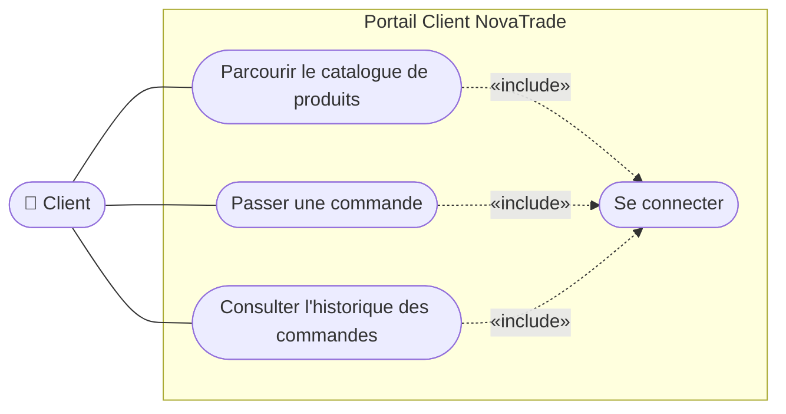
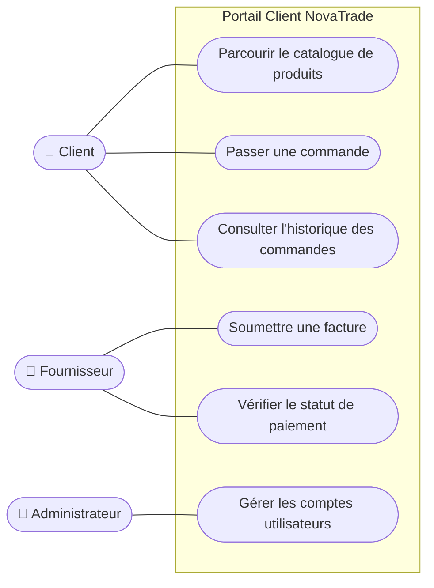
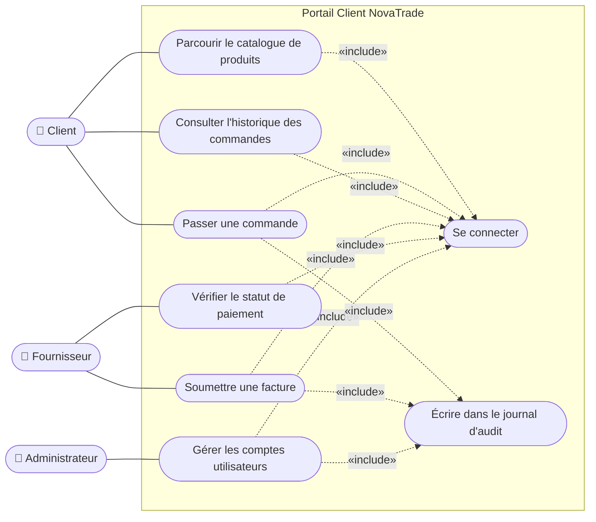
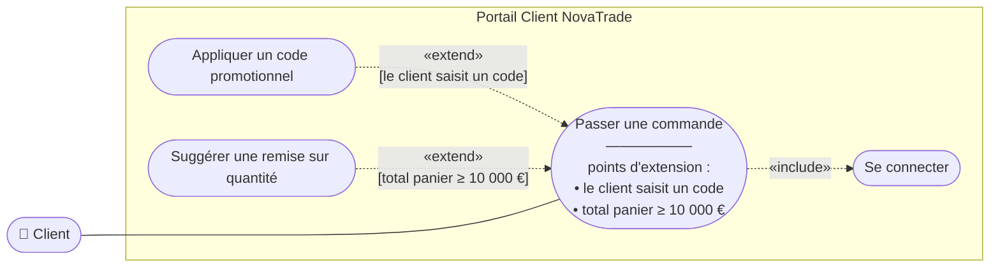
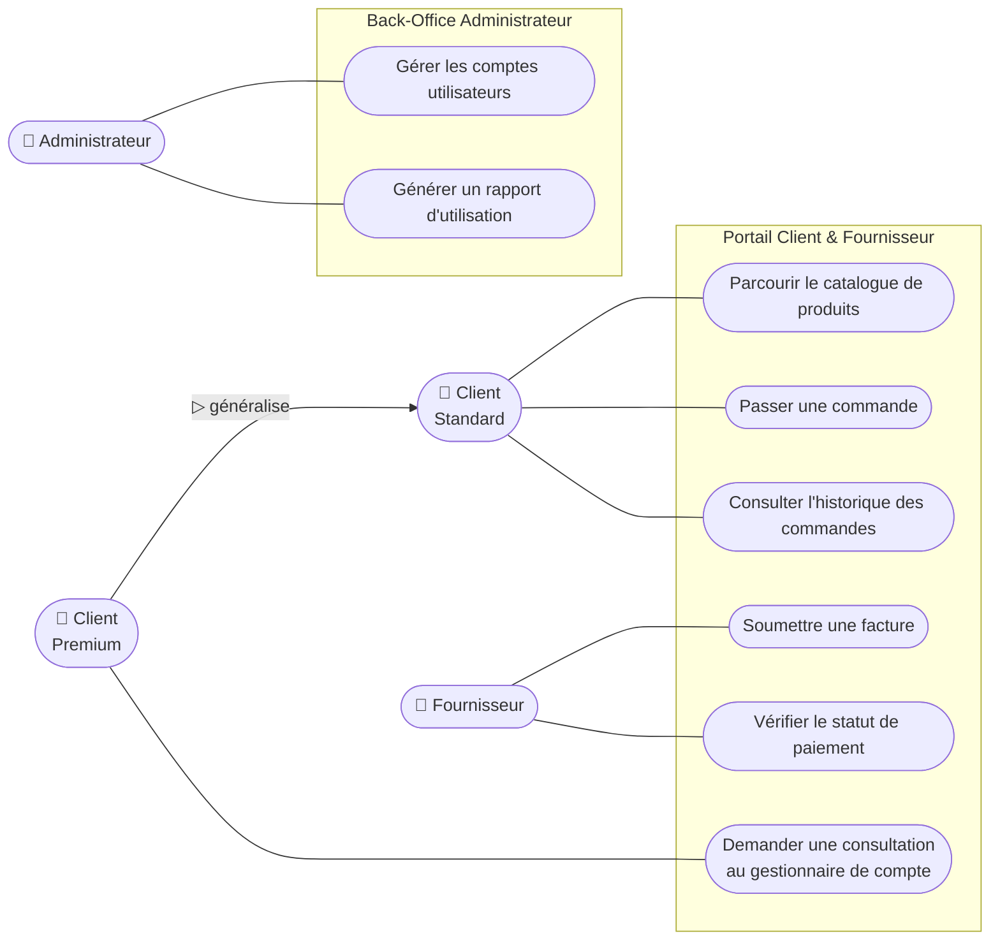
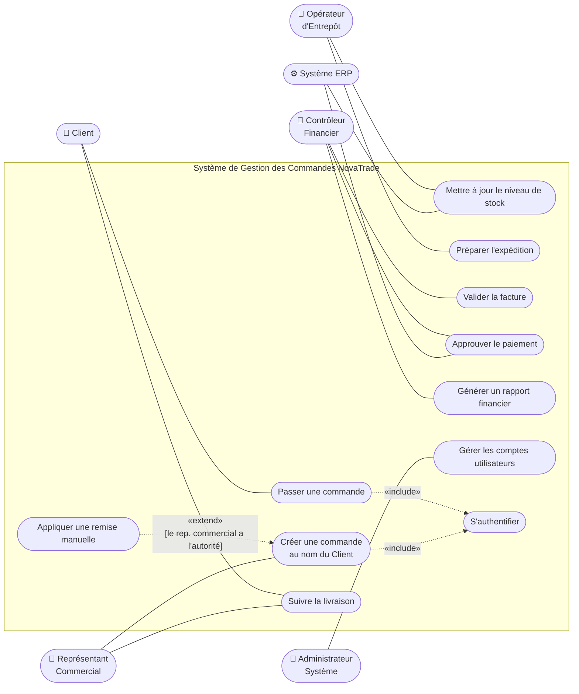
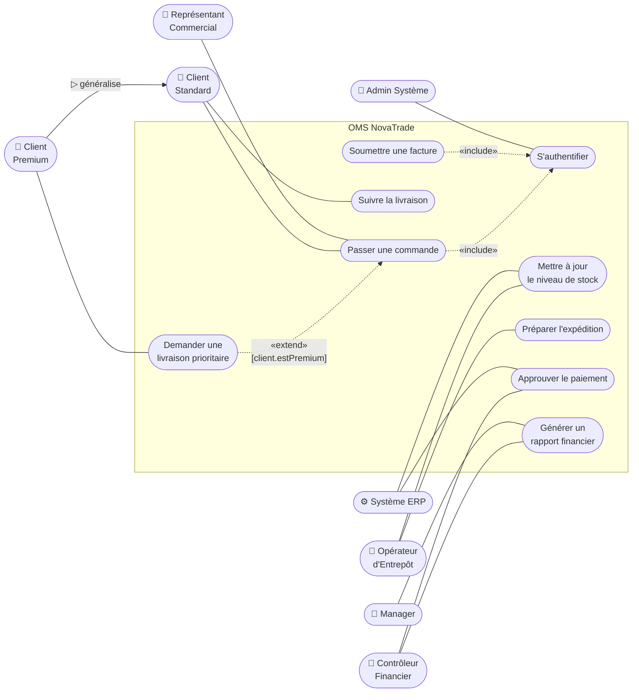
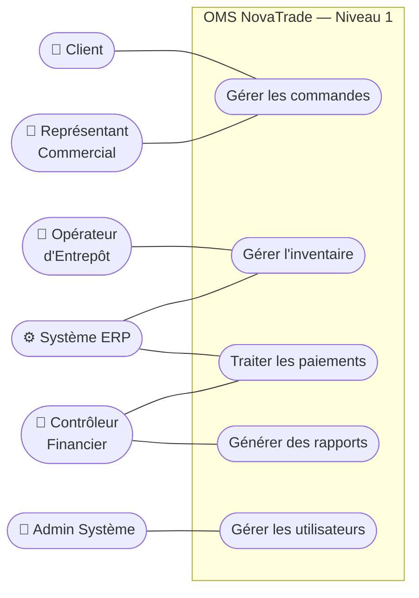
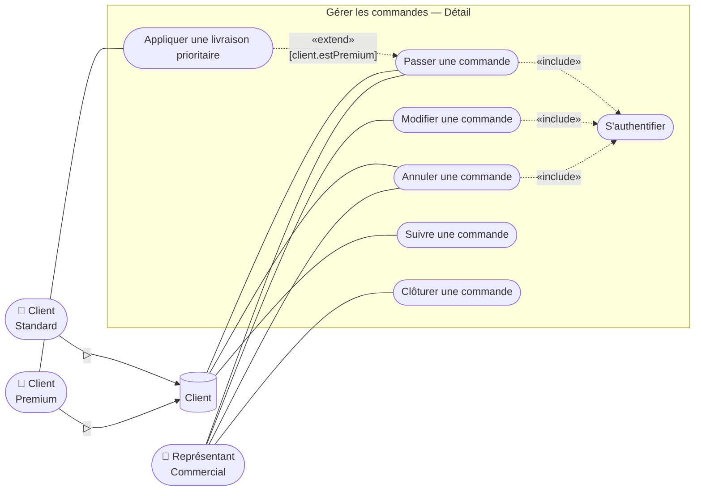

# UML — Diagramme de Cas d'Utilisation — Solutions des Exercices

Cette page rassemble les solutions modèles des neuf exercices sur le diagramme de cas d'utilisation (*Use Case Diagram*) UML. Chaque solution comporte un diagramme Mermaid corrigé, une justification des choix de modélisation et, lorsque c'est pertinent, les variantes acceptables.

---

## Exercice 01 — Portail Libre-Service Client

### Solution proposée

### Justification des choix

**`Client` est un acteur, placé à l'extérieur de la frontière.** Aurélie décrit un utilisateur humain externe — il interagit avec le système mais n'en fait pas partie. La règle UML est sans exception : tout acteur, humain ou machine, est dessiné à l'extérieur du rectangle de la frontière de système.

**Quatre cas d'utilisation à l'intérieur de la frontière.** Les trois cas métier décrits par Aurélie (`Parcourir le catalogue de produits`, `Passer une commande`, `Consulter l'historique des commandes`) plus la connexion (`Se connecter`). La frontière représente exactement le périmètre du système conçu — elle est nommée « Portail Client NovaTrade » pour rendre ce périmètre explicite.

**`Se connecter` n'est PAS associé directement à l'acteur.** C'est le point pédagogique central de l'exercice. Aurélie l'a explicité : « personne ne va sur notre portail juste pour se connecter et puis partir ». La connexion n'est pas un objectif métier autonome — c'est une étape obligatoire préalable à chaque action. Une association directe `Client --- Se connecter` créerait du bruit visuel et exprimerait à tort que la connexion est un objectif en soi.

**Relation `«include»` du cas de base vers le cas inclus.** Chaque cas métier déclenche systématiquement la connexion : c'est exactement la sémantique d'`«include»`. La flèche pointe **du cas de base vers le cas inclus** — mnémonique : le cas de base *appelle* le cas inclus, comme un appel de fonction.

### Variantes acceptables

- À ce stade débutant, on peut tolérer l'absence de `Se connecter` sur le diagramme et la transformer en simple précondition textuelle. Pédagogiquement, montrer la modélisation explicite est préférable car elle prépare l'Exercice 04 sur les préoccupations transverses multiples.
- L'ordre vertical des trois cas d'utilisation métier est arbitraire ; on peut les classer par fréquence d'usage attendue ou par ordre de découverte par l'utilisateur.

---

## Exercice 02 — Ajouter un Second Acteur

### Solution proposée

> **Précondition commune :** tous les utilisateurs doivent être connectés.

### Justification des choix

**Trois acteurs distincts, pas un acteur générique « Utilisateur ».** Aurélie est explicite : Client, Fournisseur et Administrateur ont des objectifs **différents et non recouvrants**. Un acteur unique « Utilisateur » avec six associations gommerait cette distinction et brouillerait la matrice droits-fonctionnalités. Les acteurs UML modélisent des **rôles dans le système**, pas un statut hiérarchique dans l'organisation.

**Pas de croisement entre rôles.** `Fournisseur` n'est PAS connecté à `Parcourir le catalogue de produits`, `Passer une commande` ni `Consulter l'historique des commandes` — ces fonctions sont propres au rôle Client. La rigueur de cette ségrégation est un livrable noté car elle alimente directement la matrice des autorisations côté implémentation.

**`Se connecter` retiré, remplacé par une précondition textuelle.** Aurélie l'a précisé : à ce stade le diagramme doit rester lisible. La connexion redeviendra un cas d'utilisation explicite à l'Exercice 04 quand un second besoin transverse (l'audit) viendra justifier la factorisation. Promouvoir trop tôt une précondition en cas d'utilisation, c'est encombrer le diagramme.

**Aucune ligne ne relie les acteurs entre eux.** Une règle structurelle UML : les acteurs ne sont **jamais** connectés directement les uns aux autres dans un diagramme de cas d'utilisation, uniquement aux cas d'utilisation.

### Variantes acceptables

- L'`Administrateur` peut être placé en bas plutôt qu'à droite si l'esthétique du diagramme le justifie. Convention courante : acteurs primaires (humains qui pilotent) à gauche, acteurs secondaires (automatisés ou de support) à droite ou en bas.
- La précondition commune peut être formulée comme une note attachée à la frontière ou comme un texte sous le diagramme — les deux conventions sont valides.

---

## Exercice 03 — Rédiger une Description Textuelle de Cas d'Utilisation

### Solution proposée

| Champ                      | Contenu                                                                                                                                 |
| -------------------------- | --------------------------------------------------------------------------------------------------------------------------------------- |
| **Identifiant**            | UC-03                                                                                                                                   |
| **Nom**                    | Passer une commande                                                                                                                     |
| **Acteur Principal**       | Client                                                                                                                                  |
| **Préconditions**          | Le Client est authentifié. Au moins un produit existe dans le panier du client. Le Client possède une adresse de livraison enregistrée. |
| **Postcondition — Succès** | La commande est créée avec le statut `Confirmée`. Le stock est réservé. Un courriel de confirmation est envoyé au client.               |
| **Postcondition — Échec**  | Aucune commande n'est créée. Le contenu du panier est préservé pour la prochaine session du client.                                     |

**Flux Principal**

1. Le Client examine le contenu et les quantités du panier.
2. Le Client sélectionne ou confirme l'adresse de livraison.
3. Le Client clique sur « Confirmer la commande ».
4. Le système vérifie que tous les articles du panier disposent d'un stock suffisant.
5. Le système vérifie que le total de la commande ne dépasse pas la limite de crédit du client.
6. Le système crée la commande avec le statut `Confirmée`.
7. Le système réserve le stock pour chaque ligne de commande.
8. Le système envoie un courriel de confirmation au client.
9. Le système affiche la page de confirmation de commande avec le numéro de référence.

**Flux Alternatif A — Rupture de stock (déviation à l'étape 4)**
- 4a. Un ou plusieurs articles ne disposent pas d'un stock suffisant.
- 4b. Le système affiche un message de disponibilité listant les articles concernés et leur stock actuel.
- 4c. Le cas d'utilisation se termine. Aucune commande n'est créée.

**Flux Alternatif B — Limite de crédit dépassée (déviation à l'étape 5)**
- 5a. Le total de la commande dépasse la limite de crédit approuvée du client.
- 5b. Le système affiche un avertissement de crédit montrant la limite et le total de la commande.
- 5c. Le cas d'utilisation se termine. Aucune commande n'est créée.

**Règles Métier**

- **RM-01** : La quantité minimale de commande par ligne est de 1 unité.
- **RM-02** : Le seuil de vérification de crédit est la limite de crédit approuvée du client stockée dans l'ERP ; aucune dérogation manuelle n'est permise au moment du paiement.

### Justification des choix

**Distinction stricte entre flux principal et flux alternatifs.** Le flux principal (*main flow*) couvre uniquement le **chemin nominal** (*happy path*) — l'exécution standard quand tout se passe bien. Les flux alternatifs (*alternative flows*) capturent les déviations : ils référencent **explicitement le numéro de l'étape** où la déviation se produit (ici 4 et 5), pour que les développeurs sachent précisément où insérer la logique de branchement.

**Numérotation 4a, 4b, 4c.** C'est la convention standard des descriptions textuelles UML : la lettre signale qu'on est dans une déviation à l'étape numérotée correspondante du flux principal. Cette discipline rend le document directement utilisable comme spécification d'exigences.

**Deux postconditions, succès ET échec.** Bruno a précisé qu'en cas d'échec, le panier doit être préservé. Une description textuelle qui n'aurait qu'une postcondition de succès laisserait le comportement d'échec ambigu, donc non testable. Spécifier l'état du système après échec est aussi important que de spécifier l'état après succès.

**Étapes décrivant *ce que* fait le système, pas *comment* il le fait.** « Le système vérifie que tous les articles disposent d'un stock suffisant » — pas « le système exécute une requête SQL sur la table `inventaire` ». La description textuelle est une exigence, pas une conception ; elle doit survivre aux choix d'implémentation.

**Règles métier numérotées (RM-01, RM-02).** L'identifiant explicite permet de tracer chaque règle dans le code, dans les tests et dans la documentation utilisateur — et de l'amender de manière non ambiguë.

### Variantes acceptables

- Les vérifications de stock et de crédit (étapes 4 et 5) pourraient être inversées sans changer la sémantique. Inversement, on peut argumenter que vérifier le crédit en premier (cher en latence vers l'ERP) avant le stock (peu coûteux en local) est inefficace — c'est un détail d'optimisation qui ne devrait pas figurer dans la description textuelle.
- Le format du tableau d'en-tête peut être remplacé par une liste à puces — la convention varie selon les organisations. Le contenu importe plus que la forme.

---

## Exercice 04 — Refactorisation avec Include

### Solution proposée

> **Note :** `Écrire dans le journal d'audit` n'est inclus que par les cas d'utilisation qui modifient l'état du système (`Passer une commande`, `Soumettre une facture`, `Gérer les comptes utilisateurs`). Les cas en lecture seule (`Parcourir le catalogue`, `Consulter l'historique`, `Vérifier le statut de paiement`) ne déclenchent aucune écriture, donc rien à journaliser.

### Justification des choix

**`«include»` pour les comportements *systématiques*.** Vincent a posé le critère central : un comportement est candidat à l'`«include»` quand il est **systématiquement** invoqué par d'autres. La connexion est invariablement requise par tous les cas métier ; l'écriture dans le journal d'audit est invariablement requise par tous les cas qui modifient des données. La règle sémantique d'`«include»` : « le cas de base appelle le cas inclus *à chaque exécution*, sans condition ».

**Aucune association directe entre acteur et cas inclus.** `Se connecter` et `Écrire dans le journal d'audit` ne sont connectés à aucun acteur. Aurélie comme Vincent l'ont souligné : ce sont des préoccupations transverses, jamais des objectifs métier autonomes. Une association directe créerait l'illusion qu'un utilisateur peut « se connecter » comme objectif final.

**Discrimination read-only / write.** Le diagramme distingue deux groupes : les cas en lecture seule (pas d'`«include»` vers l'audit) et les cas qui modifient des données (`«include»` vers l'audit). Cette discrimination n'est pas cosmétique : elle reflète le besoin métier exact tel que formulé par Vincent (« uniquement ce qui modifie des données »). Modéliser autrement (par exemple, journaliser tous les cas d'utilisation pour la traçabilité utilisateur) serait une **sur-spécification** — on modélise ce qui est demandé, pas ce qui pourrait être utile.

### Variantes acceptables

- Si l'organisation décide ultérieurement de tracer aussi les consultations en lecture seule (audit RGPD par exemple), tous les cas d'utilisation incluraient `Écrire dans le journal d'audit`. C'est une **évolution métier** légitime à documenter explicitement, pas une variante de modélisation libre.
- `Se connecter` pourrait être lui-même décomposé en sous-cas (`Saisir les identifiants`, `Vérifier le mot de passe`, `Créer la session`) si l'on en a besoin pour la conception sécurité. Pour ce niveau de cadrage métier, le garder atomique est préférable.

---

## Exercice 05 — Modéliser un Comportement Optionnel avec Extend

### Solution proposée

> **Note sur le déclenchement :** `Appliquer un code promotionnel` est déclenché par le **client** (action volontaire de saisir un code). `Suggérer une remise sur quantité` est déclenchée par le **système** (évaluation automatique du seuil de panier). Les deux utilisent `«extend»` car les deux sont *optionnelles* — le diagramme UML capture l'optionnalité mais ne capture pas l'origine du déclencheur, qui est documentée séparément dans la description textuelle ou en note.

### Justification des choix

**`«extend»` pour le comportement *optionnel*, pas l'`«include»` pour le systématique.** C'est la distinction clé du niveau intermédiaire. Léna l'a posée explicitement : « ce n'est pas obligatoire — pas de branche alternative à modéliser, juste rien si la condition n'est pas remplie ». C'est exactement la sémantique d'`«extend»`. Si on avait utilisé `«include»`, on aurait dit que le code promo est *toujours* appliqué, ce qui est faux.

**Direction de la flèche `«extend»` opposée à celle d'`«include»`.** L'`«extend»` pointe **de l'extension vers le cas de base** — l'extension « se branche » sur le cas de base. Mnémonique : la flèche montre où se trouve le crochet d'attache. Cette direction est l'inverse exact de celle d'`«include»` ; les inverser est une erreur classique qui inverse la sémantique.

**Points d'extension nommés sur le cas de base.** Le cas `Passer une commande` porte explicitement les deux points d'extension dans son étiquette. Cela permet à un développeur lisant le diagramme de savoir *où* dans le flux principal l'extension va s'injecter — sans cette information, l'`«extend»` reste vague.

**Conditions de garde sur les flèches `«extend»`.** Chaque flèche porte sa **condition de déclenchement** entre crochets : `[le client saisit un code]` et `[total panier ≥ 10 000 €]`. C'est ce qui permet à un développeur d'implémenter le branchement sans avoir à deviner.

**Pas d'association directe entre `Client` et les extensions.** Les deux extensions ne sont pas accessibles comme des objectifs autonomes — elles s'injectent dans `Passer une commande`. Connecter `Client` directement à `Appliquer un code promotionnel` ferait de l'application du code une interaction autonome, perdant tout l'intérêt d'`«extend»`.

### Variantes acceptables

- La distinction « déclenché par le client » vs. « déclenché par le système » peut être documentée par deux notations différentes (par exemple `«extend»` côté client vs. `«extend»` annoté `[trigger=system]` côté système). UML standard ne fournit pas cette distinction nativement ; elle vit dans la description textuelle ou en note.
- Pour des cas où les deux extensions doivent s'enchaîner (par exemple : si le client a un code promo *et* un total > 10 000 €, on accumule les remises), il peut être nécessaire de modéliser un cas intermédiaire `Calculer remise totale` qui est inclus par les deux. Pour la spec actuelle, deux extensions indépendantes suffisent.

---

## Exercice 06 — Généralisation d'Acteurs et Frontières de Système

### Solution proposée

### Justification des choix

**Généralisation d'acteurs sans acteur abstrait intermédiaire.** Vincent a explicitement demandé qu'on n'introduise pas d'acteur `Client` abstrait au-dessus des deux. La modélisation directe `Client Premium ▷ Client Standard` est plus économique parce qu'elle exprime exactement la relation métier : un Premium *est* un Standard avec un « plus ». Introduire un parent abstrait dupliquerait la hiérarchie sans valeur ajoutée.

**Direction de la flèche : du sous-type vers le parent.** La flèche de généralisation (pointe triangulaire creuse) part de `Client Premium` et pointe vers `Client Standard`. Lecture : « Premium *est une sorte de* Standard ». C'est l'inverse de la généralisation de classes en programmation orientée objet, où on dessine souvent dans la même direction — la convention UML cas d'utilisation est cohérente avec celle des classes (toujours sous-type → parent).

**Le sous-type hérite des associations du parent.** `Client Premium` n'a qu'**une seule** association directe sur le diagramme — celle vers `Demander une consultation au gestionnaire de compte`, qui est la fonctionnalité spécifique aux Premium. Toutes les autres associations (`Parcourir`, `Passer commande`, `Consulter historique`) sont **héritées** du Standard via la généralisation. Les redessiner sur le Premium serait à la fois redondant et trompeur — comme dupliquer toutes les méthodes du parent dans la classe enfant en programmation orientée objet.

**Deux frontières de système distinctes.** Vincent a demandé deux applications déployées séparément. Deux contextes de déploiement = deux frontières. Ce choix architectural a une **conséquence structurelle** : un acteur d'une frontière ne peut pas accéder à un cas d'utilisation de l'autre frontière sans une interface explicite (typiquement modélisée comme un acteur secondaire système).

**`Administrateur` connecté aux deux cas du back-office.** L'admin a deux objectifs distincts (gérer les comptes, générer un rapport d'utilisation) et donc deux associations distinctes — pas de tentative de fusion artificielle.

### Variantes acceptables

- Si les Standards et Premiums partagent demain une même fonctionnalité spécifique (par exemple `Consulter mon profil`), elle sera ajoutée comme association sur `Client Standard` et héritée automatiquement par `Client Premium` — pas besoin de la dupliquer.
- Si l'on découvre une troisième catégorie (par exemple `Client VIP`), elle peut généraliser `Client Premium` directement, créant une chaîne `VIP ▷ Premium ▷ Standard`. À surveiller : au-delà de trois niveaux, le diagramme devient illisible — c'est le moment de reconsidérer si la spécialisation est le bon outil.

---

## Exercice 07 — Cadrage du Système Complet de Gestion des Commandes

### Mémo de périmètre attendu

L'OMS NovaTrade permet aux **Clients** de passer et suivre leurs commandes, aux **Représentants Commerciaux** de gérer les commandes au nom des clients (avec autorité possible sur les remises manuelles), aux **Opérateurs d'Entrepôt** de gérer le stock et les expéditions, aux **Contrôleurs Financiers** de gérer la facturation et les paiements, et au **Système ERP** (acteur secondaire) de synchroniser les données de stock et de paiement. L'**Administrateur Système** gère les comptes utilisateurs et la configuration système.

**Hors périmètre :** la gestion de l'adresse de facturation client (gérée par un CRM séparé) et l'intégration avec les transporteurs (gérée par une plateforme logistique séparée).

### Diagramme de cas d'utilisation complet

### Description textuelle — `Créer une commande au nom du Client`

| Champ                      | Contenu                                                                                                                                                                                                          |
| -------------------------- | ---------------------------------------------------------------------------------------------------------------------------------------------------------------------------------------------------------------- |
| **Identifiant**            | UC-07                                                                                                                                                                                                            |
| **Nom**                    | Créer une commande au nom du Client                                                                                                                                                                              |
| **Acteur Principal**       | Représentant Commercial                                                                                                                                                                                          |
| **Acteurs Secondaires**    | Système ERP (lecture du stock)                                                                                                                                                                                   |
| **Préconditions**          | Le Représentant Commercial est authentifié. Le compte du Client cible existe. Le Représentant Commercial a l'autorité commerciale sur le Client (en fonction de son portefeuille).                               |
| **Postcondition — Succès** | La commande est créée avec le statut `Confirmée` et associée au Client cible. Le stock est réservé. Un courriel de confirmation est envoyé au Client. La création est journalisée avec l'identité du Rep. Com.   |
| **Postcondition — Échec**  | Aucune commande n'est créée. Aucun stock n'est réservé. Si une remise manuelle a été tentée hors autorité, elle est rejetée et journalisée comme tentative.                                                      |

**Flux Principal**

1. Le Représentant Commercial sélectionne le Client cible dans son portefeuille.
2. Le Représentant Commercial saisit ou importe la liste des produits et quantités demandés.
3. Le Représentant Commercial confirme l'adresse de livraison du Client.
4. Le système consulte le Système ERP pour vérifier le stock disponible pour chaque article.
5. Le système vérifie que le total ne dépasse pas la limite de crédit approuvée du Client.
6. Le système crée la commande au statut `Confirmée` et associe l'identité du Rep. Com. comme créateur.
7. Le système réserve le stock pour chaque ligne de commande.
8. Le système envoie un courriel de confirmation au Client (et copie le Rep. Com.).
9. Le système affiche au Rep. Com. la page de récapitulatif de commande.

**Flux Alternatif A — Stock insuffisant (déviation à l'étape 4)**
- 4a. L'ERP signale un stock insuffisant sur un ou plusieurs articles.
- 4b. Le système affiche au Rep. Com. les articles concernés et propose un délai de réapprovisionnement estimé.
- 4c. Le Rep. Com. peut soit ajuster la commande (revenir à l'étape 2), soit la sauvegarder comme commande en attente, soit annuler.

**Flux Alternatif B — Limite de crédit dépassée (déviation à l'étape 5)**
- 5a. Le total dépasse la limite de crédit du Client.
- 5b. Le système affiche au Rep. Com. la limite et le total demandé.
- 5c. Le Rep. Com. peut demander une dérogation au Contrôleur Financier (cas d'utilisation séparé hors périmètre de cette description) ou ajuster la commande.

**Flux Alternatif C — Application d'une remise manuelle (extension à l'étape 5)**
- 5a. Le Rep. Com. déclenche le cas d'utilisation `Appliquer une remise manuelle` (`«extend»`).
- 5b. Le système vérifie que le Rep. Com. a l'autorité commerciale sur le niveau de remise demandé.
- 5c. Si l'autorité est confirmée, la remise est appliquée et le total recalculé. Si l'autorité est insuffisante, la remise est rejetée et la tentative journalisée.

**Règles Métier**

- **RM-07-01** : Un Rep. Com. ne peut créer une commande que pour un Client qui figure dans son portefeuille assigné.
- **RM-07-02** : Le pourcentage maximum de remise manuelle dépend du niveau hiérarchique du Rep. Com. (5% pour un junior, 10% pour un senior, 15% pour un manager).
- **RM-07-03** : Toute commande créée au nom d'un Client par un Rep. Com. doit conserver une trace de l'identité du Rep. Com. pour audit.

### Justification des choix

**Place des acteurs.** Cinq acteurs humains à gauche (acteurs primaires : ils initient l'interaction) et un acteur secondaire (Système ERP) à droite. La distinction primaire/secondaire est une convention UML qui aide à la lecture : on lit le diagramme « gauche → frontière → droite » comme « initiateur → système → service externe consommé ».

**Trois relations avancées, chacune justifiée.**
- L'`«include»` de `Passer une commande` et `Créer une commande au nom du Client` vers `S'authentifier` factorise la précondition systématique d'authentification.
- L'`«extend»` de `Appliquer une remise manuelle` vers `Créer une commande au nom du Client` modélise un comportement **optionnel** déclenché conditionnellement (`[le rep. commercial a l'autorité]`).
- Une généralisation d'acteurs n'est pas obligatoire ici ; elle pourra apparaître à l'Exercice 09 quand on dépliera les sous-types de Client.

**Système ERP en double rôle.** Il alimente `Mettre à jour le niveau de stock` (l'ERP envoie au système) et `Approuver le paiement` (le système notifie l'ERP). Cette dualité est typique des acteurs secondaires : ils peuvent à la fois fournir et consommer.

### Variantes acceptables

- L'acteur `Administrateur Système` peut être déplacé en bas du diagramme s'il est jugé tertiaire (faible interaction métier). Aucune règle stricte sur sa position.
- Le cas d'utilisation `Appliquer une remise manuelle` peut être modélisé en `«include»` plutôt qu'`«extend»` si l'organisation considère que la remise est *toujours* appliquée (mais à 0% par défaut). Le choix `«extend»` reflète la sémantique « la remise n'est appliquée que si le Rep. Com. la déclenche explicitement ».

---

## Exercice 08 — Identifier les Exigences Manquantes

### Analyse des écarts (gap analysis)

1. **Acteur `Système` placé à l'intérieur de la frontière.** Erreur structurelle. Les acteurs sont **toujours** externes — la frontière représente le système conçu, pas ce qui interagit avec lui. Un acteur automatisé (un autre système) reste un acteur, donc à l'extérieur. **Correction :** déplacer `Système` à droite de la frontière.

2. **Direction `«include»` inversée.** Le brouillon a `Se connecter → Acheter un produit`. La règle UML est sans exception : la flèche pointe **du cas de base vers le cas inclus** (le cas de base *appelle* le cas inclus). C'est `Acheter un produit` qui inclut `Se connecter`, pas l'inverse. **Correction :** retourner la flèche.

3. **`Acheter un produit` et `Payer` séparés sans relation.** Le paiement est une étape obligatoire dans l'achat — sans paiement, pas de transaction. Soit ils ne forment qu'un seul cas d'utilisation, soit `Acheter un produit` inclut `Payer` via `«include»`. Modéliser comme deux objectifs distincts indépendants suggère à tort qu'on peut acheter sans payer ou payer sans avoir acheté.

4. **`Obtenir un reçu` n'est pas un objectif d'acteur.** Un client n'initie pas l'action « obtenir un reçu » — c'est le système qui envoie un reçu en conséquence d'une transaction réussie. C'est une **postcondition** d'`Acheter un produit`, ou éventuellement un cas d'utilisation `Envoyer un reçu` associé à l'acteur secondaire `Système`. **Correction :** retirer du diagramme et le déplacer en postcondition de `Acheter un produit`.

5. **`Consulter les rapports` est trop vague.** Quels rapports ? Rapports financiers ? De livraison ? D'activité utilisateur ? Chaque type sert un objectif différent et impose des droits d'accès différents. **Correction :** spécialiser en cas distincts (`Générer un rapport financier`, `Générer un rapport d'activité`, etc.) ou clarifier le périmètre dans la description textuelle.

6. **Acteurs manquants du contexte NovaTrade.** Le brouillon ne couvre que `Client` et `Manager` — il manque au minimum les acteurs identifiés à l'Exercice 07 : `Représentant Commercial`, `Opérateur d'Entrepôt`, `Contrôleur Financier`, `Système ERP`. Un OMS sans son Entrepôt ni sa Finance n'est pas un OMS.

7. **Cas d'utilisation manquants.** L'OMS doit couvrir tout le cycle de vie d'une commande, pas uniquement l'achat. Manquent au minimum : `Suivre la livraison`, `Soumettre une facture`, `Approuver le paiement`, `Mettre à jour le niveau de stock`, `Préparer l'expédition`. Le brouillon couvre au mieux 20 % du périmètre fonctionnel attendu.

8. **`Envoyer un courriel` est un détail technique d'implémentation.** L'envoi de courriel n'est pas un objectif d'acteur — c'est un mécanisme de notification que le système utilise en interne. Le promouvoir en cas d'utilisation enferme un détail d'implémentation dans le contrat fonctionnel. **Correction :** retirer du diagramme ; documenter en note de la classe `Système` ou en exigence non fonctionnelle (par exemple « le système peut envoyer des notifications par courriel »).

9. **Pas de Généralisation d'Acteurs.** Si l'OMS distingue les Clients Standard et Premium (cf. Exercice 06), une généralisation est attendue. Le brouillon a un acteur `Client` plat.

10. **Pas d'`«extend»`.** Aucun comportement optionnel n'est modélisé alors que le cas réel en comporte (remise manuelle, code promotionnel, livraison prioritaire, etc.).

### Diagramme corrigé

### Justification des choix

**Application disciplinée des règles.** Chaque correction du diagramme corrigé adresse un point précis de l'analyse des écarts — pas de correction « libre » qui ne corresponde à aucun écart identifié. Cette traçabilité analyse → correction est le livrable principal de l'exercice.

**Granularité métier vs. technique.** Les corrections 4 (`Obtenir un reçu`) et 8 (`Envoyer un courriel`) appliquent toutes les deux le même test : « est-ce un objectif que poursuit un acteur, ou un mécanisme technique ? ». Si c'est un mécanisme, ça ne va pas sur le diagramme — ça va en note ou en postcondition.

**Cohérence avec l'Exercice 07.** Le diagramme corrigé reprend exactement le vocabulaire et les acteurs de l'Exercice 07 (Représentant Commercial, Opérateur d'Entrepôt, etc.). Cette cohérence est volontaire : elle évite que NovaTrade se retrouve avec deux modèles concurrents pour le même système.

### Variantes acceptables

- L'analyse des écarts peut comporter plus de dix points si l'apprenant a été exhaustif. Six est un minimum.
- Le diagramme corrigé peut être plus dense (intégrer aussi des cas non mentionnés explicitement, comme `Annuler une commande`, `Modifier une commande`) — c'est légitime tant que ces ajouts sont justifiés par le contexte NovaTrade.

---

## Exercice 09 — Spécification Complète de Cas d'Utilisation pour le Périmètre Order-to-Cash

### Niveau 1 — Diagramme de haut niveau

### Niveau 2 — Expansion de `Gérer les commandes`

### Description textuelle — `Passer une commande`

| Champ                      | Contenu                                                                                                                                  |
| -------------------------- | ---------------------------------------------------------------------------------------------------------------------------------------- |
| **Identifiant**            | UC-09-01                                                                                                                                 |
| **Nom**                    | Passer une commande                                                                                                                      |
| **Acteur Principal**       | Client (Standard ou Premium) ou Représentant Commercial                                                                                  |
| **Acteurs Secondaires**    | Système ERP (vérification de stock)                                                                                                      |
| **Préconditions**          | L'acteur est authentifié. Le panier contient au moins un produit. Le Client cible possède une adresse de livraison.                      |
| **Postcondition — Succès** | Commande créée au statut `Confirmée`. Stock réservé. Courriel de confirmation envoyé. Audit journalisé.                                  |
| **Postcondition — Échec**  | Aucune commande créée. Panier préservé. Si erreur ERP, transaction annulée et notification d'incident envoyée à l'admin.                 |

**Flux Principal**
1. L'acteur sélectionne ou confirme le Client cible.
2. L'acteur examine le contenu et les quantités du panier.
3. L'acteur confirme l'adresse de livraison.
4. L'acteur clique sur « Confirmer la commande ».
5. Le système consulte le Système ERP pour vérifier le stock de chaque article.
6. Le système vérifie que le total ne dépasse pas la limite de crédit du Client.
7. Le système crée la commande au statut `Confirmée`.
8. Le système réserve le stock pour chaque ligne.
9. Le système envoie un courriel de confirmation au Client.
10. Le système affiche la page de confirmation avec le numéro de référence.

**Flux Alternatif A — Stock insuffisant (déviation à l'étape 5)**
- 5a. L'ERP signale un stock insuffisant.
- 5b. Le système affiche les articles concernés et le délai de réapprovisionnement.
- 5c. Le cas d'utilisation se termine sans commande.

**Flux Alternatif B — Livraison prioritaire (extension à l'étape 4 si client.estPremium)**
- 4a. Le système propose au Client Premium l'option de livraison prioritaire.
- 4b. Si accepté, la commande est marquée prioritaire pour la préparation en entrepôt.
- 4c. Le flux principal reprend à l'étape 5.

**Règles Métier**
- **RM-09-01** : Quantité minimale par ligne = 1.
- **RM-09-02** : La limite de crédit est lue depuis l'ERP, pas de dérogation manuelle.
- **RM-09-03** : Une commande Premium prioritaire est traitée en entrepôt avant les commandes Standard du même jour.

**Exigence non fonctionnelle**
- **ENF-09-01** : Le flux principal doit s'exécuter en moins de 3 secondes en charge normale (P95).

**Note de mappage**
`Passer une commande` introduit les classes `Commande`, `LigneCommande`, `Client`, `Produit`, et l'opération `Commande.confirmer()`. Le flux principal se mappe directement à un Diagramme de Séquence où les étapes 5–9 deviennent des messages entre `:AppWeb`, `:ServiceCommande`, `:Inventaire` (acteur ERP) et `:ServiceEmail`. La transition d'état `[*] → Brouillon → Confirmée` apparaît dans le Diagramme d'État de `Commande`.

### Description textuelle — `Annuler une commande`

| Champ                      | Contenu                                                                                                                                |
| -------------------------- | -------------------------------------------------------------------------------------------------------------------------------------- |
| **Identifiant**            | UC-09-02                                                                                                                               |
| **Nom**                    | Annuler une commande                                                                                                                   |
| **Acteur Principal**       | Client ou Représentant Commercial                                                                                                      |
| **Préconditions**          | L'acteur est authentifié. La commande existe et son statut autorise l'annulation (`Confirmée`, ou `Préparation` selon délai).           |
| **Postcondition — Succès** | Commande au statut `Annulée`. Stock réservé libéré. Courriel d'annulation envoyé. Audit journalisé.                                    |
| **Postcondition — Échec**  | Statut de commande inchangé. Aucun courriel envoyé.                                                                                    |

**Flux Principal**
1. L'acteur identifie la commande à annuler.
2. L'acteur clique sur « Annuler la commande ».
3. Le système vérifie que le statut autorise l'annulation.
4. Le système vérifie que le délai d'annulation client n'est pas dépassé (24h pour un Client agissant seul).
5. Le système passe la commande au statut `Annulée`.
6. Le système libère le stock réservé pour chaque ligne.
7. Le système envoie un courriel d'annulation au Client.
8. Le système affiche la confirmation d'annulation.

**Flux Alternatif A — Délai d'annulation client dépassé (déviation à l'étape 4)**
- 4a. Le délai client est dépassé et l'acteur est un Client (pas un Rep. Com.).
- 4b. Le système affiche un message indiquant que l'annulation client n'est plus possible et propose de contacter le Rep. Com.
- 4c. Le cas d'utilisation se termine sans annulation.

**Flux Alternatif B — Annulation par Rep. Com. après délai client (extension à l'étape 4)**
- 4a. L'acteur est un Représentant Commercial — la garde [moinsDe24h] ne s'applique pas.
- 4b. Le flux continue à l'étape 5 même si plus de 24h se sont écoulées.

**Règles Métier**
- **RM-09-04** : Un Client peut annuler dans les 24h après confirmation. Un Rep. Com. peut annuler tant que la commande n'est pas en `Expédition`.
- **RM-09-05** : L'annulation libère intégralement le stock réservé — pas de stock résiduel orphelin.

**Exigence non fonctionnelle**
- **ENF-09-02** : La libération du stock doit être atomique avec le passage au statut `Annulée` (pas d'état intermédiaire visible).

**Note de mappage**
Introduit l'opération `Commande.annuler()` avec garde `[moinsDe24h]` (côté Client) ou inconditionnelle (côté Rep. Com.). La transition d'état `Confirmée → Annulée` apparaît dans le Diagramme d'État de `Commande`. Le diagramme de séquence montre la libération du stock par appel à `:Inventaire.libererReservation()`.

### Description textuelle — `Modifier une commande`

| Champ                      | Contenu                                                                                                                            |
| -------------------------- | ---------------------------------------------------------------------------------------------------------------------------------- |
| **Identifiant**            | UC-09-03                                                                                                                           |
| **Nom**                    | Modifier une commande                                                                                                              |
| **Acteur Principal**       | Représentant Commercial                                                                                                            |
| **Préconditions**          | Le Rep. Com. est authentifié. La commande existe et son statut est `Confirmée` (modification interdite après `Préparation`).        |
| **Postcondition — Succès** | Commande mise à jour avec les nouvelles lignes. Stock réservé ajusté. Courriel de modification envoyé. Audit journalisé.            |
| **Postcondition — Échec**  | Commande inchangée. Aucun changement de stock.                                                                                     |

**Flux Principal**
1. Le Rep. Com. ouvre la commande à modifier.
2. Le système vérifie que le statut autorise la modification.
3. Le Rep. Com. modifie la liste des produits, les quantités ou l'adresse de livraison.
4. Le système calcule l'écart de stock à réserver ou à libérer par rapport à l'original.
5. Le système consulte l'ERP pour vérifier la disponibilité des nouveaux articles.
6. Le système vérifie que le nouveau total ne dépasse pas la limite de crédit du Client.
7. Le système met à jour la commande et ajuste les réservations de stock.
8. Le système envoie un courriel de modification au Client.

**Flux Alternatif A — Statut non modifiable (déviation à l'étape 2)**
- 2a. La commande est en `Préparation` ou plus loin.
- 2b. Le système affiche un message indiquant que la modification n'est pas possible.
- 2c. Le cas d'utilisation se termine.

**Flux Alternatif B — Stock insuffisant pour les nouveaux articles (déviation à l'étape 5)**
- 5a. L'ERP signale un stock insuffisant.
- 5b. Le Rep. Com. peut soit ajuster les quantités, soit annuler la modification (la commande revient à son état original).

**Règles Métier**
- **RM-09-06** : La modification est possible uniquement tant que la commande est au statut `Confirmée`.
- **RM-09-07** : L'audit doit conserver l'état avant et après modification pour permettre un rollback éventuel.

**Exigence non fonctionnelle**
- **ENF-09-03** : Le calcul d'écart de stock doit être transactionnel — si l'opération échoue à mi-chemin, ni la commande ni les réservations ne sont modifiées.

**Note de mappage**
Introduit `Commande.modifier(nouvellesLignes)`. Pas de transition d'état (la commande reste `Confirmée`) — c'est une mise à jour interne. Diagramme de séquence : ajustements de réservation par calcul d'écart, pas par cycle libérer/réserver complet.

### Vérification de cohérence des noms

| Niveau 1                   | Niveau 2                                  | Description textuelle           |
| -------------------------- | ----------------------------------------- | ------------------------------- |
| Acteur `Client`            | `Client Standard` (généralise `Client`)   | Cité comme `Client`             |
| Acteur `Client`            | `Client Premium` (généralise `Client`)    | Cité comme `Client`             |
| Acteur `Représentant Commercial` | Acteur `Représentant Commercial`    | Acteur `Représentant Commercial` |
| Cas `Gérer les commandes`  | Détaillé en 6 sous-cas                    | (regroupe les trois descriptions) |
| —                          | `Passer une commande`                     | UC-09-01 `Passer une commande`  |
| —                          | `Annuler une commande`                    | UC-09-02 `Annuler une commande` |
| —                          | `Modifier une commande`                   | UC-09-03 `Modifier une commande` |

### Justification des choix

**Cohérence stricte des noms à travers les trois artéfacts.** Les acteurs et cas d'utilisation portent **exactement** le même nom au Niveau 1, au Niveau 2 et dans les descriptions textuelles. Vincent l'a posé comme exigence : sans cette discipline, l'équipe risque de construire trois implémentations divergentes pour la même fonctionnalité.

**Trois descriptions textuelles couvrant le triptyque création / modification / suppression.** Choix volontaire de couvrir le cycle CRUD complet du domaine commande, parce que ces trois cas sont les plus susceptibles de poser des questions d'intégrité (cohérence des réservations de stock, transitions d'état, audit) qui doivent être tranchées avant la conception.

**Exigences non fonctionnelles présentes dans chaque description.** Vincent a explicitement demandé qu'on ne les oublie pas. Une exigence non fonctionnelle (« le flux doit s'exécuter en moins de 3 secondes ») affecte directement la conception du Diagramme de Séquence — par exemple, elle peut imposer un appel asynchrone là où un appel synchrone bloquerait trop longtemps.

**Notes de mappage anticipant les diagrammes aval.** Chaque description identifie les classes, opérations et transitions d'état attendues. C'est un livre de bord pour l'architecte qui construira le Diagramme de Classes — il sait quelles classes doivent émerger de quelles descriptions, et peut auditer la couverture.

### Variantes acceptables

- Plus de trois descriptions textuelles peuvent être produites si le périmètre l'exige (`Suivre une commande`, `Clôturer une commande`, etc.). Trois est un minimum, choisi pour assurer la couverture CRUD.
- Le Niveau 1 peut être plus ou moins granulaire selon l'audience — pour un Comité de Direction, cinq cas d'utilisation suffisent ; pour un kick-off d'équipe technique, on peut aller jusqu'à sept ou huit.

---

*Page précédente : [[UML Use Case Enonces]] — énoncés des exercices.*
