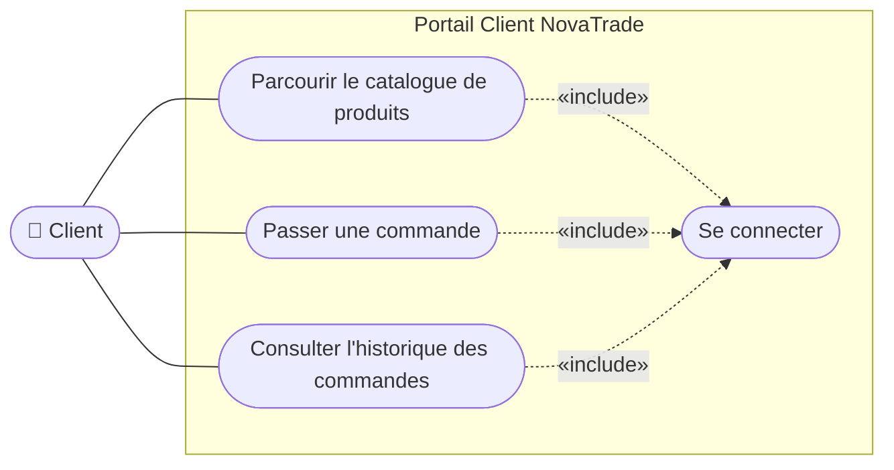
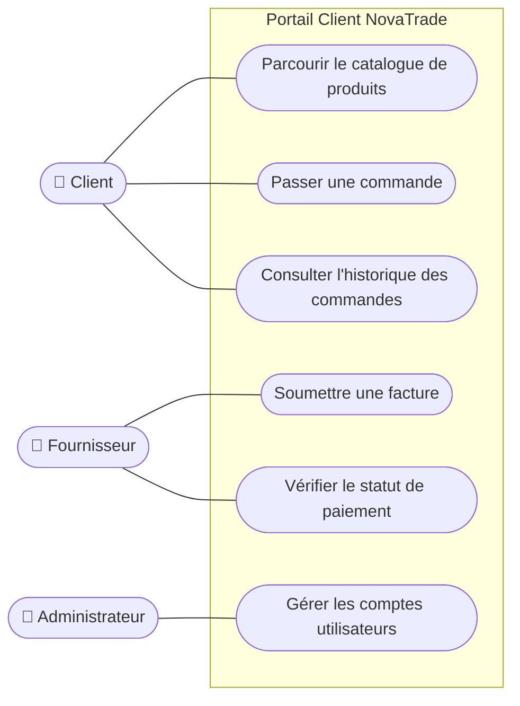
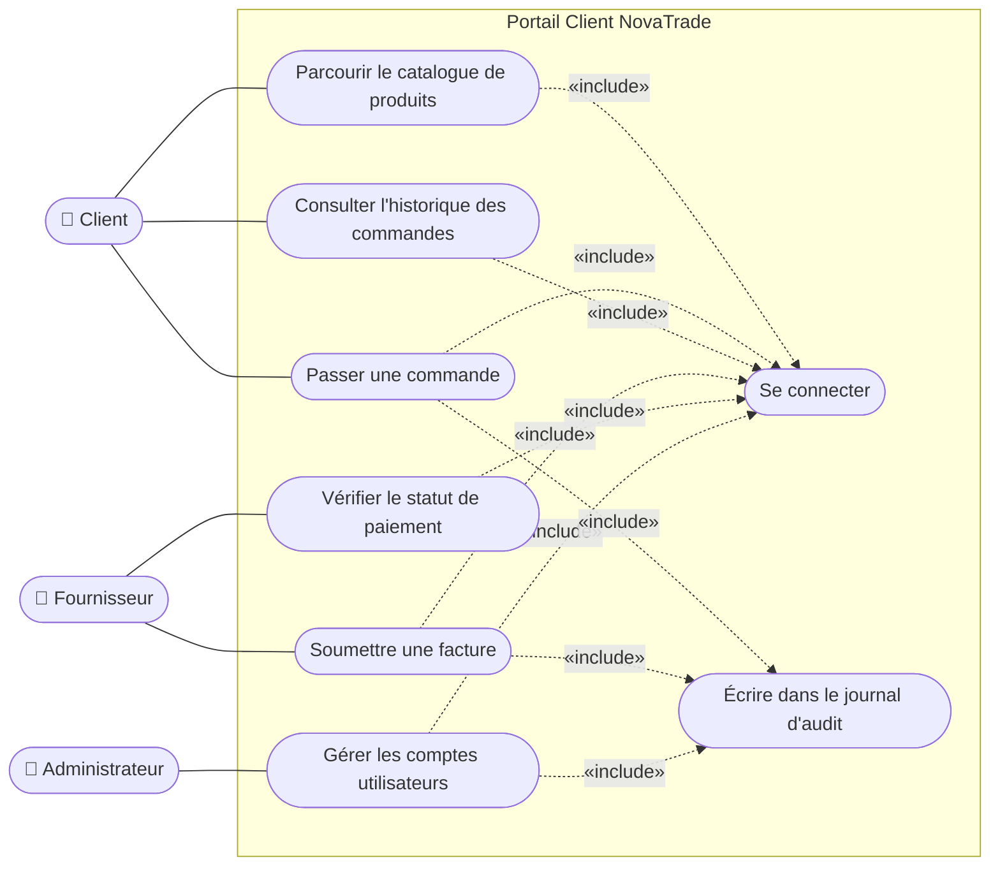
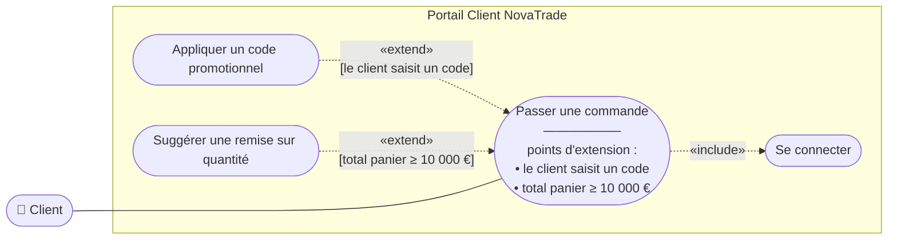
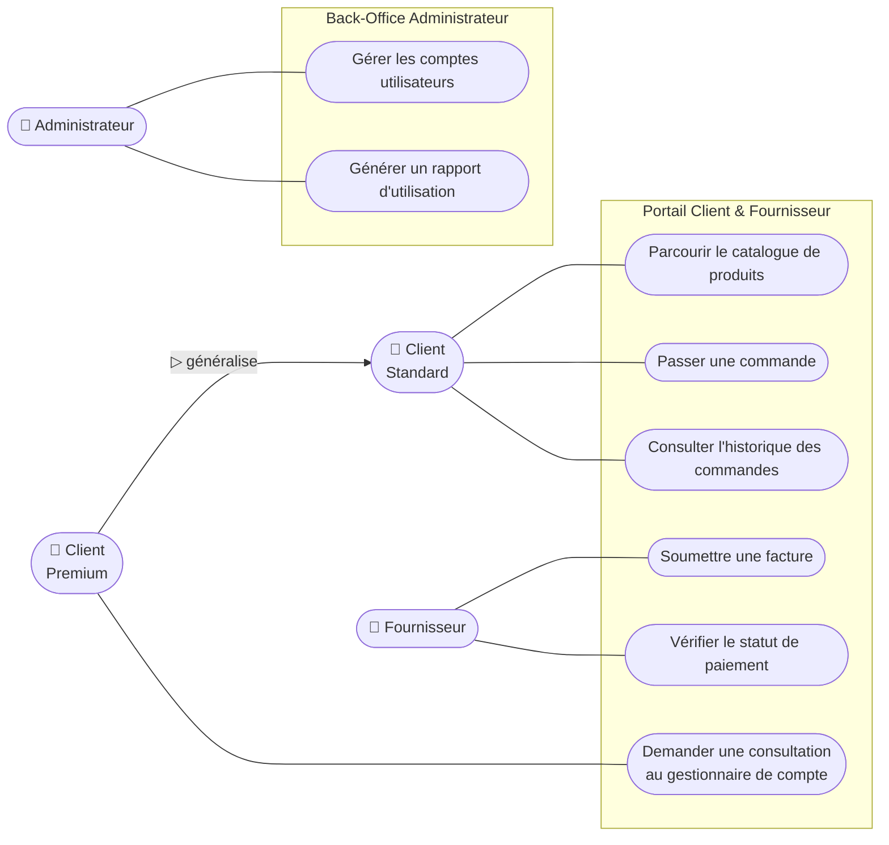
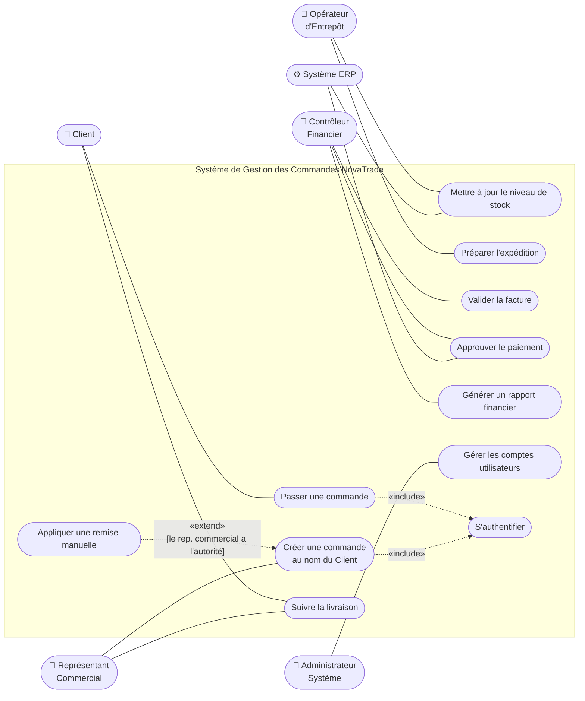
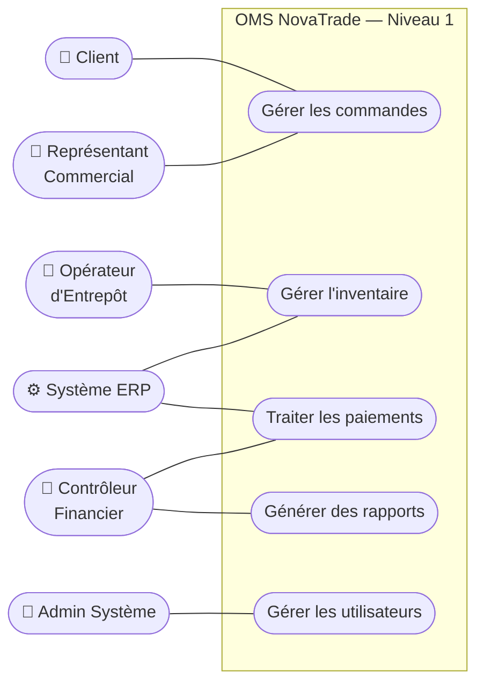
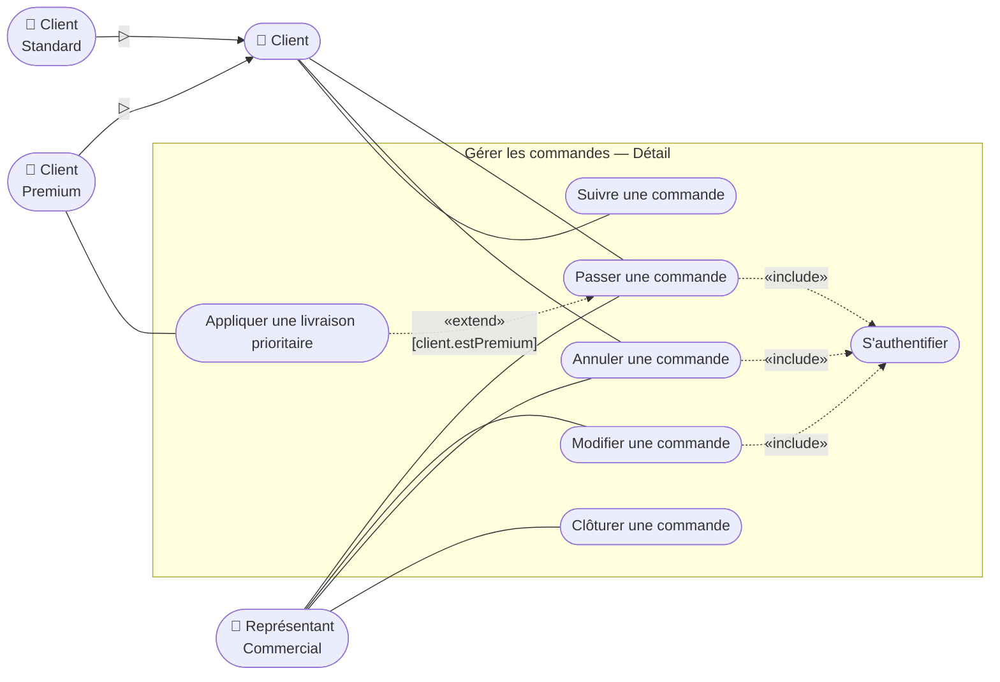

# UML Use Cases - Solutions

## 🟢 Niveau Débutant

### Exercice 01 — Portail Libre-Service Client

### Exercice 02 — Ajouter un Second Acteur

> **Pre-conditions**: Les utilisateurs doivent être connectés.

### Exercice 03 — Rédiger une Description Textuelle de Cas d'Utilisation

| Champ | Contenu |
|---|---|
| **Identifiant** | UC-03 |
| **Nom** | Passer une commande |
| **Acteur Principal** | Client |
| **Préconditions** | Le Client est authentifié. Au moins un produit existe dans le panier du client. Le Client possède une adresse de livraison enregistrée. |
| **Postcondition — Succès** | La commande est créée avec le statut `Confirmée`. Le stock est réservé. Un courriel de confirmation est envoyé au client. |
| **Postcondition — Échec** | Aucune commande n'est créée. Le contenu du panier est préservé pour la prochaine session du client. |

**Flux Principal**
1. Le Client examine le contenu et les quantités du panier.
2. Le Client sélectionne ou confirme l'adresse de livraison.
3. Le Client clique sur « Confirmer la commande ».
4. Le système vérifie que tous les articles du panier disposent d'un stock suffisant.
5. Le système vérifie que le total de la commande ne dépasse pas la limite de crédit du client.
6. Le système crée la commande avec le statut `Confirmée`.
7. Le système réserve le stock pour chaque ligne de commande.
8. Le système envoie un courriel de confirmation au client.
9. Le système affiche la page de confirmation de commande avec le numéro de référence.

**Flux Alternatif A — Rupture de stock (déviation à l'étape 4)**
4a. Un ou plusieurs articles ne disposent pas d'un stock suffisant.
4b. Le système affiche un message de disponibilité listant les articles concernés et leur stock actuel.
4c. Le cas d'utilisation se termine. Aucune commande n'est créée.

**Flux Alternatif B — Limite de crédit dépassée (déviation à l'étape 5)**
5a. Le total de la commande dépasse la limite de crédit approuvée du client.
5b. Le système affiche un avertissement de crédit montrant la limite et le total de la commande.
5c. Le cas d'utilisation se termine. Aucune commande n'est créée.

**Règles Métier**
- RM-01 : La quantité minimale de commande par ligne est de 1 unité.
- RM-02 : Le seuil de vérification de crédit est la limite de crédit approuvée du client stockée dans l'ERP ; aucune dérogation manuelle n'est permise au moment du paiement.

## 🟡 Niveau Intermédiaire
### Exercice 04 — Refactorisation avec Include

### Exercice 05 — Modéliser un Comportement Optionnel avec Extend

### Exercice 06 — Généralisation d'Acteurs et Frontières de Système

## 🔴 Niveau Avancé
### Exercice 07 — Cadrage du Système Complet de Gestion des Commandes

**Énoncé de Périmètre**
L'OMS NovaTrade permet aux Clients de passer et suivre leurs commandes, aux Représentants Commerciaux de gérer les commandes au nom des clients, aux Opérateurs d'Entrepôt de gérer le stock et les expéditions, aux Contrôleurs Financiers de gérer la facturation et les paiements, et au Système ERP de synchroniser les données de stock et de paiement. L'Administrateur Système gère les comptes utilisateurs et la configuration système. Hors périmètre : la gestion de l'adresse de facturation client (gérée par un CRM séparé) et l'intégration avec les transporteurs (gérée par une plateforme logistique séparée).

### Exercice 08 — Identifier les Exigences Manquantes

**Analyse des Écarts**

1. `Système` est placé *à l'intérieur* de la frontière du système — les acteurs sont toujours externes. La frontière représente le système en cours de construction ; l'acteur `Système` est un participant automatisé externe, pas le système lui-même.
2. La flèche `«include»` va de `Se connecter` vers `Acheter un produit` — la direction est inversée. `Acheter un produit` inclut `Se connecter` (le cas de base appelle le cas inclus), pas l'inverse.
3. `Acheter un produit` et `Payer` sont deux cas d'utilisation séparés, mais le paiement est probablement une étape obligatoire dans l'achat — ils devraient n'en former qu'un seul ou être modélisés avec `«include»`.
4. `Obtenir un reçu` est un événement (le système envoie un reçu), pas un objectif que l'acteur initie. Cela peut appartenir à une postcondition ou à un cas d'utilisation `Envoyer un reçu` associé à l'acteur `Système`.
5. `Consulter les rapports` est trop vague — quels rapports ? Rapports financiers, de livraison, d'activité utilisateur ? Chaque type sert un objectif différent et peut requérir des données et des droits d'accès différents.
6. Acteurs manquants du contexte NovaTrade : `Fournisseur`, `Opérateur d'Entrepôt`, `Contrôleur Financier` — le brouillon ne couvre que le côté client, ignorant les opérations back-office que l'OMS doit prendre en charge.
7. Cas d'utilisation manquants : `Suivre la livraison`, `Soumettre une facture`, `Approuver le paiement`, `Mettre à jour le stock` — le brouillon ne décrit que l'achat, pas le cycle de vie complet de la commande.
8. `Envoyer un courriel` est un détail d'implémentation, pas un cas d'utilisation métier — l'envoi d'un courriel par le système est un mécanisme technique, pas un objectif que poursuit un acteur. Cela appartient à une note ou une annotation, pas à un cas d'utilisation.

### Exercice 09 — Spécification Complète de Cas d'Utilisation pour le Périmètre Order-to-Cash

**Niveau 1 — Diagramme de haut niveau**

**Niveau 2 — Expansion de Gérer les Commandes**

**Notes de Mappage (exemple pour Passer une commande)**
`Passer une commande` introduit les classes `Commande` et `LigneCommande`, les classes `Client` et `Produit`, ainsi que les opérations `confirmer()` et `annuler()` — toutes doivent apparaître dans le Diagramme de Classes. Le flux principal se mappe directement au Diagramme de Séquence `passerCommande`, où les étapes deviennent des messages entre `AppWeb`, `ServiceCommande`, `Inventaire` et `ServicePaiement`.

